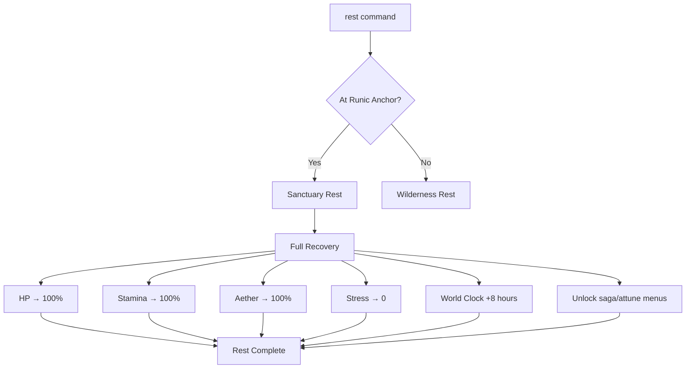
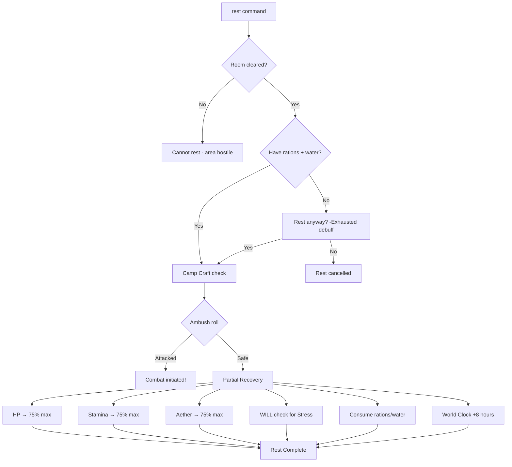

# Rest & Camp Commands

---

## Overview

Rest and camp commands allow characters to recover resources, manage stress, and access progression systems. Two rest types exist: **Sanctuary Rest** (full recovery at Runic Anchors) and **Wilderness Rest** (partial recovery with risk).

| Command | Aliases | Syntax | Context |
|---------|---------|--------|---------|
| `rest` | `sleep` | `rest` | Exploration (safe rooms) |
| `camp` | `make camp` | `camp` | Exploration (wilderness) |
| `attune` | `bind` | `attune [anchor]` | Sanctuary only |
| `saga` | `level`, `progress` | `saga` | Sanctuary only |

---

## 1. Rest

### 1.1 Syntax

```
rest
```

### 1.2 Aliases

| Input | Resolves To |
|-------|-------------|
| `rest` | `rest` |
| `sleep` | `rest` |

### 1.3 Context Requirements

| Condition | Required |
|-----------|----------|
| Context | Exploration only |
| Location | Safe room (Runic Anchor or cleared room) |
| Combat | Not in combat |
| Resources | Rations + Water (wilderness only) |

### 1.4 Behavior

The `rest` command behaves differently based on location:

#### At Runic Anchor (Sanctuary Rest)



#### In Wilderness (Wilderness Rest)



### 1.5 Recovery Values

| Resource | Sanctuary | Wilderness |
|----------|-----------|------------|
| HP | 100% | 75% |
| Stamina | 100% | 75% |
| Aether Pool | 100% | 75% |
| Stress | Reset to 0 | WILL check (successes removed) |

### 1.6 Examples

**Sanctuary Rest:**
```
> rest
  You settle near the Runic Anchor. Its steady hum calms your mind
  as you drift into deep, restorative sleep.

  [SANCTUARY REST — 8 HOURS]
  ═══════════════════════════════════════
  HP:       80/80 (+35)
  Stamina:  100/100 (+45)
  Aether:   60/60 (+20)
  Stress:   0/100 (-52)
  ═══════════════════════════════════════

  The Saga is saved.

  Use 'saga' to spend Progression Points.
  Use 'attune' to bind artifacts or change respawn.
```

**Wilderness Rest:**
```
> rest
  You make camp in the ruins. It's not safe, but you need recovery.

  Camp Craft Check: WITS vs DC 12
  Roll: [7, 8, 5, 9, 6] = 4 successes ✓

  [WILDERNESS REST — 8 HOURS]
  ═══════════════════════════════════════
  HP:       60/80 (+25, 75% max)
  Stamina:  75/100 (+30, 75% max)
  Aether:   45/60 (+15, 75% max)
  Stress:   38/100 (-12, WILL check)
  ═══════════════════════════════════════

  Consumed: 1 Ration, 1 Clean Water
```

**Ambush During Rest:**
```
> rest
  You make camp in the ruins.

  Camp Craft Check: WITS vs DC 12
  Roll: [2, 3, 4, 1, 5] = 0 successes ✗

  [!] Your camp was discovered!

  3 Ash Vargr emerge from the darkness...

  COMBAT INITIATED
```

**Insufficient Resources:**
```
> rest
  You don't have enough supplies for a proper rest.
  Required: 1 Ration, 1 Clean Water
  Available: 0 Rations, 1 Clean Water

  Rest without supplies? You'll gain [Exhausted] debuff. (y/n)
```

### 1.7 Validation

| Condition | Error Message |
|-----------|---------------|
| In combat | "Cannot rest during combat." |
| Hostile room | "Cannot rest here — the area is not secure." |
| Time-sensitive quest | "Warning: Resting will fail quest 'X'. Continue? (y/n)" |

### 1.8 Events Raised

| Event | When | Payload |
|-------|------|---------|
| `RestStartedEvent` | Rest begins | `RestType`, `LocationId` |
| `RestCompletedEvent` | Rest finishes | `RestType`, `Recovery`, `TimeAdvanced` |
| `AmbushTriggeredEvent` | Ambush during wilderness rest | `EnemyIds`, `AmbushSource` |
| `ResourcesConsumedEvent` | Rations/water used | `ItemIds`, `Quantities` |

---

## 2. Camp

### 2.1 Syntax

```
camp
make camp
```

### 2.2 Aliases

| Input | Resolves To |
|-------|-------------|
| `camp` | `camp` |
| `make camp` | `camp` |

### 2.3 Behavior

The `camp` command is functionally identical to `rest` in wilderness locations, but provides more explicit feedback about the camping process.

```
> camp
  You search for a defensible position...

  Camp Craft Check: WITS + Wasteland Survival vs DC 12
  Modifiers:
    - Einbui specialization: -2 DC
    - Sheltered alcove: -2 DC
  Final DC: 8

  Roll: [6, 7, 8, 4, 9] = 4 successes ✓

  You establish a hidden camp. No ambush tonight.

  [WILDERNESS REST — 8 HOURS]
  ...
```

### 2.4 Camp Quality Modifiers

| Condition | Ambush Modifier |
|-----------|-----------------|
| **Critical success (5+ over)** | -40% ambush chance |
| **Success** | -20% ambush chance |
| **Failure** | +0% ambush chance |
| **Fumble (5+ under)** | +20% ambush chance |

| Specialization | Bonus |
|----------------|-------|
| Einbui | -2 DC to Camp Craft |
| Veiðimaðr | -1 DC to Camp Craft |
| Ruin-Stalker | Automatically detect ambush 1 round early |

---

## 3. Attune

### 3.1 Syntax

```
attune
attune <target>
attune artifact <item> <slot>
```

### 3.2 Aliases

| Input | Resolves To |
|-------|-------------|
| `attune` | `attune` (show attunement menu) |
| `bind` | `attune` |
| `attune here` | `attune anchor` |

### 3.3 Context Requirements

| Condition | Required |
|-----------|----------|
| Location | At Runic Anchor only |
| State | During or immediately after Sanctuary Rest |

### 3.4 Behavior

#### 3.4.1 Anchor Attunement

Setting a Runic Anchor as your respawn point:

```
> attune
  ATTUNEMENT OPTIONS
  ═══════════════════════════════════════
  [1] Bind to this Anchor (set respawn)
  [2] Manage artifact attunements

  Current respawn: The Broken Spire (3 sectors away)

> 1
  You place your hand on the Runic Anchor. Its warm pulse synchronizes
  with your heartbeat, creating a bond across the shattered code of
  reality.

  Respawn point set: Crossroads Hold
```

#### 3.4.2 Artifact Attunement

Managing up to 3 attuned artifacts:

```
> attune artifact
  ARTIFACT ATTUNEMENT SLOTS
  ═══════════════════════════════════════
  Slot 1: [Empty]
  Slot 2: [Empty]
  Slot 3: [Empty]

  Available artifacts in inventory:
  [A] Shard of the Old World (Tier 2)
  [B] Rune-Etched Gauntlet (Tier 1)

  Enter slot + artifact (e.g., '1 A') or 'cancel':

> 1 A
  You attune the Shard of the Old World to slot 1.

  Effect: +5% Corruption resistance
```

### 3.5 Validation

| Condition | Error Message |
|-----------|---------------|
| Not at Anchor | "You must be at a Runic Anchor to attune." |
| No artifacts | "You have no artifacts to attune." |
| Slot occupied | "Slot 1 is occupied. Remove existing? (y/n)" |

### 3.6 Events Raised

| Event | When | Payload |
|-------|------|---------|
| `AnchorAttunedEvent` | Respawn point changed | `AnchorId`, `PreviousAnchorId` |
| `ArtifactAttunedEvent` | Artifact bound to slot | `ItemId`, `SlotNumber` |
| `ArtifactUnattunedEvent` | Artifact removed from slot | `ItemId`, `SlotNumber` |

---

## 4. Saga

### 4.1 Syntax

```
saga
saga spend <category>
saga view
```

### 4.2 Aliases

| Input | Resolves To |
|-------|-------------|
| `saga` | `saga` (show progression menu) |
| `level` | `saga` |
| `progress` | `saga` |
| `level up` | `saga` |

### 4.3 Context Requirements

| Condition | Required |
|-----------|----------|
| Location | At Runic Anchor only |
| State | During or immediately after Sanctuary Rest |

### 4.4 Behavior

The `saga` command opens the progression system menu:

```
> saga
  THE SAGA OF TORSTEN
  ═══════════════════════════════════════
  Legend Tier: 2 (Wanderer)
  Progression Points: 8 PP

  SPEND PP:
  [1] Attributes (+1 to any attribute, 3 PP)
  [2] Skills (+1 rank, 2 PP)
  [3] Abilities (Unlock new ability, varies)

  [V] View current stats
  [H] View spending history
  [0] Exit saga menu

> 1
  ATTRIBUTE ADVANCEMENT
  ═══════════════════════════════════════
  Current Attributes:
    MIGHT: 5
    FINESSE: 4
    STURDINESS: 4
    WITS: 3
    WILL: 3

  Which attribute? (3 PP each)

> MIGHT
  MIGHT increased: 5 → 6
  Remaining PP: 5
```

### 4.5 Spending Categories

| Category | Cost | Effect |
|----------|------|--------|
| Attribute | 3 PP | +1 to chosen attribute |
| Skill | 2 PP | +1 rank in chosen skill |
| Ability (Tier 1) | 2 PP | Unlock new Tier 1 ability |
| Ability (Tier 2) | 4 PP | Unlock new Tier 2 ability |
| Ability (Tier 3) | 6 PP | Unlock new Tier 3 ability |
| Capstone | 8 PP | Unlock capstone ability |

### 4.6 Validation

| Condition | Error Message |
|-----------|---------------|
| Not at Sanctuary | "The Saga can only be written at a Runic Anchor." |
| Insufficient PP | "Not enough Progression Points. Need X, have Y." |
| Prerequisite missing | "Requires Tier 1 ability in this tree first." |

### 4.7 Events Raised

| Event | When | Payload |
|-------|------|---------|
| `ProgressionPointsSpentEvent` | PP used | `Category`, `Target`, `Cost` |
| `AttributeIncreasedEvent` | Attribute raised | `Attribute`, `OldValue`, `NewValue` |
| `AbilityUnlockedEvent` | New ability gained | `AbilityId`, `Tier` |

---

## 5. Implementation Status

| Command | File Path | Status |
|---------|-----------|--------|
| `rest` | `RuneAndRust.Engine/Commands/RestCommand.cs` | ❌ Planned |
| `camp` | `RuneAndRust.Engine/Commands/CampCommand.cs` | ❌ Planned |
| `attune` | `RuneAndRust.Engine/Commands/AttuneCommand.cs` | ❌ Planned |
| `saga` | `RuneAndRust.Engine/Commands/SagaCommand.cs` | ❌ Planned |
| RestService | `RuneAndRust.Engine/Services/RestService.cs` | ❌ Planned |
| AttunementService | `RuneAndRust.Engine/Services/AttunementService.cs` | ❌ Planned |

---

## 6. Service Interface

```csharp
public interface IRestService
{
    /// <summary>Determines if character can rest at current location.</summary>
    RestAvailability CanRest(Character character, Room room);

    /// <summary>Executes sanctuary rest (full recovery).</summary>
    RestResult SanctuaryRest(Character character, RunicAnchor anchor);

    /// <summary>Executes wilderness rest (partial recovery, ambush risk).</summary>
    RestResult WildernessRest(Character character, Room room);

    /// <summary>Rolls for ambush during wilderness rest.</summary>
    AmbushResult RollForAmbush(Character character, Room room, int campCraftSuccesses);

    /// <summary>Consumes rations and water for rest.</summary>
    bool ConsumeRestResources(Character character, int partySize);
}

public interface IAttunementService
{
    /// <summary>Binds character to a Runic Anchor (respawn point).</summary>
    AttunementResult AttuneToAnchor(Character character, RunicAnchor anchor);

    /// <summary>Attunes artifact to one of 3 slots.</summary>
    AttunementResult AttuneArtifact(Character character, Item artifact, int slot);

    /// <summary>Removes artifact from attunement slot.</summary>
    void UnattuneArtifact(Character character, int slot);

    /// <summary>Gets character's current attunement state.</summary>
    AttunementState GetAttunementState(Character character);
}

public record RestAvailability(
    bool CanRest,
    RestType AvailableType,
    string? BlockReason,
    bool HasResources,
    bool WillFailQuest
);

public record RestResult(
    RestType Type,
    int HpRecovered,
    int StaminaRecovered,
    int AetherRecovered,
    int StressReduced,
    bool WasAmbushed,
    int HoursElapsed
);

public enum RestType { Sanctuary, Wilderness }
```

---

## 7. Related Specifications

| Document | Relationship |
|----------|--------------|
| [resting-system.md](../../04-systems/resting-system.md) | **Core system spec**: Design philosophy, mechanics, resource costs |
| [parser.md](parser.md) | Grammar rules for rest commands |
| [navigation.md](navigation.md) | Room-based context for rest |
| [trauma-economy.md](../../01-core/trauma-economy.md) | Stress recovery mechanics |
| [saga-system.md](../../01-core/saga-system.md) | PP spending mechanics |

---

## 8. Changelog

| Version | Date | Changes |
|---------|------|---------|
| 1.0 | 2025-12-14 | Initial specification |
