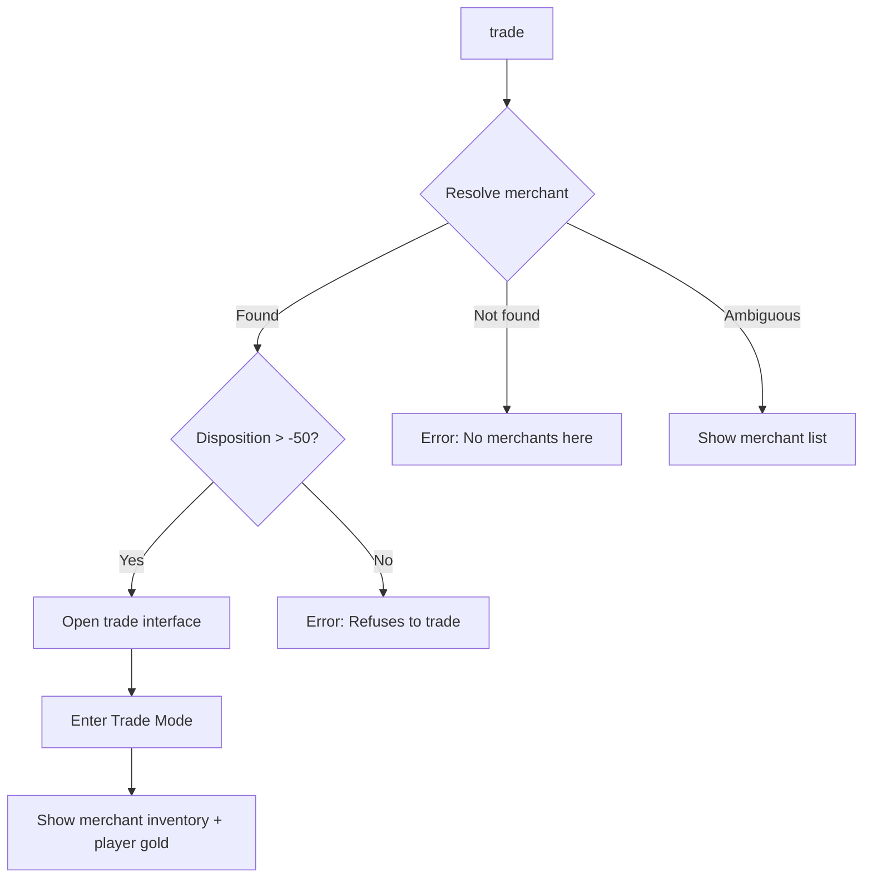
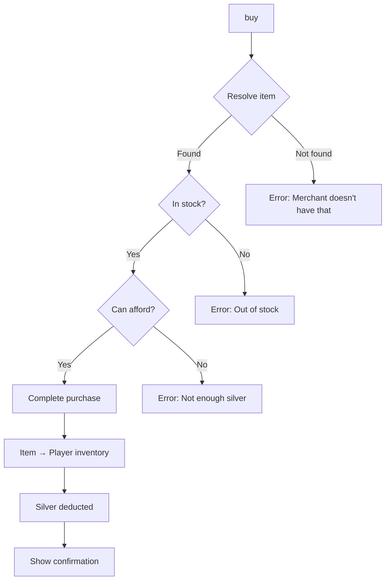
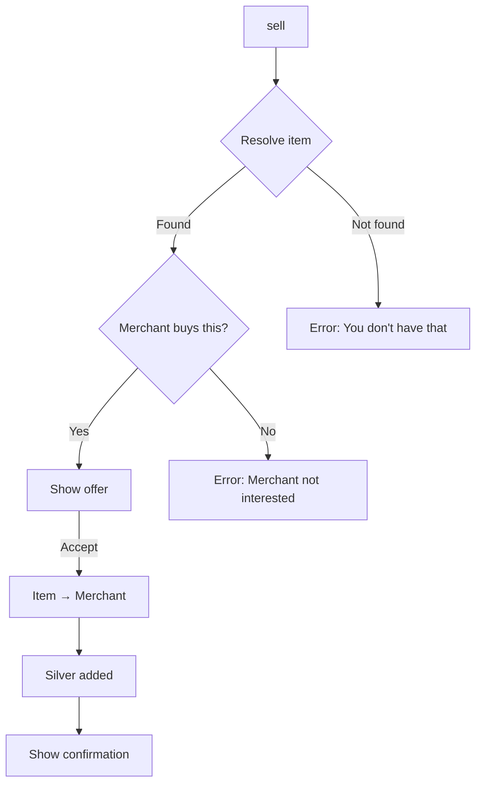
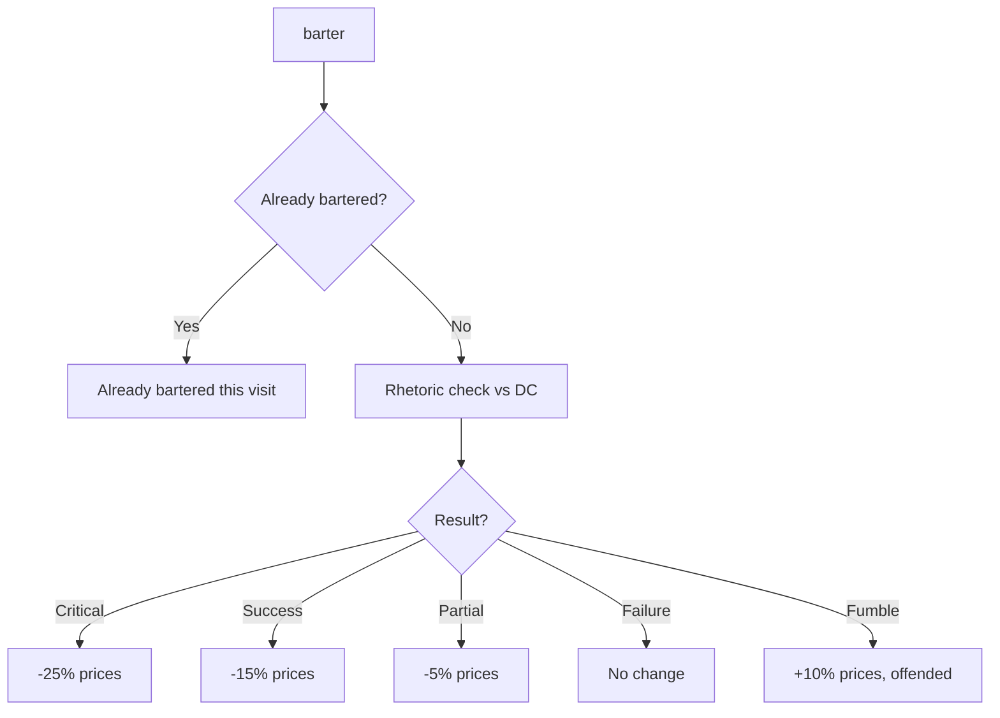

# Trade & Economy Commands

---

## Voice Guidance

> **See:** [SPEC-SYSTEM-INVENTORY-VOICE](../../04-systems/inventory-voice.md) for mandatory terminology.
>
> - Currency is called **Scrip** (₴), not "gold" or "coins"
> - Player inventory is the **Pack** or **Burden**
> - Use setting-appropriate language (salvage, scrap, draughts)

---

## Overview

Trade commands allow players to buy and sell goods with merchants, appraise item values, and manage economic interactions. Trading occurs at MerchantStall rooms in settlements or with wandering traders.

| Command | Aliases | Syntax | Context |
|---------|---------|--------|---------|
| `trade` | `shop`, `merchant` | `trade [npc]` | Exploration (merchant present) |
| `buy` | `purchase` | `buy <item> [quantity]` | Trade mode |
| `sell` | — | `sell <item> [quantity]` | Trade mode |
| `appraise` | `value`, `price` | `appraise <item>` | Trade mode, Exploration |
| `barter` | `haggle` | `barter` | Trade mode |

---

## 1. Trade

### 1.1 Syntax

```
trade
trade <merchant>
shop
```

### 1.2 Aliases

| Input | Resolves To |
|-------|-------------|
| `trade` | Open trade with nearest merchant |
| `trade kjartan` | `trade kjartan` |
| `shop` | `trade` |
| `merchant` | `trade` |

### 1.3 Context Requirements

| Condition | Required |
|-----------|----------|
| Context | Exploration only |
| Location | MerchantStall room or merchant NPC present |
| Disposition | Merchant not Hostile (disposition > -50) |
| Not in combat | Cannot trade during combat |

### 1.4 Behavior



### 1.5 Trade Interface

```
┌─────────────────────────────────────────────────────────────────────────┐
│  HP: 60/60 ██████████  Stamina: 100/100 ██████████                      │
├─────────────────────────────────────────────────────────────────────────┤
│  TRADING WITH: Kjartan — General Merchant                               │
│  Disposition: [Friendly] — Prices reduced by 10%                        │
│  Your Scrip: 342 ₴                                                      │
├─────────────────────────────┬───────────────────────────────────────────┤
│  MERCHANT'S WARES           │  YOUR PACK                                │
│  ─────────────────────────  │  ─────────────────────────────────────    │
│  [1] Rations ×10      15 ₴  │  [A] Iron Sword           →  45 ₴         │
│  [2] Clean Water ×5   10 ₴  │  [B] Leather Scraps ×8    →  16 ₴         │
│  [3] Torch ×3          6 ₴  │  [C] Mending Draught ×2   →  30 ₴         │
│  [4] Rope (50ft)      12 ₴  │  [D] Scrap Metal ×15      →  22 ₴         │
│  [5] Lockpicks ×3     25 ₴  │  [E] Rusted Key           →   5 ₴         │
│  [6] Medical Kit      80 ₴  │                                           │
│  [7] Iron Dagger      35 ₴  │                                           │
│                             │                                           │
│  [↓] More items...          │  [↓] More items...                        │
├─────────────────────────────┴───────────────────────────────────────────┤
│  → Selected: Rations ×10 (15 ₴)                                         │
│  Press number to buy, letter to sell, [B]arter, [Esc] to leave          │
├─────────────────────────────────────────────────────────────────────────┤
│  [Trade] > _                                                            │
└─────────────────────────────────────────────────────────────────────────┘
```

### 1.6 Examples

**Opening trade:**
```
> trade
  You approach Kjartan's stall.

  "Welcome, friend! See anything you like?"

  [Entering Trade Mode]

  KJARTAN'S GENERAL GOODS
  ═══════════════════════════════════════
  Your Scrip: 342 ₴
  Disposition: Friendly (-10% prices)
  ...
```

**Multiple merchants:**
```
> trade
  Multiple merchants available:
  [1] Kjartan — General Goods
  [2] Ragnhild — Apothecary
  [3] Ulf — Salvage Dealer

  Trade with whom? (1-3) > _
```

**Hostile merchant:**
```
> trade
  Kjartan eyes you with suspicion.
  "I don't deal with your kind. Get out of my shop."

  (Disposition: Hostile — improve reputation to trade)
```

### 1.7 Validation

| Condition | Error Message |
|-----------|---------------|
| No merchant | "There are no merchants here." |
| Hostile disposition | "'X' refuses to trade with you." |
| In combat | "Cannot trade during combat." |
| Shop closed | "'X' is not open for business right now." |

### 1.8 Events Raised

| Event | When | Payload |
|-------|------|---------|
| `TradeStartedEvent` | Trade mode entered | `MerchantId`, `MerchantName`, `PriceModifier` |
| `TradeEndedEvent` | Trade mode exited | `MerchantId`, `TotalBought`, `TotalSold` |

---

## 2. Buy

### 2.1 Syntax

```
buy <item>
buy <item> <quantity>
buy <number>
<number>
```

### 2.2 Context Requirements

| Condition | Required |
|-----------|----------|
| Context | Trade mode only |
| Sufficient funds | Player has enough silver |
| Item in stock | Merchant has item available |

### 2.3 Behavior



### 2.4 Price Modifiers

| Factor | Modifier |
|--------|----------|
| **Friendly disposition** | -10% price |
| **Neutral disposition** | Base price |
| **Unfriendly disposition** | +15% price |
| **Faction alignment** | -5% to -20% for allied factions |
| **Rhetoric skill** | -2% per rank |
| **Successful barter** | -10% to -25% (varies) |

### 2.5 Examples

**Standard purchase:**
```
[Trade] > buy rations
  Purchasing: Rations ×1
  Price: 15 ₴
  Your Scrip: 342 ₴ → 327 ₴

  Purchased: Rations ×1
```

**Quantity purchase:**
```
[Trade] > buy rations 5
  Purchasing: Rations ×5
  Price: 75 ₴ (15 ₴ each)
  Your Scrip: 342 ₴ → 267 ₴

  Purchased: Rations ×5
```

**Numbered selection:**
```
[Trade] > 3
  Purchasing: Torch ×1
  Price: 6 ₴

  Purchased: Torch ×1
```

**Insufficient funds:**
```
[Trade] > buy medical kit
  Medical Kit costs 80 ₴
  You only have 42 ₴ Scrip.

  Cannot afford this item.
```

### 2.6 Events Raised

| Event | When | Payload |
|-------|------|---------|
| `ItemPurchasedEvent` | Item bought | `ItemId`, `Quantity`, `TotalCost`, `MerchantId` |
| `ScripSpentEvent` | Scrip deducted | `Amount`, `NewBalance` |

---

## 3. Sell

### 3.1 Syntax

```
sell <item>
sell <item> <quantity>
sell <letter>
```

### 3.2 Context Requirements

| Condition | Required |
|-----------|----------|
| Context | Trade mode only |
| Item owned | Player has item in inventory |
| Merchant buys | Item in merchant's buy list |

### 3.3 Behavior



### 3.4 Sell Price Calculation

Sell prices are typically **40-60%** of buy price, modified by:

| Factor | Modifier |
|--------|----------|
| **Base sell rate** | 50% of buy price |
| **Friendly disposition** | +10% sell value |
| **Item condition** | -5% per 25% damage |
| **Merchant specialty** | +15% if matches category |
| **Glut (many in stock)** | -10% sell value |
| **Scarcity (low stock)** | +10% sell value |

### 3.5 Examples

**Standard sale:**
```
[Trade] > sell leather scraps
  Selling: Leather Scraps ×8
  Offer: 16 ₴ (2 ₴ each)

  Accept? (y/n) > y

  Sold: Leather Scraps ×8
  Your Scrip: 267 ₴ → 283 ₴
```

**Partial sale:**
```
[Trade] > sell scrap metal 10
  Selling: Scrap Metal ×10 (of 15)
  Offer: 15 ₴ (1.5 ₴ each)

  Accept? (y/n) > y

  Sold: Scrap Metal ×10
  Remaining in Pack: Scrap Metal ×5
```

**Merchant not interested:**
```
[Trade] > sell rusted key
  Kjartan examines the key and shakes his head.
  "I have no use for that. Try the salvage dealer."

  (Item not in merchant's buy list)
```

**Lettered selection:**
```
[Trade] > C
  Selling: Healing Salve ×2
  Offer: 30 ₴

  Accept? (y/n) > _
```

### 3.6 Events Raised

| Event | When | Payload |
|-------|------|---------|
| `ItemSoldEvent` | Item sold | `ItemId`, `Quantity`, `TotalValue`, `MerchantId` |
| `ScripEarnedEvent` | Scrip added | `Amount`, `NewBalance`, `Source` |

---

## 4. Appraise

### 4.1 Syntax

```
appraise <item>
value <item>
price <item>
```

### 4.2 Context Requirements

| Condition | Required |
|-----------|----------|
| Context | Trade mode OR Exploration |
| Item present | In inventory, on ground, or in merchant stock |

### 4.3 Behavior

Shows estimated value and relevant details:

```
> appraise iron sword
  APPRAISAL: Iron Sword
  ═══════════════════════════════════════
  Type: Weapon (One-Handed Sword)
  Condition: 85/100 (Good)
  Quality: Standard

  BASE VALUE: 90 ₴

  SELL ESTIMATES:
    General Merchant:   45 ₴ (50%)
    Weapons Dealer:     54 ₴ (60%, specialty)
    Salvage Dealer:     36 ₴ (40%, non-specialty)

  BUY PRICE (if available):
    General Merchant:   90 ₴
    Weapons Dealer:     81 ₴ (Friendly: -10%)

  Notes:
    - Condition reduces value by 7%
    - Standard quality, no modifiers
```

### 4.4 Appraise in Trade Mode

When in trade mode, appraise shows specific pricing for current merchant:

```
[Trade] > appraise iron sword
  APPRAISAL: Iron Sword (with Kjartan)
  ═══════════════════════════════════════
  Your item: Iron Sword (85/100 condition)

  Kjartan's Offer: 42 ₴
    Base value:     90 ₴
    Sell rate:      50%    =  45 ₴
    Condition:      -7%    =  -3 ₴
    ────────────────────────────
    Final offer:            42 ₴

  Sell to Kjartan? Use 'sell iron sword'
```

### 4.5 Events Raised

| Event | When | Payload |
|-------|------|---------|
| `ItemAppraisedEvent` | Item valued | `ItemId`, `BaseValue`, `SellEstimates` |

---

## 5. Barter

### 5.1 Syntax

```
barter
haggle
```

### 5.2 Context Requirements

| Condition | Required |
|-----------|----------|
| Context | Trade mode only |
| Rhetoric skill | Higher ranks improve success |
| Not already bartered | Once per transaction |

### 5.3 Behavior

Barter initiates a Rhetoric skill check to improve prices:



### 5.4 Barter DC

| Merchant Disposition | Base DC |
|----------------------|---------|
| Friendly | 8 |
| Neutral | 12 |
| Unfriendly | 16 |

### 5.5 Examples

**Successful barter:**
```
[Trade] > barter
  You attempt to negotiate better prices with Kjartan.

  Rhetoric Check: DC 8 (Friendly merchant)
  Modifiers:
    Rhetoric Rank 2:  +2d10
    Skald bonus:      +1d10

  Roll: [7, 9, 8, 6, 5] = 4 successes

  [SUCCESS] +2 over DC

  "Ah, you drive a hard bargain, friend. Very well."

  Prices improved by 15% for this visit!
  Buy prices: -15%
  Sell prices: +15%
```

**Failed barter:**
```
[Trade] > barter
  You attempt to negotiate better prices.

  Rhetoric Check: DC 12
  Roll: [4, 3, 5, 2] = 0 successes

  [FAILURE]

  Kjartan shrugs. "My prices are fair. Take it or leave it."

  Prices unchanged.
```

**Fumbled barter:**
```
[Trade] > barter
  You attempt to negotiate...

  Rhetoric Check: DC 12
  Roll: [1, 2, 1, 3] = 0 successes (Fumble!)

  [FUMBLE] 5+ under DC

  Kjartan's expression hardens.
  "You insult me with such offers. Prices just went up."

  Prices worsened by 10% for this visit.
  Disposition -5 with Kjartan
```

### 5.6 Barter Modifiers

| Factor | Effect |
|--------|--------|
| **Rhetoric rank** | +1d10 per rank |
| **Skald specialization** | +1d10 to social checks |
| **WILL attribute** | Base dice pool |
| **Prior relationship** | Affects DC |

### 5.7 Events Raised

| Event | When | Payload |
|-------|------|---------|
| `BarterAttemptedEvent` | Barter check made | `MerchantId`, `Success`, `PriceModifier` |
| `DispositionChangedEvent` | Fumble offends | `NpcId`, `Change`, `NewValue` |

---

## 6. Trade Mode Context

### 6.1 Available Commands in Trade Mode

| Command | Available | Notes |
|---------|-----------|-------|
| `buy <item>` | ✓ | Purchase from merchant |
| `sell <item>` | ✓ | Sell to merchant |
| `appraise <item>` | ✓ | Get item valuation |
| `barter` | ✓ | Negotiate prices (once) |
| `inventory` | ✓ | View your items |
| `1-9`, `a-z` | ✓ | Quick select items |
| `bye`, `leave`, `Esc` | ✓ | Exit trade mode |
| Navigation | ✗ | Cannot move while trading |
| Combat | ✗ | Not in combat |

### 6.2 Trade Help

```
[Trade] > help
  TRADE COMMANDS
  ═══════════════════════════════════════
  buy <item> [qty]    Purchase item(s)
  sell <item> [qty]   Sell item(s)
  appraise <item>     Check item value
  barter              Negotiate prices (once)
  inventory           View your items
  1-9                 Quick buy by number
  a-z                 Quick sell by letter
  leave / Esc         Exit trade

  TIPS:
  - Higher disposition = better prices
  - Specialty merchants pay more for matching items
  - Rhetoric skill improves barter success
  - Faction reputation affects all faction merchants
```

---

## 7. Merchant Categories

Different merchant types have different inventories and buy preferences:

| Category | Sells | Buys | Price Bonus |
|----------|-------|------|-------------|
| **General** | Consumables, tools, common goods | Most items | None |
| **Weapons** | Weapons, ammunition | Weapons only | +10% for weapons |
| **Armor** | Armor, shields, clothing | Armor only | +10% for armor |
| **Alchemy** | Potions, reagents, ingredients | Alchemy items | +15% for potions |
| **Salvage** | Components, scrap, materials | Raw materials | +20% for scrap |
| **Specialty** | Rare items, faction goods | Specific items | Varies |

---

## 8. Currency

### 8.1 Currency Types

> **Voice:** Currency is called **Scrip**, not "gold", "silver", or "coins". This reflects the post-Glitch economy of salvage and barter.

| Currency | Symbol | Value | Common Use |
|----------|--------|-------|------------|
| **Scrip** | ₴ | 1 | Standard currency |
| **High Scrip** | ₲ | 100 ₴ | Large transactions |
| **Faction Tokens** | Various | Varies | Faction-specific rewards |

### 8.2 Currency Commands

```
> scrip
  YOUR FUNDS
  ═══════════════════════════════════════
  Scrip: 342 ₴

  Faction Tokens:
    Midgard Combine: 15 MC
    Rust-Clans: 0 RC
    Dvergr Hegemony: 3 DH
```

**Aliases:** `money`, `funds`, `scrip`

---

## 9. Implementation Status

| Command | File Path | Status |
|---------|-----------|--------|
| `trade` | `RuneAndRust.Engine/Commands/TradeCommand.cs` | ❌ Planned |
| `buy` | `RuneAndRust.Engine/Commands/BuyCommand.cs` | ❌ Planned |
| `sell` | `RuneAndRust.Engine/Commands/SellCommand.cs` | ❌ Planned |
| `appraise` | `RuneAndRust.Engine/Commands/AppraiseCommand.cs` | ❌ Planned |
| `barter` | `RuneAndRust.Engine/Commands/BarterCommand.cs` | ❌ Planned |
| TradeService | `RuneAndRust.Engine/Services/TradeService.cs` | ❌ Planned |

---

## 10. Service Interface

```csharp
public interface ITradeService
{
    /// <summary>Opens trade with a merchant.</summary>
    TradeSession StartTrade(Character character, Npc merchant);

    /// <summary>Purchases item(s) from merchant.</summary>
    PurchaseResult Buy(TradeSession session, string itemId, int quantity);

    /// <summary>Sells item(s) to merchant.</summary>
    SaleResult Sell(TradeSession session, string itemId, int quantity);

    /// <summary>Gets appraisal for an item.</summary>
    Appraisal AppraiseItem(Item item, Npc? merchant = null);

    /// <summary>Attempts to barter for better prices.</summary>
    BarterResult AttemptBarter(TradeSession session, Character character);

    /// <summary>Calculates buy price with all modifiers.</summary>
    int CalculateBuyPrice(Npc merchant, Item item, Character buyer);

    /// <summary>Calculates sell price with all modifiers.</summary>
    int CalculateSellPrice(Npc merchant, Item item, Character seller);

    /// <summary>Ends trade session.</summary>
    void EndTrade(TradeSession session);
}

public record TradeSession(
    string SessionId,
    Npc Merchant,
    Character Customer,
    decimal PriceModifier,
    bool HasBartered,
    IReadOnlyList<MerchantItem> MerchantInventory
);

public record MerchantItem(
    string ItemId,
    string Name,
    int Quantity,
    int BuyPrice,
    bool InStock
);

public record Appraisal(
    Item Item,
    int BaseValue,
    int Condition,
    Dictionary<string, int> SellEstimates,
    Dictionary<string, int> BuyEstimates
);

public record BarterResult(
    bool Success,
    int Margin,
    decimal PriceModifier,
    int? DispositionChange
);
```

---

## 11. Related Specifications

| Document | Relationship |
|----------|--------------|
| [settlements.md](../../07-environment/settlements.md) | MerchantStall room archetype |
| [faction-reputation.md](../../02-entities/faction-reputation.md) | Disposition and faction pricing |
| [inventory.md](inventory.md) | Item management commands |
| [dialogue.md](dialogue.md) | Trade through dialogue outcomes |
| [parser.md](parser.md) | Grammar rules for commands |

---

## 12. Changelog

| Version | Date | Changes |
|---------|------|---------|
| 1.0 | 2025-12-14 | Initial specification |
