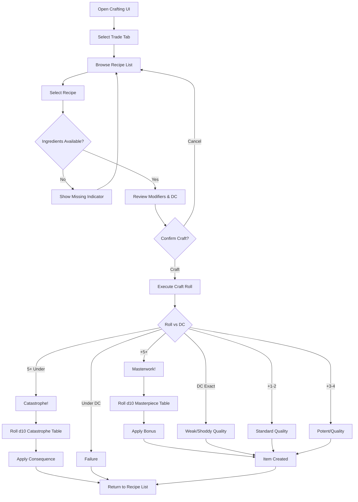
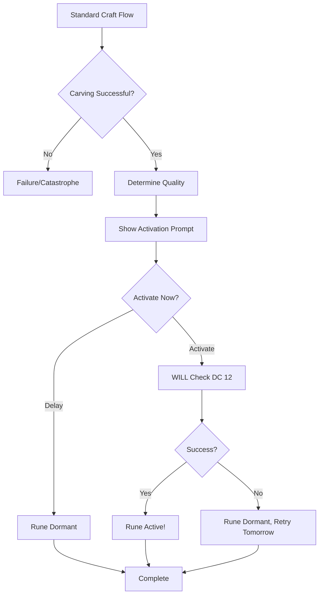

# Crafting UI — Unified Interface Specification

> *"Four trades, one workbench. The hands change, but the rhythm of making remains."*

---

## 1. Overview

This specification defines a **unified crafting interface** that serves all four crafting trades: Bodging, Alchemy, Runeforging, and Field Medicine. The trades share identical mechanical patterns (DC calculation, quality tiers, masterpiece/catastrophe tables), enabling a single UI system with conditional trade-specific elements.

### 1.1 Identity Table

| Property | Value |
|----------|-------|
| Spec ID | `SPEC-UI-CRAFTING` |
| Category | UI System |
| Priority | Should-Have |
| Status | Draft |

### 1.2 Design Pillars

- **Unified Experience** — One crafting interface serves all trades
- **Information Clarity** — Show all modifiers and their sources transparently
- **Feedback Rich** — Clear success/failure feedback with quality indication
- **Trade Awareness** — Conditional elements for trade-specific mechanics

---

## 2. Trade Consistency Matrix

All four trades share these mechanical patterns:

| Aspect | Bodging | Alchemy | Runeforging | Field Medicine |
|--------|---------|---------|-------------|----------------|
| **Governing Attribute** | WITS | WITS | WITS + WILL | WITS |
| **Quality Tier Names** | Shoddy/Standard/Quality/Masterwork | Weak/Standard/Potent/Masterwork | Flawed/Standard/Potent/Masterwork | Weak/Standard/Potent/Masterwork |
| **Quality Thresholds** | DC / +1-2 / +3-4 / +5+ | DC / +1-2 / +3-4 / +5+ | DC / +1-2 / +3-4 / +5+ | DC / +1-2 / +3-4 / +5+ |
| **Masterpiece Trigger** | 5+ over DC | 5+ over DC | 5+ over DC | 5+ over DC |
| **Catastrophe Trigger** | 5+ under DC | 5+ under DC | 5+ under DC | 5+ under DC |
| **Tool Modifier Range** | -4 to +4 | -4 to +4 | -4 to +4 | -2 to +4 |
| **Knowledge Modifier Range** | -2 to +8 | -2 to +8 | -2 to +8 | -2 to +4 |

### 2.1 Trade-Specific Differences

| Trade | Unique UI Element | Conditional Display |
|-------|-------------------|---------------------|
| **Bodging** | Repair mode | Show when repairing equipment |
| **Alchemy** | Shelf life display | Show on output preview |
| **Alchemy** | [Glitched] chaos warning | Show when using [Glitched] ingredients |
| **Runeforging** | Activation step (WILL) | Show after carving phase |
| **Runeforging** | Corruption risk warning | Always show for runeforging |
| **Field Medicine** | Location restriction | Show campfire/lab requirement |

---

## 3. Screen Layout

### 3.1 TUI Layout — Crafting Mode

```
┌─────────────────────────────────────────────────────────────────────────┐
│  HP: 60/60 ██████████  Stamina: 100/100 ██████████                      │
├─────────────────────────────────────────────────────────────────────────┤
│  CRAFTING — [Bodging] [Alchemy] [Runeforging] [Medicine]                │
├───────────────────────────────────────────┬─────────────────────────────┤
│  RECIPES                                  │  DETAILS                    │
│  ─────────────────────────────────────    │  ─────────────────────────  │
│  [Known] Healing Poultice          DC 12  │  Healing Poultice           │
│  [Known] Strong Healer             DC 16  │                             │
│  [Known] Antidote                  DC 16  │  Base DC: 12                │
│  [???] Miracle Tincture            DC 24  │  Time: 1 hour               │
│  [???] Trauma Purge                DC 22  │                             │
│                                           │  MODIFIERS:                 │
│                                           │   Tools (full kit)    -2    │
│                                           │   Knowledge (taught)  -2    │
│                                           │   Fresh ingredients   -2    │
│                                           │   ────────────────────────  │
│                                           │   Final DC: 6               │
│                                           │                             │
│                                           │  INPUTS:                    │
│                                           │   • Red Moss ×2    ✓ (5)    │
│                                           │   • Fat ×1         ✓ (3)    │
│                                           │   • Water ×1       ✓        │
│                                           │                             │
│                                           │  OUTPUT:                    │
│                                           │   Heals 2d6 + WITS HP       │
├───────────────────────────────────────────┴─────────────────────────────┤
│  → Selected: Healing Poultice (Alchemy)                                 │
│  ◆ All ingredients available. Ready to craft.                           │
├─────────────────────────────────────────────────────────────────────────┤
│  [1] ↑/↓ select  [2] Tab trade  [3] Enter craft  [4] Esc back           │
├─────────────────────────────────────────────────────────────────────────┤
│  [Crafting] > _                                                         │
└─────────────────────────────────────────────────────────────────────────┘
```

### 3.2 Panel Definitions

| Panel | Purpose | Contents |
|-------|---------|----------|
| **Trade Tabs** | Switch between crafting trades | 4 tabs: Bodging, Alchemy, Runeforging, Medicine |
| **Recipe List** | Browse available recipes | Known recipes (named), Unknown (???), DC, category |
| **Details Panel** | Show selected recipe info | DC breakdown, time, inputs, output |
| **Modifier Breakdown** | Explain DC calculation | Line-by-line modifier sources |
| **Ingredient Checklist** | Show material availability | Required items, quantities, have/need |
| **Activity Log** | Crafting feedback | Process messages, results |
| **Command Panel** | Available actions | Context-sensitive commands |

---

## 4. UI Components

### 4.1 Trade Tab Bar

```
┌─────────────────────────────────────────────────────────────────────────┐
│  CRAFTING — [Bodging] [Alchemy] [Runeforging] [Medicine]                │
└─────────────────────────────────────────────────────────────────────────┘
```

| Element | Behavior |
|---------|----------|
| **Active Tab** | Highlighted, shows current trade |
| **Inactive Tabs** | Dimmed, clickable/Tab-selectable |
| **Keyboard** | `Tab` cycles trades, `1-4` direct select |
| **Disabled Tab** | Grayed out if character lacks specialization access |

### 4.2 Recipe List Panel

```
┌───────────────────────────────────────────┐
│  RECIPES                     [Filter: All]│
│  ─────────────────────────────────────    │
│  [Known] Healing Poultice          DC 12  │
│  [Known] Strong Healer             DC 16  │
│  [Known] Antidote                  DC 16  │
│  [???] Miracle Tincture            DC 24  │
│  [???] Trauma Purge                DC 22  │
│                                           │
│                        [5 recipes, 3 known]│
└───────────────────────────────────────────┘
```

| Element | Display |
|---------|---------|
| **Known Recipe** | `[Known] Recipe Name` — Full name visible |
| **Unknown Recipe** | `[???] ????????????` — Name hidden until learned |
| **DC Display** | Base DC shown (not modified) |
| **Can Craft Indicator** | Green checkmark if all ingredients available |
| **Filter Options** | All / Craftable / Known / By Category |
| **Selection** | Arrow keys / mouse click |

### 4.3 Modifier Breakdown Panel

```
┌─────────────────────────────────────┐
│  MODIFIERS                          │
│  ─────────────────────────────────  │
│  Base DC:                    12     │
│  Tools (full workshop):      -4     │
│  Knowledge (master taught):  -2     │
│  Fresh ingredients:          -2     │
│  Rushing (half time):        +4     │
│  ────────────────────────────────   │
│  Final DC:                    8     │
│                                     │
│  Roll needed: 8+ on WITS (6d10)     │
│  Success chance: ~82%               │
└─────────────────────────────────────┘
```

| Element | Source |
|---------|--------|
| **Base DC** | Recipe definition |
| **Tool Modifier** | Workshop (-4) / Full tools (-2) / Improvised (+0) / None (+4) |
| **Knowledge Modifier** | Master (-2) / Casual (+0) / Notes (+2) / Memory (+4) / Experiment (+8) |
| **Material Modifier** | Fresh (-2) / Standard (+0) / Old (+2) / Degraded (+4) |
| **Situation Modifier** | Clean (-1) / Standard (+0) / Dirty (+1) / Hostile (+2) / Rushing (+4) |
| **Specialization Modifier** | Relevant spec (-2) |
| **Final DC** | Sum of all modifiers |
| **Success Chance** | Calculated probability display |

### 4.4 Ingredient Checklist Panel

```
┌─────────────────────────────────────┐
│  INPUTS REQUIRED                    │
│  ─────────────────────────────────  │
│  ✓ Red Moss ×2         (have: 5)   │
│  ✓ Fat ×1              (have: 3)   │
│  ✓ Water ×1            (have: ∞)   │
│  ─────────────────────────────────  │
│  ◆ All ingredients available        │
└─────────────────────────────────────┘
```

**Missing Ingredient Display:**
```
│  ✗ Rare Herbs ×2       (have: 0)   │
│  ─────────────────────────────────  │
│  ⚠ Missing 1 ingredient type        │
```

| Symbol | Meaning |
|--------|---------|
| `✓` | Ingredient available in sufficient quantity |
| `✗` | Ingredient missing or insufficient |
| `◆` | All requirements met |
| `⚠` | Missing requirements |
| `(have: N)` | Current inventory count |
| `(have: ∞)` | Unlimited resource (water at well, etc.) |

### 4.5 Output Preview Panel

```
┌─────────────────────────────────────┐
│  OUTPUT                             │
│  ─────────────────────────────────  │
│  Healing Poultice                   │
│  Type: Consumable (Healing)         │
│                                     │
│  Effect: Heals 2d6 + WITS HP        │
│  Duration: Instant                  │
│  Shelf Life: 1 week                 │
│                                     │
│  Quality scaling:                   │
│   Weak: -25% healing                │
│   Standard: Normal                  │
│   Potent: +25% healing              │
│   Masterwork: +50% + bonus          │
└─────────────────────────────────────┘
```

---

## 5. Trade-Specific Conditional Elements

### 5.1 Runeforging: Corruption Warning

When `SelectedTrade == Runeforging`, display:

```
┌─────────────────────────────────────┐
│  ⚠ RUNEFORGING WARNING              │
│  ─────────────────────────────────  │
│  Catastrophic failure causes:       │
│   • Corruption gain (+2)            │
│   • Psychic damage (3d10)           │
│   • Possible trauma                 │
│                                     │
│  Rúnasmiðr specialization halves    │
│  corruption from failures.          │
└─────────────────────────────────────┘
```

### 5.2 Runeforging: Activation Step

After successful carving, show activation UI:

```
┌─────────────────────────────────────────────────────────────────────────┐
│  RUNE CARVED — Activation Required                                      │
├─────────────────────────────────────────────────────────────────────────┤
│  ╔═══════════════════════════════════════════════════════════════════╗  │
│  ║  ᚦ Thurisaz inscribed on Iron Axe                                 ║  │
│  ║                                                                   ║  │
│  ║  Carving Quality: Potent (+50% effect)                            ║  │
│  ║                                                                   ║  │
│  ║  ACTIVATION CHECK                                                 ║  │
│  ║  ─────────────────────────────────────────────────────────────    ║  │
│  ║  Attribute: WILL                                                  ║  │
│  ║  DC: 12                                                           ║  │
│  ║  Your WILL: 5 (5d10)                                              ║  │
│  ║                                                                   ║  │
│  ║  [Activate Now]  [Delay Until Tomorrow]                           ║  │
│  ╚═══════════════════════════════════════════════════════════════════╝  │
└─────────────────────────────────────────────────────────────────────────┘
```

### 5.3 Alchemy: [Glitched] Ingredient Warning

When recipe includes [Glitched] ingredients:

```
┌─────────────────────────────────────┐
│  ⚠ [GLITCHED] INGREDIENT            │
│  ─────────────────────────────────  │
│  Blight Bloom is [Glitched].        │
│  Unpredictable results possible.    │
│                                     │
│  Chaos Table (d10):                 │
│   1: Toxic (2d10 poison)            │
│   2-3: Inert (no effect)            │
│   4-5: Hallucinations               │
│   6-7: Normal                       │
│   8-9: Potent (+50%)                │
│   10: Miraculous (double)           │
│                                     │
│  [Proceed Anyway]  [Cancel]         │
└─────────────────────────────────────┘
```

### 5.4 Alchemy: Shelf Life Display

Show on output preview for alchemy:

```
│  Shelf Life: 1 week                 │
│  ⚠ Spoils after 2025-12-21          │
```

### 5.5 Field Medicine: Location Restriction

When recipe has location requirements:

```
┌─────────────────────────────────────┐
│  ⚠ LOCATION REQUIRED                │
│  ─────────────────────────────────  │
│  Stabilizing Draught requires:      │
│   Alchemist's Lab                   │
│                                     │
│  Current location: Campfire         │
│  Status: CANNOT CRAFT HERE          │
│                                     │
│  Available at Campfire:             │
│   • Basic recipes                   │
│   • Standard recipes                │
└─────────────────────────────────────┘
```

### 5.6 Bodging: Repair Mode

When repairing equipment (not crafting new):

```
┌─────────────────────────────────────────────────────────────────────────┐
│  REPAIR MODE — Iron Axe                                                 │
├─────────────────────────────────────────────────────────────────────────┤
│  CURRENT CONDITION                  │  REPAIR DETAILS                   │
│  ─────────────────────────────────  │  ─────────────────────────────    │
│  Durability: 3/10 (Severe)          │  Damage Level: Severe             │
│  ████░░░░░░░░░░░░░░░░               │  DC: 16                           │
│                                     │  Time: 1+ hours                   │
│  Damage Type: Structural            │                                   │
│  Repairable: Yes                    │  MATERIALS NEEDED:                │
│                                     │   • Scrap Metal ×5                │
│                                     │   • Leather ×3                    │
│                                     │   • Specialty (rivets) ×2         │
│                                     │                                   │
│                                     │  RESULT:                          │
│                                     │   Restores to 10/10 durability    │
├─────────────────────────────────────┴───────────────────────────────────┤
│  [1] Repair  [2] Cancel  [3] View Item                                  │
└─────────────────────────────────────────────────────────────────────────┘
```

---

## 6. Crafting Process Flow

### 6.1 Standard Crafting Flow



### 6.2 Runeforging Extended Flow



---

## 7. Result Display

### 7.1 Success Display

```
┌─────────────────────────────────────────────────────────────────────────┐
│  ★ CRAFTING SUCCESS                                                     │
├─────────────────────────────────────────────────────────────────────────┤
│                                                                         │
│     ╔═══════════════════════════════════════════════════════════╗       │
│     ║                                                           ║       │
│     ║   Created: Healing Poultice                               ║       │
│     ║   Quality: POTENT                                         ║       │
│     ║                                                           ║       │
│     ║   Effect: Heals 2d6+6 HP (+25%)                           ║       │
│     ║                                                           ║       │
│     ║   Materials consumed:                                     ║       │
│     ║    • Red Moss ×2                                          ║       │
│     ║    • Fat ×1                                               ║       │
│     ║    • Water ×1                                             ║       │
│     ║                                                           ║       │
│     ╚═══════════════════════════════════════════════════════════╝       │
│                                                                         │
│                          [Continue]                                     │
└─────────────────────────────────────────────────────────────────────────┘
```

### 7.2 Masterpiece Display

```
┌─────────────────────────────────────────────────────────────────────────┐
│  ★★★ MASTERPIECE! ★★★                                                   │
├─────────────────────────────────────────────────────────────────────────┤
│                                                                         │
│     ╔═══════════════════════════════════════════════════════════╗       │
│     ║                                                           ║       │
│     ║   Created: Healing Poultice                               ║       │
│     ║   Quality: MASTERWORK                                     ║       │
│     ║                                                           ║       │
│     ║   Effect: Heals 2d6+6 HP (+50%)                           ║       │
│     ║                                                           ║       │
│     ║   MASTERPIECE BONUS (d10 → 3):                            ║       │
│     ║   Long-Lasting — Duration doubled                         ║       │
│     ║                                                           ║       │
│     ║   ◆ First masterpiece of this recipe!                     ║       │
│     ║     Recipe DC permanently reduced by 1.                   ║       │
│     ║                                                           ║       │
│     ╚═══════════════════════════════════════════════════════════╝       │
│                                                                         │
│                          [Continue]                                     │
└─────────────────────────────────────────────────────────────────────────┘
```

### 7.3 Failure Display

```
┌─────────────────────────────────────────────────────────────────────────┐
│  ✗ CRAFTING FAILED                                                      │
├─────────────────────────────────────────────────────────────────────────┤
│                                                                         │
│     ╔═══════════════════════════════════════════════════════════╗       │
│     ║                                                           ║       │
│     ║   Recipe: Healing Poultice                                ║       │
│     ║   Result: FAILURE                                         ║       │
│     ║                                                           ║       │
│     ║   Roll: 2 successes vs DC 6                               ║       │
│     ║   Margin: -4 (Failure by 4)                               ║       │
│     ║                                                           ║       │
│     ║   Materials LOST:                                         ║       │
│     ║    • Red Moss ×2                                          ║       │
│     ║    • Fat ×1                                               ║       │
│     ║    • Water ×1                                             ║       │
│     ║                                                           ║       │
│     ║   Cannot retry this recipe today.                         ║       │
│     ║                                                           ║       │
│     ╚═══════════════════════════════════════════════════════════╝       │
│                                                                         │
│                          [Continue]                                     │
└─────────────────────────────────────────────────────────────────────────┘
```

### 7.4 Catastrophe Display

```
┌─────────────────────────────────────────────────────────────────────────┐
│  ✗✗✗ CATASTROPHIC FAILURE! ✗✗✗                                          │
├─────────────────────────────────────────────────────────────────────────┤
│                                                                         │
│     ╔═══════════════════════════════════════════════════════════╗       │
│     ║                                                           ║       │
│     ║   Recipe: Healing Poultice                                ║       │
│     ║   Result: CATASTROPHE                                     ║       │
│     ║                                                           ║       │
│     ║   Roll: 0 successes vs DC 6                               ║       │
│     ║   Margin: -6 (Catastrophic!)                              ║       │
│     ║                                                           ║       │
│     ║   CATASTROPHE (d10 → 5):                                  ║       │
│     ║   Stench — Nauseating smell fills the area.               ║       │
│     ║   Workspace unusable for 4 hours.                         ║       │
│     ║                                                           ║       │
│     ║   Materials LOST:                                         ║       │
│     ║    • Red Moss ×2                                          ║       │
│     ║    • Fat ×1                                               ║       │
│     ║    • Water ×1                                             ║       │
│     ║                                                           ║       │
│     ╚═══════════════════════════════════════════════════════════╝       │
│                                                                         │
│                          [Continue]                                     │
└─────────────────────────────────────────────────────────────────────────┘
```

---

## 8. GUI Specification

### 8.1 CraftingViewModel

```csharp
public class CraftingViewModel : ViewModelBase
{
    // Trade selection
    private CraftingTrade _selectedTrade;
    public CraftingTrade SelectedTrade
    {
        get => _selectedTrade;
        set => this.RaiseAndSetIfChanged(ref _selectedTrade, value);
    }

    // Recipe browsing
    public ObservableCollection<RecipeDisplay> AvailableRecipes { get; }

    private RecipeDisplay? _selectedRecipe;
    public RecipeDisplay? SelectedRecipe
    {
        get => _selectedRecipe;
        set => this.RaiseAndSetIfChanged(ref _selectedRecipe, value);
    }

    // Modifier breakdown (auto-calculated)
    private ModifierBreakdownDisplay? _modifierBreakdown;
    public ModifierBreakdownDisplay? ModifierBreakdown
    {
        get => _modifierBreakdown;
        private set => this.RaiseAndSetIfChanged(ref _modifierBreakdown, value);
    }

    // Ingredient status
    public ObservableCollection<IngredientStatusDisplay> IngredientStatus { get; }

    // Computed properties
    public bool CanCraft => SelectedRecipe != null
        && IngredientStatus.All(i => i.IsAvailable)
        && MeetsLocationRequirement;

    public bool MeetsLocationRequirement =>
        _craftingService.CanCraftAtLocation(SelectedRecipe?.RecipeId, CurrentLocation);

    // Trade-specific conditionals
    public bool ShowCorruptionWarning => SelectedTrade == CraftingTrade.Runeforging;
    public bool ShowGlitchedWarning => IngredientStatus.Any(i => i.IsGlitched);
    public bool ShowShelfLife => SelectedTrade == CraftingTrade.Alchemy;
    public bool ShowLocationRestriction => SelectedTrade == CraftingTrade.FieldMedicine;
    public bool IsRepairMode { get; set; }

    // Commands
    public ReactiveCommand<Unit, Unit> CraftCommand { get; }
    public ReactiveCommand<CraftingTrade, Unit> SelectTradeCommand { get; }
    public ReactiveCommand<RecipeDisplay, Unit> SelectRecipeCommand { get; }
    public ReactiveCommand<Unit, Unit> CancelCommand { get; }

    // Runeforging-specific
    public ReactiveCommand<Unit, Unit> ActivateRuneCommand { get; }
    public ReactiveCommand<Unit, Unit> DelayActivationCommand { get; }
}
```

### 8.2 Display Records

```csharp
public record RecipeDisplay(
    string RecipeId,
    string DisplayName,
    bool IsKnown,
    int BaseDc,
    string Category,
    CraftingTrade Trade,
    bool CanCraft
);

public record ModifierBreakdownDisplay(
    int BaseDc,
    IReadOnlyList<ModifierLine> Modifiers,
    int FinalDc,
    int DicePool,
    double SuccessChance
);

public record ModifierLine(
    string Source,
    int Modifier,
    string Description
);

public record IngredientStatusDisplay(
    string IngredientId,
    string DisplayName,
    int Required,
    int Available,
    bool IsAvailable,
    bool IsGlitched
);

public record CraftingResultDisplay(
    bool Success,
    CraftQuality Quality,
    string ItemName,
    string EffectDescription,
    string? MasterpieceBonus,
    string? CatastropheEffect,
    IReadOnlyList<string> MaterialsConsumed
);
```

### 8.3 CraftingView Layout (AXAML Sketch)

```xml
<UserControl x:Class="RuneAndRust.DesktopUI.Views.CraftingView">
    <Grid RowDefinitions="Auto,*,Auto">

        <!-- Trade Tabs -->
        <TabControl Grid.Row="0"
                    SelectedIndex="{Binding SelectedTradeIndex}">
            <TabItem Header="Bodging" />
            <TabItem Header="Alchemy" />
            <TabItem Header="Runeforging" />
            <TabItem Header="Medicine" />
        </TabControl>

        <!-- Main Content -->
        <Grid Grid.Row="1" ColumnDefinitions="*,*">

            <!-- Recipe List -->
            <Border Grid.Column="0" Classes="panel">
                <DockPanel>
                    <TextBlock DockPanel.Dock="Top" Text="RECIPES" Classes="header" />
                    <ListBox ItemsSource="{Binding AvailableRecipes}"
                             SelectedItem="{Binding SelectedRecipe}">
                        <ListBox.ItemTemplate>
                            <DataTemplate>
                                <Grid ColumnDefinitions="Auto,*,Auto">
                                    <TextBlock Grid.Column="0"
                                               Text="{Binding KnownIndicator}" />
                                    <TextBlock Grid.Column="1"
                                               Text="{Binding DisplayName}" />
                                    <TextBlock Grid.Column="2"
                                               Text="{Binding DcDisplay}" />
                                </Grid>
                            </DataTemplate>
                        </ListBox.ItemTemplate>
                    </ListBox>
                </DockPanel>
            </Border>

            <!-- Details Panel -->
            <ScrollViewer Grid.Column="1">
                <StackPanel>
                    <!-- Recipe Details -->
                    <controls:RecipeDetailsPanel
                        Recipe="{Binding SelectedRecipe}" />

                    <!-- Modifier Breakdown -->
                    <controls:ModifierBreakdownPanel
                        Breakdown="{Binding ModifierBreakdown}" />

                    <!-- Ingredients -->
                    <controls:IngredientChecklistPanel
                        Ingredients="{Binding IngredientStatus}" />

                    <!-- Trade-Specific Warnings -->
                    <controls:CorruptionWarningPanel
                        IsVisible="{Binding ShowCorruptionWarning}" />
                    <controls:GlitchedWarningPanel
                        IsVisible="{Binding ShowGlitchedWarning}" />
                    <controls:LocationRestrictionPanel
                        IsVisible="{Binding ShowLocationRestriction}" />

                    <!-- Craft Button -->
                    <Button Content="Craft"
                            Command="{Binding CraftCommand}"
                            IsEnabled="{Binding CanCraft}" />
                </StackPanel>
            </ScrollViewer>

        </Grid>

        <!-- Activity Log -->
        <controls:ActivityLogPanel Grid.Row="2" />

    </Grid>
</UserControl>
```

---

## 9. Service Interface Extensions

### 9.1 ICraftingService UI Methods

```csharp
public interface ICraftingService
{
    // === Existing Core Methods ===
    CraftingResult CraftItem(Character character, string recipeId, List<Ingredient> materials);
    bool KnowsRecipe(Character character, string recipeId);
    void LearnRecipe(Character character, string recipeId, LearningMethod method);
    int CalculateDc(Character character, Recipe recipe);

    // === UI-Focused Additions ===

    /// <summary>
    /// Get detailed breakdown of all DC modifiers for UI display.
    /// </summary>
    ModifierBreakdown GetModifierBreakdown(Character character, Recipe recipe);

    /// <summary>
    /// Get availability status of all ingredients for a recipe.
    /// </summary>
    IReadOnlyList<IngredientStatus> GetIngredientStatus(Character character, Recipe recipe);

    /// <summary>
    /// Get final calculated DC after all modifiers.
    /// </summary>
    int GetFinalDc(Character character, Recipe recipe);

    /// <summary>
    /// Calculate success probability for UI display.
    /// </summary>
    double GetSuccessProbability(Character character, Recipe recipe);

    /// <summary>
    /// Check if recipe can be crafted at current location.
    /// </summary>
    bool CanCraftAtLocation(string recipeId, LocationType location);

    /// <summary>
    /// Get all recipes for a trade, including unknown (for UI browsing).
    /// </summary>
    IReadOnlyList<RecipeSummary> GetRecipesForTrade(CraftingTrade trade, Character character);

    /// <summary>
    /// Check if character has required specialization for trade.
    /// </summary>
    bool HasTradeAccess(Character character, CraftingTrade trade);
}

public record ModifierBreakdown(
    int BaseDc,
    IReadOnlyList<ModifierEntry> Modifiers,
    int FinalDc
);

public record ModifierEntry(
    string Source,
    int Value,
    ModifierCategory Category
);

public enum ModifierCategory
{
    Tool,
    Knowledge,
    Material,
    Situation,
    Specialization,
    Other
}

public record IngredientStatus(
    string IngredientId,
    string Name,
    int Required,
    int Available,
    bool IsSufficient,
    bool IsGlitched
);

public record RecipeSummary(
    string RecipeId,
    string Name,
    int BaseDc,
    CraftingTrade Trade,
    string Category,
    bool IsKnown,
    bool CanCraft
);
```

### 9.2 Trade-Specific Service Extensions

```csharp
// Runeforging extension
public interface IRuneforgingService : ICraftingService
{
    CraftingResult InscribeRune(Character character, Item item, Rune rune);
    ActivationResult ActivateRune(Character character, Item inscribedItem);
    bool IsRuneDormant(Item item);
    int GetCorruptionRisk(Character character, Rune rune);
}

// Bodging extension
public interface IBodgingService : ICraftingService
{
    RepairResult AttemptRepair(Character character, Item item);
    RepairAssessment AssessRepair(Item item);
    bool CanRepair(Item item);
}

// Field Medicine extension
public interface IFieldMedicineService : ICraftingService
{
    bool CanCraftAtLocation(Recipe recipe, LocationType location);
    IReadOnlyList<Recipe> GetRecipesAvailableAtLocation(LocationType location);
}
```

---

## 10. Activity Log Integration

### 10.1 Crafting Log Events

| Event | Type | Message Format |
|-------|------|----------------|
| Craft Start | Info | `→ Crafting {RecipeName}...` |
| Roll Result | Debug | `Roll: {Successes} vs DC {DC}` |
| Success | Info | `★ Created {ItemName} ({Quality})` |
| Masterpiece | Info | `★★★ MASTERPIECE! Bonus: {Bonus}` |
| Failure | Warning | `✗ Crafting failed. Materials lost.` |
| Catastrophe | Error | `✗✗✗ CATASTROPHE! {Effect}` |
| Material Consumed | Debug | `Consumed: {Material} ×{Count}` |
| Recipe Learned | Info | `◆ Learned recipe: {RecipeName}` |

### 10.2 Activity Log Subscriber

```csharp
public class CraftingActivityLogSubscriber
{
    private readonly IActivityLog _activityLog;

    public CraftingActivityLogSubscriber(IEventBus eventBus, IActivityLog activityLog)
    {
        _activityLog = activityLog;

        eventBus.Subscribe<CraftingStartedEvent>(OnCraftingStarted);
        eventBus.Subscribe<CraftingCompletedEvent>(OnCraftingCompleted);
        eventBus.Subscribe<CraftingFailedEvent>(OnCraftingFailed);
        eventBus.Subscribe<CatastropheOccurredEvent>(OnCatastrophe);
        eventBus.Subscribe<MasterpieceCreatedEvent>(OnMasterpiece);
    }

    private void OnCraftingCompleted(CraftingCompletedEvent evt)
    {
        var qualityDisplay = evt.Quality switch
        {
            CraftQuality.Shoddy => "Shoddy",
            CraftQuality.Standard => "Standard",
            CraftQuality.Potent => "Potent",
            CraftQuality.Masterwork => "Masterwork",
            _ => "Unknown"
        };

        _activityLog.AddEntry(new ActivityLogEntry(
            $"★ Created {evt.ItemName} ({qualityDisplay})",
            ActivityLogType.CraftSuccess,
            DateTime.UtcNow));
    }
}
```

---

## 11. Keyboard Navigation

### 11.1 TUI Keybindings

| Key | Context | Action |
|-----|---------|--------|
| `Tab` | Any | Cycle trade tabs |
| `1-4` | Any | Direct select trade (1=Bodging, 2=Alchemy, 3=Rune, 4=Med) |
| `↑/↓` | Recipe list | Navigate recipes |
| `Enter` | Recipe selected | Begin craft |
| `Esc` | Any | Cancel/Back |
| `F` | Recipe list | Toggle filter |
| `?` | Any | Show help |

### 11.2 GUI Keybindings

| Key | Action |
|-----|--------|
| `Ctrl+1-4` | Select trade tab |
| `Up/Down` | Navigate recipe list |
| `Enter` | Craft selected recipe |
| `Escape` | Close crafting UI |
| `F` | Focus filter |

---

## 12. Implementation Status

| Component | File Path | Status |
|-----------|-----------|--------|
| CraftingViewModel | `ViewModels/CraftingViewModel.cs` | Planned |
| CraftingView | `Views/CraftingView.axaml` | Planned |
| RecipeDetailsPanel | `Controls/RecipeDetailsPanel.axaml` | Planned |
| ModifierBreakdownPanel | `Controls/ModifierBreakdownPanel.axaml` | Planned |
| IngredientChecklistPanel | `Controls/IngredientChecklistPanel.axaml` | Planned |
| ICraftingService UI methods | `Services/ICraftingService.cs` | Planned |
| CraftingActivityLogSubscriber | `Services/CraftingActivityLogSubscriber.cs` | Planned |
| TUI Crafting Mode | `TUI/CraftingMode.cs` | Planned |

---

## 13. Phased Implementation Guide

### Phase 1: Service Layer
- [ ] **Interface**: Add UI-focused methods to `ICraftingService`
- [ ] **Breakdown**: Implement `GetModifierBreakdown()`
- [ ] **Ingredients**: Implement `GetIngredientStatus()`
- [ ] **Probability**: Implement `GetSuccessProbability()`

### Phase 2: Display Models
- [ ] **Records**: Define `RecipeDisplay`, `ModifierBreakdownDisplay`, etc.
- [ ] **Factory**: Create `CraftingDisplayFactory` to build display models
- [ ] **Mapping**: Map domain models to display models

### Phase 3: TUI Implementation
- [ ] **Layout**: Implement crafting screen layout
- [ ] **Navigation**: Implement trade tabs and recipe list
- [ ] **Details**: Implement modifier breakdown and ingredient panels
- [ ] **Flow**: Implement craft confirmation and result display

### Phase 4: GUI Implementation
- [ ] **ViewModel**: Implement `CraftingViewModel`
- [ ] **View**: Create `CraftingView.axaml`
- [ ] **Controls**: Create reusable panel controls
- [ ] **Binding**: Wire up reactive bindings

### Phase 5: Polish
- [ ] **Animations**: Add success/failure animations
- [ ] **Sound**: Add crafting sound effects
- [ ] **Accessibility**: Ensure keyboard navigation complete

---

## 14. Testing Requirements

### 14.1 Unit Tests
- [ ] `GetModifierBreakdown` returns all applicable modifiers
- [ ] `GetSuccessProbability` calculates correctly
- [ ] `CanCraftAtLocation` enforces Field Medicine restrictions
- [ ] Trade-specific conditionals display correctly

### 14.2 Integration Tests
- [ ] Full craft flow: select → review → confirm → result
- [ ] Trade switching preserves state appropriately
- [ ] Activity log receives crafting events

### 14.3 Manual QA
- [ ] Modifier breakdown matches expected values
- [ ] Unknown recipes show ??? names
- [ ] Trade-specific warnings appear appropriately
- [ ] Keyboard navigation works in TUI and GUI

---

## 15. Related Specifications

| Document | Purpose |
|----------|---------|
| [Crafting Overview](../04-systems/crafting/crafting-overview.md) | Core crafting mechanics |
| [Bodging](../04-systems/crafting/bodging.md) | Bodging trade specifics |
| [Alchemy](../04-systems/crafting/alchemy.md) | Alchemy trade specifics |
| [Runeforging](../04-systems/crafting/runeforging.md) | Runeforging trade specifics |
| [Field Medicine](../04-systems/crafting/field-medicine.md) | Field Medicine trade specifics |
| [TUI Layout](tui-layout.md) | Screen composition |
| [GUI Adapter](gui-adapter.md) | Avalonia implementation |

---

## 16. Changelog

| Version | Date | Changes |
|---------|------|---------|
| 1.0 | 2025-12-14 | Initial specification |
