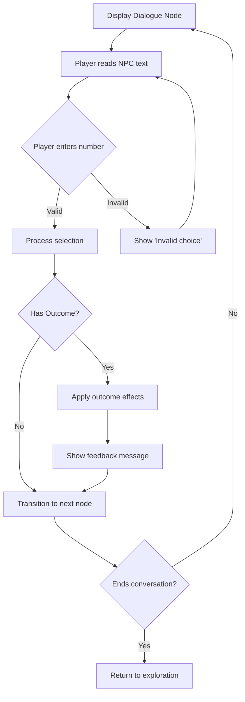
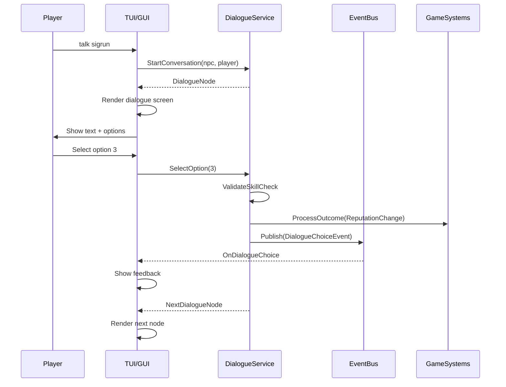

# Dialogue UI — TUI & GUI Specification

> *"Words are weapons. Choose them wisely."*

---

## 1. Overview

This specification defines the terminal (TUI) and graphical (GUI) interfaces for the Dialogue System, enabling players to converse with NPCs, make meaningful choices, and observe consequences.

### 1.1 Identity Table

| Property | Value |
|----------|-------|
| Spec ID | `SPEC-UI-DIALOGUE` |
| Category | UI System |
| Priority | Critical |
| Status | Draft |

### 1.2 Design Pillars

- **Readability** — NPC dialogue is easy to read; text flows naturally
- **Choice Clarity** — Options are numbered and clearly distinguished
- **Skill Visibility** — Skill check requirements are prominently displayed
- **Consequence Awareness** — Outcomes (quests, reputation) show immediately
- **Personality Expression** — NPC character comes through in presentation

---

## 2. TUI Dialogue Layout

### 2.1 Full Dialogue Screen

When the player enters a conversation, the screen switches to **Dialogue Mode**:

```
┌─────────────────────────────────────────────────────────────────────┐
│  HP: 60/60 ██████████  Stamina: 100/100 ██████████                  │
├─────────────────────────────────────────────────────────────────────┤
│  ╔══════════════════════════════════════════════════════════════╗   │
│  ║  SIGRUN — Midgard Combine Scavenger                          ║   │
│  ║  [Neutral]                                                    ║   │
│  ╟──────────────────────────────────────────────────────────────╢   │
│  ║                                                              ║   │
│  ║  "Another scavenger in these ruins? You look capable enough. ║   │
│  ║   The Combine could use hands like yours — if you've got the ║   │
│  ║   stomach for real work."                                    ║   │
│  ║                                                              ║   │
│  ╟──────────────────────────────────────────────────────────────╢   │
│  ║  RESPONSES:                                                  ║   │
│  ║                                                              ║   │
│  ║  [1] "Who are you?"                                          ║   │
│  ║  [2] "What kind of work?"                                    ║   │
│  ║  [3] [WITS 4] "These ruins are Jötun-Forged..."              ║   │
│  ║  [4] [Bone-Setter] "I can see the strain on your joints..."  ║   │
│  ║  [5] "I should go." [END]                                    ║   │
│  ║                                                              ║   │
│  ╚══════════════════════════════════════════════════════════════╝   │
├─────────────────────────────────────────────────────────────────────┤
│  » Speaking with Sigrun                                             │
├─────────────────────────────────────────────────────────────────────┤
│  [Say] > _                                                          │
└─────────────────────────────────────────────────────────────────────┘
```

### 2.2 Component Breakdown

| Component | Description | Lines |
|-----------|-------------|-------|
| **Header Bar** | Player resources (always visible) | 1 |
| **NPC Header** | Name, faction, disposition tier | 2 |
| **Dialogue Text** | NPC's current speech (wrapped) | 4-6 |
| **Response Options** | Numbered choices with skill tags | Variable |
| **Activity Log** | Single line noting conversation | 1 |
| **Input Prompt** | `[Say] > ` prompt for input | 1 |

### 2.3 Skill Check Display

| Check Type | Display Format | Color |
|------------|----------------|-------|
| **Attribute (passing)** | `[WITS 4]` | Green |
| **Attribute (hidden)** | *Not shown* | — |
| **Specialization (passing)** | `[Bone-Setter]` | Cyan |
| **Specialization (hidden)** | *Not shown* | — |
| **Combined** | `[WILL 3] [Skald]` | Green + Cyan |

> [!NOTE]
> **Hard Check System:** Options the player doesn't qualify for are completely hidden, not grayed out. Players only see what they can say.

### 2.4 Outcome Feedback (Post-Selection)

> [!NOTE]
> **Design Decision:** Outcome tags are revealed AFTER selecting an option, not before. This preserves the surprise and consequence of choices.

After a player selects an option, feedback shows the outcome:

| Outcome | Feedback Message | Color |
|---------|------------------|-------|
| Trade opened | `[Trade] Opening merchant interface...` | Yellow |
| Quest given | `[Quest] New: "Scrap Collection"` | Blue |
| Reputation gained | `[Reputation] +5 with Midgard Combine` | Green |
| Reputation lost | `[Reputation] -10 with Ash Wardens` | Red |
| Combat initiated | `[!] Combat initiated!` | Red |

### 2.5 Always-Visible Leave Option

A leave/end conversation option is **always visible** at the bottom of the response list:

```
║  [1] "Who are you?"                                             ║
║  [2] "What kind of work?"                                       ║
║  [3] [WITS 4] "These ruins are Jötun-Forged..."                 ║
║                                                                 ║
║  [0] "I should go." [Leave]                                     ║
```

---

## 3. TUI Dialogue Interactions

### 3.1 Input Commands

| Input | Action |
|-------|--------|
| `1`, `2`, `3`... | Select numbered response |
| `say <text>` | Free-form input (if supported) |
| `bye`, `leave` | End conversation immediately |
| `?`, `help` | Show dialogue help |
| `PgUp` / `PgDn` | Scroll if text is long |

### 3.2 Text Typing Effect (Optional)

For enhanced immersion, NPC dialogue can display with a typewriter effect:

| Setting | Value |
|---------|-------|
| `DialogueTypewriterSpeed` | 30-50 ms per character |
| `SkipOnKeypress` | true — any key shows full text |
| `DisableTypewriter` | Config option to show instant |

### 3.3 Response Selection Flow



### 3.4 Conversation Log (Optional, Collapsed)

> [!NOTE]
> **Design Decision:** Conversation log is optional and collapsed by default. Press `[L]` to expand it.

**Collapsed:**
```
┌─────────────────────────────────────────────────────────────────────┐
│  [L] Show Conversation Log                                          │
└─────────────────────────────────────────────────────────────────────┘
```

**Expanded:**
```
┌─────────────────────────────────────────────────────────────────────┐
│  CONVERSATION LOG                                          [L] Hide │
├─────────────────────────────────────────────────────────────────────┤
│  SIGRUN: "Another scavenger in these ruins? You look capable..."    │
│  YOU: "Who are you?"                                                │
│  SIGRUN: "Name's Sigrun. I scout for the Midgard Combine..."        │
└─────────────────────────────────────────────────────────────────────┘
```

---

## 4. TUI Feedback Messages

### 4.1 Outcome Feedback

When a dialogue choice triggers an outcome, display in the activity log:

| Outcome Type | Message Format | Color |
|--------------|----------------|-------|
| **ReputationChange (+)** | `[Reputation] +5 with Midgard Combine` | Green |
| **ReputationChange (-)** | `[Reputation] -10 with Ash Wardens` | Red |
| **QuestGiven** | `[Quest] New: "Scrap Collection"` | Blue |
| **QuestComplete** | `[Quest] Completed: "Scrap Collection"` | Green |
| **ItemReceived** | `[Item] Received: Aetheric Stabilizer` | Cyan |
| **ItemLost** | `[Item] Lost: Iron Key` | Yellow |
| **InitiateCombat** | `[!] Combat initiated!` | Red |

### 4.2 First Meeting Indicator

When speaking to an NPC for the first time:

```
» First meeting with Sigrun
```

Subsequent conversations:
```
» Speaking with Sigrun
```

---

## 5. GUI Dialogue Panel

### 5.1 Panel Layout

```
┌───────────────────────────────────────────────────────────────────────┐
│  ┌─────────┐  SIGRUN                                                  │
│  │         │  Midgard Combine Scavenger                               │
│  │ PORTRAIT│  ═══════════════════════════════                         │
│  │         │  Disposition: ████████░░ Neutral-Positive                │
│  └─────────┘                                                          │
├───────────────────────────────────────────────────────────────────────┤
│                                                                       │
│  "Another scavenger in these ruins? You look capable enough. The     │
│   Combine could use hands like yours — if you've got the stomach     │
│   for real work."                                                     │
│                                                                       │
├───────────────────────────────────────────────────────────────────────┤
│  ┌─────────────────────────────────────────────────────────────────┐  │
│  │  ▶ Who are you?                                                 │  │
│  ├─────────────────────────────────────────────────────────────────┤  │
│  │    What kind of work?                                           │  │
│  ├─────────────────────────────────────────────────────────────────┤  │
│  │  ✓ [WITS 4] These ruins are Jötun-Forged...                     │  │
│  ├─────────────────────────────────────────────────────────────────┤  │
│  │  ✓ [Bone-Setter] I can see the strain on your joints...         │  │
│  ├─────────────────────────────────────────────────────────────────┤  │
│  │    I should go.  [END]                                          │  │
│  └─────────────────────────────────────────────────────────────────┘  │
│                                                                       │
│  [1-5 to select]   [ESC] End Conversation   [?] Help                  │
└───────────────────────────────────────────────────────────────────────┘
```

### 5.2 GUI Components

| Component | Description |
|-----------|-------------|
| **NPC Portrait** | 64x64 or 128x128 character portrait |
| **NPC Name** | Large, bold text |
| **Faction Badge** | Small icon + faction name |
| **Disposition Bar** | Visual meter showing -100 to +100 |
| **Dialogue Text Area** | Scrollable text with typographic styling |
| **Response List** | Selectable list with hover highlighting |
| **Skill Check Indicators** | Icons showing pass/fail for checks |
| **Hotkey Bar** | Bottom bar with keyboard shortcuts |

### 5.3 Visual Skill Check Indicators

| State | Icon | Color | Tooltip |
|-------|------|-------|---------|
| **Passes (attribute)** | ✓ | Green | "Requires WITS 4 (You: 5)" |
| **Passes (spec)** | ✓ | Cyan | "Requires Bone-Setter (You have)" |
| **Barely passes** | ≈ | Yellow | "Requires WITS 4 (You: 4)" |
| **Hidden (fails)** | *Not shown* | — | — |

### 5.4 Disposition Display

> [!NOTE]
> **Design Decision:** Show disposition TIER only, not exact values. This keeps the number hidden while giving players useful feedback.

| Tier | Display | Color |
|------|---------|-------|
| Friendly (≥50) | `[Friendly]` | Green |
| Neutral-Positive (10-49) | `[Neutral-Positive]` | Light Green |
| Neutral (-9 to +9) | `[Neutral]` | Gray |
| Unfriendly (-49 to -10) | `[Unfriendly]` | Orange |
| Hostile (≤-50) | `[Hostile]` | Red |

---

## 6. Dialogue ViewModel

### 6.1 Interface

```csharp
public interface IDialogueViewModel
{
    // State
    bool IsInConversation { get; }
    string NpcName { get; }
    string NpcFaction { get; }
    string NpcPortraitPath { get; }
    int NpcDisposition { get; }
    DispositionTier DispositionTier { get; }
    string DialogueText { get; }
    bool IsFirstMeeting { get; }
    
    // Options
    IReadOnlyList<DialogueOptionViewModel> AvailableOptions { get; }
    int SelectedOptionIndex { get; set; }
    
    // Commands
    ICommand SelectOptionCommand { get; }
    ICommand EndConversationCommand { get; }
    
    // Events
    event Action<DialogueOutcomeArgs> OnOutcome;
    event Action OnConversationEnded;
}

public record DialogueOptionViewModel(
    int Index,
    string Text,
    string? SkillCheckTag,
    bool PassesSkillCheck,
    bool BarelyPasses,
    string? OutcomeTag
);
```

### 6.2 Terminal Adapter Implementation

```csharp
public class TerminalDialogueRenderer : IDialogueRenderer
{
    private readonly IConsole _console;
    private readonly IDialogueViewModel _viewModel;
    
    public void Render()
    {
        // NPC Header
        _console.WriteLine($"╔══════════════════════════════════════════╗");
        _console.WriteLine($"║  {_viewModel.NpcName} — {_viewModel.NpcFaction}");
        _console.WriteLine($"║  Disposition: {GetDispositionText()}");
        _console.WriteLine($"╟──────────────────────────────────────────╢");
        
        // Dialogue text (word-wrapped)
        foreach (var line in WrapText(_viewModel.DialogueText, 50))
        {
            _console.WriteLine($"║  {line}");
        }
        
        _console.WriteLine($"╟──────────────────────────────────────────╢");
        _console.WriteLine($"║  RESPONSES:");
        
        // Options
        foreach (var opt in _viewModel.AvailableOptions)
        {
            var tag = opt.SkillCheckTag ?? "";
            var outcome = opt.OutcomeTag ?? "";
            _console.WriteLine($"║  [{opt.Index}] {tag}{opt.Text} {outcome}");
        }
        
        _console.WriteLine($"╚══════════════════════════════════════════╝");
    }
}
```

---

## 7. Topic History (Optional)

### 7.1 Previously Discussed Topics

When revisiting an NPC, show topics already discussed:

```
╟──────────────────────────────────────────────────────────────╢
║  TOPICS DISCUSSED:                                           ║
║  ◆ Her background                                            ║
║  ◆ The Midgard Combine's goals                               ║
║  ◆ Local dangers                                             ║
╟──────────────────────────────────────────────────────────────╢
```

### 7.2 "Remind Me" Option

For topics already discussed, offer a reminder option:

```
║  [6] "Tell me again about the local dangers..." [REMIND]     ║
```

---

## 8. Integration with Dialogue System

### 8.1 Event Flow



### 8.2 Events

| Event | Published When | Payload |
|-------|----------------|---------|
| `ConversationStartedEvent` | Player starts talking to NPC | NpcId, NpcName, IsFirstMeeting |
| `DialogueChoiceEvent` | Player selects option | NodeId, OptionIndex, OutcomeType |
| `ReputationChangedEvent` | Reputation outcome applied | FactionId, Change, NewValue |
| `ConversationEndedEvent` | Dialogue ends | NpcId, TotalChoicesMade |

---

## 9. Accessibility

### 9.1 TUI Accessibility

| Feature | Implementation |
|---------|----------------|
| **Screen reader support** | All text is standard output |
| **High contrast** | ANSI colors with fallback to mono |
| **Keyboard navigation** | Number keys for all options |
| **Text scaling** | Font size controlled by terminal |

### 9.2 GUI Accessibility

| Feature | Implementation |
|---------|----------------|
| **Screen reader** | All elements have accessible names |
| **Keyboard navigation** | Arrow keys + Enter |
| **Font scaling** | Scales with system font size |
| **Color blind modes** | Shape + color for indicators |

---

## 10. Configuration

| Setting | Default | Options |
|---------|---------|---------|
| `DialogueTypewriterEnabled` | true | true/false |
| `DialogueTypewriterSpeed` | 40 | 20-100 ms |
| `ShowDispositionBar` | true | true/false |
| `ShowTopicHistory` | true | true/false |
| `DialogueFontSize` | 14 | 10-24 |

---

## 11. Implementation Status

| Component | TUI Status | GUI Status |
|-----------|------------|------------|
| Dialogue screen layout | ❌ Planned | ❌ Planned |
| NPC header display | ❌ Planned | ❌ Planned |
| Text rendering + wrap | ❌ Planned | ❌ Planned |
| Response option list | ❌ Planned | ❌ Planned |
| Skill check indicators | ❌ Planned | ❌ Planned |
| Outcome feedback | ❌ Planned | ❌ Planned |
| Typewriter effect | ❌ Planned | ❌ Planned |
| Disposition visualization | ❌ Planned | ❌ Planned |
| Topic history | ❌ Planned | ❌ Planned |
| DialogueViewModel | ❌ Planned | ❌ Planned |

---

## 12. Phased Implementation Guide

### Phase 1: Core TUI Dialogue
- [ ] Create `IDialogueRenderer` interface
- [ ] Implement `TerminalDialogueRenderer`
- [ ] Basic dialogue screen layout
- [ ] Option selection via number keys
- [ ] Activity log integration

### Phase 2: Skill Checks & Outcomes
- [ ] Display skill check tags on options
- [ ] Color-code passing checks
- [ ] Show outcome feedback messages
- [ ] Integrate with ReputationSystem events

### Phase 3: Enhanced Presentation
- [ ] Typewriter text effect
- [ ] Disposition bar visualization
- [ ] Topic history display
- [ ] "Remind me" functionality

### Phase 4: GUI Implementation
- [ ] Create `DialogueViewModel`
- [ ] Create Avalonia `DialogueView.axaml`
- [ ] NPC portrait display
- [ ] Animated disposition meter
- [ ] Response hover effects

---

## 13. Testing Requirements

### 13.1 TUI Tests
- [ ] Dialogue text wraps correctly at 50 chars
- [ ] Options numbered correctly
- [ ] Hidden options not displayed
- [ ] Skill check tags formatted correctly
- [ ] Outcome messages appear in activity log

### 13.2 GUI Tests
- [ ] Portrait loads correctly
- [ ] Disposition bar reflects NPC state
- [ ] Keyboard navigation works (arrow keys + enter)
- [ ] Mouse selection works
- [ ] Tooltips display on hover

### 13.3 Integration Tests
- [ ] StartConversation → DialogueNode displayed
- [ ] SelectOption → NextNode displayed
- [ ] ReputationChange outcome → Feedback message
- [ ] EndConversation → Return to exploration

---

## 14. Related Specifications

| Spec | Relationship |
|------|--------------|
| [dialogue-system.md](../02-entities/dialogue-system.md) | Core dialogue mechanics |
| [tui-layout.md](tui-layout.md) | Screen composition |
| [terminal-adapter.md](terminal-adapter.md) | Terminal rendering |
| [gui-adapter.md](gui-adapter.md) | Avalonia integration |
| [presentation-layer.md](presentation-layer.md) | IPresenter interface |

---

## 15. Changelog

| Version | Date | Changes |
|---------|------|---------|
| 1.0 | 2025-12-14 | Initial specification |
