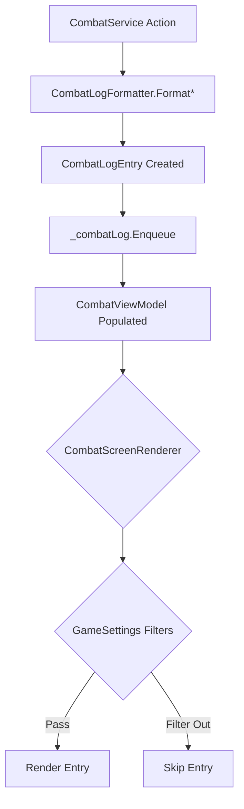

# v0.3.22a: The Filter (Log Customization)

**Status:** Planned
**Parent Plan:** [v0.3.22](./v0.3.22.md)
**Dependencies:** None

## Overview

As the combat system grows in complexity (traits, conditions, status effects), the combat log has become a "wall of text." **v0.3.22a** introduces a structured logging system that allows players to filter information based on their preferences (e.g., hiding dice rolls, muting flavor text). This transforms the log from a raw string dump into a queryable data source.

## Goals

1.  **Structured Data:** Replace `Queue<string>` with `Queue<CombatLogEntry>` to enable categorization.
2.  **User Control:** Allow players to toggle visibility of Mechanics, Flavor, and System messages via `GameSettings`.
3.  **Visual Clarity:** Use semantic coloring and tagging for easier parsing at a glance.

---

## 1. Core Architecture

### 1.1 Component Diagram

| Component | Layer | File | Purpose |
|-----------|-------|------|---------|
| `LogCategory` | Core | `Enums/LogCategory.cs` | Enum for log entry classification. |
| `CombatLogEntry` | Core | `Models/Combat/CombatLogEntry.cs` | Structured log data record. |
| `CombatLogFormatter` | Engine | `Services/CombatLogFormatter.cs` | **Updated** to return `CombatLogEntry` objects. |
| `CombatService` | Engine | `Services/CombatService.cs` | **Updated** `_combatLog` from `Queue<string>` → `Queue<CombatLogEntry>`. |
| `GameSettings` | Core | `Models/GameSettings.cs` | **Updated** with filter toggles. |
| `CombatScreenRenderer` | Terminal | `Rendering/CombatScreenRenderer.cs` | **Updated** with filtering logic. |

### 1.2 The Logging Pipeline



---

## 2. Data Structures

### 2.1 LogCategory Enum

**File:** `RuneAndRust.Core/Enums/LogCategory.cs` (New)

```csharp
namespace RuneAndRust.Core.Enums;

/// <summary>
/// Categories for combat log entries, enabling user-configurable filtering.
/// </summary>
public enum LogCategory
{
    /// <summary>
    /// System messages: Round start, turn transitions, combat end.
    /// </summary>
    System,

    /// <summary>
    /// Mechanical details: Dice rolls, attack vs defense, damage calculations.
    /// </summary>
    Mechanics,

    /// <summary>
    /// Outcome messages: Hit/miss, damage dealt, healing received.
    /// Always shown unless Narrative Only mode is enabled.
    /// </summary>
    Outcome,

    /// <summary>
    /// Flavor text: Barks, atmospheric descriptions, ability flavor.
    /// </summary>
    Flavor,

    /// <summary>
    /// Status effect application and removal.
    /// </summary>
    Status,

    /// <summary>
    /// Critical events: Crits, deaths, level ups. Bypass most filters.
    /// </summary>
    Critical
}
```

### 2.2 CombatLogEntry Record

**File:** `RuneAndRust.Core/Models/Combat/CombatLogEntry.cs` (New)

```csharp
using RuneAndRust.Core.Enums;

namespace RuneAndRust.Core.Models.Combat;

/// <summary>
/// A structured combat log entry with category and importance metadata.
/// </summary>
/// <param name="Markup">The display text (Spectre.Console markup).</param>
/// <param name="Category">The category for filtering.</param>
/// <param name="RoundNumber">The combat round this occurred in.</param>
/// <param name="IsImportant">If true, bypasses filters (e.g., Crits, Deaths).</param>
public record CombatLogEntry(
    string Markup,
    LogCategory Category,
    int RoundNumber,
    bool IsImportant = false
);
```

### 2.3 GameSettings Updates

**File:** `RuneAndRust.Core/Models/GameSettings.cs`

```diff
  public class GameSettings
  {
      // ... existing settings ...

+     /// <summary>
+     /// Show system messages in combat log (round start, turn changes).
+     /// </summary>
+     public bool ShowCombatSystemMessages { get; set; } = true;
+
+     /// <summary>
+     /// Show mechanical details in combat log (dice rolls, math).
+     /// </summary>
+     public bool ShowCombatMechanics { get; set; } = true;
+
+     /// <summary>
+     /// Show flavor text in combat log (barks, descriptions).
+     /// </summary>
+     public bool ShowCombatFlavorText { get; set; } = true;
+
+     /// <summary>
+     /// Show status effect messages in combat log.
+     /// </summary>
+     public bool ShowCombatStatusEffects { get; set; } = true;
  }
```

---

## 3. Implementation Specifications

### 3.1 CombatService Refactoring

**File:** `RuneAndRust.Engine/Services/CombatService.cs`

**Current State (Line 46):**
```csharp
private readonly Queue<string> _combatLog = new();
```

**Target State:**
```csharp
private readonly Queue<CombatLogEntry> _combatLog = new();
```

**Required Changes:**

1.  **Update `_combatLog` type** from `Queue<string>` to `Queue<CombatLogEntry>`.
2.  **Update `LogCombatEvent` method** (Line ~1033):

```csharp
private void LogCombatEvent(CombatLogEntry entry)
{
    if (_combatLog.Count >= MaxLogHistory)
    {
        _combatLog.Dequeue();
    }

    _combatLog.Enqueue(entry);
    _logger.LogTrace("[Combat] Logged: {Category} - {Markup}", entry.Category, entry.Markup);
}

// Overload for backward compatibility during migration
private void LogCombatEvent(string message, LogCategory category = LogCategory.System, bool isImportant = false)
{
    var entry = new CombatLogEntry(message, category, _combatState?.CurrentRound ?? 0, isImportant);
    LogCombatEvent(entry);
}
```

3.  **Update all call sites** to use the overload with category:

| Current Call | Category | IsImportant |
|--------------|----------|-------------|
| `FormatRoundStart(round)` | `System` | false |
| `FormatTurnStart(name)` | `System` | false |
| `FormatHitMessage(...)` | `Outcome` | isCrit |
| `FormatMissMessage(...)` | `Outcome` | false |
| `FormatDeathMessage(...)` | `Critical` | true |
| `FormatStatusApplied(...)` | `Status` | false |
| `FormatAbilityUse(...)` | `Mechanics` | false |
| `FormatHealMessage(...)` | `Outcome` | false |
| `FormatVictory()` | `Critical` | true |
| `FormatDefeat()` | `Critical` | true |

### 3.2 CombatLogFormatter Updates

**File:** `RuneAndRust.Engine/Services/CombatLogFormatter.cs`

**Option A: Return `CombatLogEntry` directly** (Recommended)

Refactor each `Format*` method to return a `CombatLogEntry` instead of just a string:

```csharp
public static CombatLogEntry FormatRoundStart(int round)
{
    var markup = $"[bold yellow]═══ Round {round} ═══[/]";
    return new CombatLogEntry(markup, LogCategory.System, round);
}

public static CombatLogEntry FormatHitMessage(
    string attacker, string target, int damage, DamageType type, bool isCrit)
{
    var color = GetDamageColor(type);
    var critMarker = isCrit ? "[bold red]CRITICAL! [/]" : "";
    var markup = $"{critMarker}[bold]{Markup.Escape(attacker)}[/] hits " +
                 $"[bold]{Markup.Escape(target)}[/] for [{color}]{damage}[/] damage!";
    return new CombatLogEntry(markup, LogCategory.Outcome, -1, isCrit);
}
```

**Option B: Keep string methods, add factory** (Less invasive)

Add a factory method to wrap existing string outputs:

```csharp
public static CombatLogEntry CreateEntry(string markup, LogCategory category, int round = -1, bool isImportant = false)
    => new(markup, category, round, isImportant);
```

### 3.3 CombatScreenRenderer Filtering

**File:** `RuneAndRust.Terminal/Rendering/CombatScreenRenderer.cs`

**Add filtering logic in `RenderCombatLog`:**

```csharp
private void RenderCombatLog(IReadOnlyList<CombatLogEntry> log, GameSettings settings)
{
    foreach (var entry in log)
    {
        // Important entries always shown
        if (entry.IsImportant)
        {
            AnsiConsole.MarkupLine(entry.Markup);
            continue;
        }

        // Apply category filters
        var show = entry.Category switch
        {
            LogCategory.System => settings.ShowCombatSystemMessages,
            LogCategory.Mechanics => settings.ShowCombatMechanics,
            LogCategory.Flavor => settings.ShowCombatFlavorText,
            LogCategory.Status => settings.ShowCombatStatusEffects,
            LogCategory.Outcome => true, // Always show outcomes
            LogCategory.Critical => true, // Already handled by IsImportant
            _ => true
        };

        if (show)
        {
            AnsiConsole.MarkupLine(entry.Markup);
        }
    }
}
```

---

## 4. Logging Requirements

| Component | Event | Level | Template | Properties |
|-----------|-------|-------|----------|------------|
| `CombatService` | Entry Logged | Trace | `[Combat] Logged: {Category} - {Markup}` | Category, Markup |
| `CombatScreenRenderer` | Entry Filtered | Trace | `[Combat UI] Filtered {Category} entry (setting disabled)` | Category |
| `SettingsService` | Filter Changed | Debug | `[Settings] Combat filter changed: {Setting} = {Value}` | Setting, Value |

---

## 5. Migration Strategy

To avoid breaking all call sites at once:

**Phase 1: Add New Types (Non-Breaking)**
- [ ] Create `LogCategory` enum.
- [ ] Create `CombatLogEntry` record.
- [ ] Add `GameSettings` filter properties.

**Phase 2: Add Overloads (Non-Breaking)**
- [ ] Add `LogCombatEvent(CombatLogEntry)` overload.
- [ ] Add `LogCombatEvent(string, LogCategory, bool)` overload.
- [ ] Update `_combatLog` type to `Queue<CombatLogEntry>`.

**Phase 3: Migrate Call Sites (Incremental)**
- [ ] Update `CombatLogFormatter` methods to return `CombatLogEntry`.
- [ ] Update all `LogCombatEvent` calls to use new overload.
- [ ] Remove deprecated string-only overload.

**Phase 4: Rendering Integration**
- [ ] Update `CombatViewModel` to expose `List<CombatLogEntry>`.
- [ ] Update `CombatScreenRenderer` with filtering logic.

---

## 6. Testing Strategy

### 6.1 Unit Tests

**File:** `RuneAndRust.Tests/Engine/CombatLogFilterTests.cs` (New)

| Test Method | Scenario | Setup | Expected Outcome |
|-------------|----------|-------|------------------|
| `LogEntry_CategoryAssignment_System` | Round start entry | Call `FormatRoundStart(3)` | Category = `System` |
| `LogEntry_CategoryAssignment_Outcome` | Hit message | Call `FormatHitMessage(...)` | Category = `Outcome` |
| `LogEntry_CategoryAssignment_Critical` | Death message | Call `FormatDeathMessage(...)` | Category = `Critical`, IsImportant = true |
| `LogEntry_CategoryAssignment_Status` | Status applied | Call `FormatStatusApplied(...)` | Category = `Status` |
| `Filter_SystemMessagesHidden_WhenDisabled` | Filter test | Settings.ShowCombatSystemMessages = false | System entries not rendered |
| `Filter_MechanicsHidden_WhenDisabled` | Filter test | Settings.ShowCombatMechanics = false | Mechanics entries not rendered |
| `Filter_FlavorHidden_WhenDisabled` | Filter test | Settings.ShowCombatFlavorText = false | Flavor entries not rendered |
| `Filter_StatusHidden_WhenDisabled` | Filter test | Settings.ShowCombatStatusEffects = false | Status entries not rendered |
| `Filter_ImportantAlwaysShown` | Important bypass | Settings.ShowCombatSystemMessages = false, IsImportant = true | Entry still rendered |
| `Filter_OutcomeAlwaysShown` | Outcome bypass | All filters false | Outcome entries still rendered |
| `CombatService_LogQueue_AcceptsCombatLogEntry` | Type migration | Enqueue `CombatLogEntry` | No exception, dequeue returns same entry |
| `CombatViewModel_ExposesLogEntries` | ViewModel update | Populate from service | `CombatLog` contains `CombatLogEntry` list |

### 6.2 Existing Test Updates

**File:** `RuneAndRust.Tests/Engine/CombatLogFormatterTests.cs`

Update existing 23 tests to verify `CombatLogEntry` return type instead of string:

```diff
- var result = CombatLogFormatter.FormatHitMessage(...);
- Assert.Contains("[red]", result);
+ var entry = CombatLogFormatter.FormatHitMessage(...);
+ Assert.Contains("[red]", entry.Markup);
+ Assert.Equal(LogCategory.Outcome, entry.Category);
```

### 6.3 Verification Commands

**Run all log filter tests:**
```bash
dotnet test RuneAndRust.Tests --filter "FullyQualifiedName~CombatLogFilterTests"
```

**Run all formatter tests (after update):**
```bash
dotnet test RuneAndRust.Tests --filter "FullyQualifiedName~CombatLogFormatterTests"
```

**Run all Engine tests (regression check):**
```bash
dotnet test RuneAndRust.Tests --filter "FullyQualifiedName~Engine"
```

### 6.4 Manual Verification

1.  **Prerequisites:** Debug mode, start combat.
2.  **Default State:** Verify all log entries appear (System, Mechanics, Flavor, Status, Outcome).
3.  **Open Options Menu:** Navigate to Gameplay → Combat Log Filters.
4.  **Disable System Messages:** Toggle off. Re-enter combat.
    -   Verify: "Round X" and turn announcements are hidden.
    -   Verify: Hit/miss/damage messages still appear.
5.  **Disable Mechanics:** Toggle off.
    -   Verify: Dice roll details hidden (if implemented).
    -   Verify: Outcomes still visible.
6.  **Disable Flavor Text:** Toggle off.
    -   Verify: Barks and descriptions hidden.
7.  **Trigger Critical:** Fight until death or crit.
    -   Verify: Death message appears regardless of filters.

---

## 7. Work Breakdown

- [ ] **Core:** Create `LogCategory.cs` enum.
- [ ] **Core:** Create `CombatLogEntry.cs` record.
- [ ] **Core:** Update `GameSettings.cs` with filter properties.
- [ ] **Engine:** Update `CombatService._combatLog` type.
- [ ] **Engine:** Add `LogCombatEvent` overloads.
- [ ] **Engine:** Update `CombatLogFormatter` to return `CombatLogEntry`.
- [ ] **Terminal:** Update `CombatScreenRenderer` with filtering logic.
- [ ] **Terminal:** Add filter options to Options menu.
- [ ] **Tests:** Create `CombatLogFilterTests.cs`.
- [ ] **Tests:** Update `CombatLogFormatterTests.cs` for new return type.

