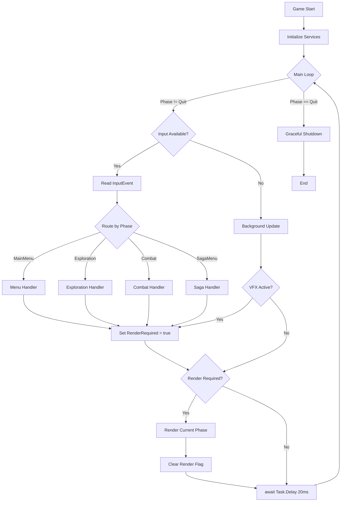

# v0.3.23b: The Loop (Event-Driven Architecture) - Expanded Implementation Plan

## Overview

Transform the main game loop from a blocking "Wait for Key" model to a non-blocking, Event-Driven Architecture. This allows the game to process background tasks (Ambience, VFX, Animations) while waiting for user input, enabling a more dynamic "alive" feel without sacrificing the turn-based core.

**Parent Plan:** [v0.3.23](./v0.3.23.md)
**Status:** Planned
**Dependencies:** `v0.3.23a` (IInputService abstraction)

---

## Architecture Summary

### Key Design Decisions

1. **Non-Blocking Loop:** The main `while` loop checks `_inputService.IsInputAvailable()` instead of blocking on `ReadKey`.
2. **Tick Rate:** The loop runs at ~50 ticks per second (`Task.Delay(20)`), providing sufficient resolution for UI animations and input responsiveness.
3. **Dirty Flag Rendering:** To avoid expensive console redraws every tick, we introduce a `_renderRequired` flag. Rendering only occurs when state changes (Input processed) or Visual Effects update.
4. **Cancellation Token:** Define a `CancellationTokenSource` for the entire game session to handle graceful shutdowns (Quit command, SIGINT).
5. **Phase-Specific Input Routing:** Different `GamePhase` values route input to different handlers.

### The Game Loop Lifecycle



---

## Technical Specifications

### Loop Timing Analysis

| Metric | Value | Rationale |
|--------|-------|-----------|
| Tick Rate | 50 Hz (20ms delay) | Balances responsiveness vs CPU usage |
| Input Latency | 0-20ms | Acceptable for turn-based games |
| VFX Precision | ±20ms | Sufficient for border flashes |
| CPU Idle | < 5% | `Task.Delay` yields thread |

### Phase-Specific Rendering

| GamePhase | Renderer | ViewModel |
|-----------|----------|-----------|
| `MainMenu` | `MainMenuRenderer` | N/A (static) |
| `Exploration` | `ExplorationScreenRenderer` | `ExplorationViewModel` |
| `Combat` | `CombatScreenRenderer` | `CombatViewModel` |
| `SagaMenu` | `SagaScreenRenderer` | `SagaViewModel` |
| `Quit` | N/A (exit loop) | N/A |

---

## Files to Create (1 new file)

| File | Purpose |
|------|---------|
| `RuneAndRust.Tests/Engine/GameLoopTests.cs` | Unit tests for non-blocking loop behavior |

## Files to Modify (5 existing files)

| File | Changes |
|------|---------|
| `RuneAndRust.Core/Interfaces/IGameService.cs` | Add `CancellationToken` parameter to `StartAsync` |
| `RuneAndRust.Engine/Services/GameService.cs` | Complete rewrite of `StartAsync` with non-blocking loop |
| `RuneAndRust.Terminal/Program.cs` | Create `CancellationTokenSource`, wire up Console.CancelKeyPress |
| `RuneAndRust.Terminal/Services/VisualEffectService.cs` | Add `OnInvalidateVisuals` event for redraw triggers |
| `RuneAndRust.Core/Interfaces/IVisualEffectService.cs` | Add `event Action? OnInvalidateVisuals` to interface |

---

## Implementation Order

1. Update `IGameService` interface signature
2. Update `IVisualEffectService` with invalidation event
3. Update `VisualEffectService` implementation
4. Refactor `GameService.StartAsync` with non-blocking loop
5. Update `Program.cs` with cancellation token and SIGINT handling
6. Create unit tests
7. Verify with manual testing

---

## Detailed Code Specifications

### 1. IGameService Update

**File:** `RuneAndRust.Core/Interfaces/IGameService.cs`

```csharp
namespace RuneAndRust.Core.Interfaces;

/// <summary>
/// Main game orchestration service.
/// </summary>
public interface IGameService
{
    /// <summary>
    /// Starts the main game loop.
    /// v0.3.23b: Updated to support cancellation for graceful shutdown.
    /// </summary>
    /// <param name="cancellationToken">Token for graceful shutdown on SIGINT or quit command.</param>
    /// <returns>A task that completes when the game exits.</returns>
    Task StartAsync(CancellationToken cancellationToken = default);
}
```

### 2. IVisualEffectService Update

**File:** `RuneAndRust.Core/Interfaces/IVisualEffectService.cs`

```csharp
// Add to existing interface:

/// <summary>
/// Event raised when visual state changes and a redraw is required.
/// v0.3.23b: Used by non-blocking loop to trigger renders.
/// </summary>
event Action? OnInvalidateVisuals;
```

### 3. VisualEffectService Update

**File:** `RuneAndRust.Terminal/Services/VisualEffectService.cs`

```csharp
// Add field:
public event Action? OnInvalidateVisuals;

// Update SetBorderOverride:
public void SetBorderOverride(Color color, int durationMs)
{
    _borderOverride = color;
    _borderOverrideExpiry = DateTime.UtcNow.AddMilliseconds(durationMs);
    OnInvalidateVisuals?.Invoke(); // Trigger redraw
}

// Update ClearBorderOverride:
public void ClearBorderOverride()
{
    _borderOverride = null;
    OnInvalidateVisuals?.Invoke(); // Trigger redraw
}

// Add new method for loop polling:
/// <summary>
/// Checks if a border override has expired and clears it.
/// Called by the game loop each tick.
/// </summary>
/// <returns>True if the override was cleared (redraw needed).</returns>
public bool CheckAndClearExpiredOverrides()
{
    if (_borderOverride.HasValue && DateTime.UtcNow > _borderOverrideExpiry)
    {
        ClearBorderOverride();
        return true;
    }
    return false;
}
```

### 4. GameService Non-Blocking Loop

**File:** `RuneAndRust.Engine/Services/GameService.cs`

```csharp
public class GameService : IGameService
{
    private readonly IInputService _inputService;
    private readonly IVisualEffectService _vfxService;
    private readonly ICombatService _combatService;
    private readonly IExplorationService _explorationService;
    private readonly ICombatScreenRenderer _combatRenderer;
    private readonly IExplorationScreenRenderer _explorationRenderer;
    private readonly ISagaScreenRenderer _sagaRenderer;
    private readonly ILogger<GameService> _logger;
    private readonly GameState _state;

    private bool _renderRequired = true;

    public GameService(
        IInputService inputService,
        IVisualEffectService vfxService,
        ICombatService combatService,
        IExplorationService explorationService,
        ICombatScreenRenderer combatRenderer,
        IExplorationScreenRenderer explorationRenderer,
        ISagaScreenRenderer sagaRenderer,
        ILogger<GameService> logger,
        GameState state)
    {
        _inputService = inputService;
        _vfxService = vfxService;
        _combatService = combatService;
        _explorationService = explorationService;
        _combatRenderer = combatRenderer;
        _explorationRenderer = explorationRenderer;
        _sagaRenderer = sagaRenderer;
        _logger = logger;
        _state = state;

        // Subscribe to VFX invalidation
        _vfxService.OnInvalidateVisuals += () => _renderRequired = true;
    }

    /// <inheritdoc/>
    public async Task StartAsync(CancellationToken ct = default)
    {
        _logger.LogInformation("[GameLoop] Starting non-blocking game loop");
        _renderRequired = true; // Initial render

        while (_state.Phase != GamePhase.Quit && !ct.IsCancellationRequested)
        {
            try
            {
                // 1. Input Phase (Non-blocking)
                if (_inputService.IsInputAvailable())
                {
                    var inputEvent = _inputService.ReadNext();
                    _logger.LogTrace("[GameLoop] Processing input: {Action}", inputEvent.Action);

                    await ProcessInputEventAsync(inputEvent);
                    _renderRequired = true;
                }

                // 2. Background Update Phase
                // Check for expired VFX
                if (_vfxService.CheckAndClearExpiredOverrides())
                {
                    _renderRequired = true;
                }

                // 3. Render Phase (Conditional)
                if (_renderRequired)
                {
                    RenderCurrentPhase();
                    _renderRequired = false;
                }

                // 4. Throttle (only if no input processed)
                await Task.Delay(20, ct);
            }
            catch (OperationCanceledException)
            {
                _logger.LogInformation("[GameLoop] Cancellation requested, exiting loop");
                break;
            }
            catch (Exception ex)
            {
                _logger.LogError(ex, "[GameLoop] Unexpected error in game loop");
                // Continue running - don't crash on single tick errors
            }
        }

        _logger.LogInformation("[GameLoop] Game loop ended. Phase: {Phase}", _state.Phase);
    }

    /// <summary>
    /// Routes input to the appropriate handler based on current game phase.
    /// </summary>
    private async Task ProcessInputEventAsync(InputEvent input)
    {
        switch (_state.Phase)
        {
            case GamePhase.MainMenu:
                await HandleMainMenuInputAsync(input);
                break;

            case GamePhase.Exploration:
                await HandleExplorationInputAsync(input);
                break;

            case GamePhase.Combat:
                await HandleCombatInputAsync(input);
                break;

            case GamePhase.SagaMenu:
                await HandleSagaInputAsync(input);
                break;

            default:
                _logger.LogWarning("[GameLoop] Unhandled phase: {Phase}", _state.Phase);
                break;
        }
    }

    /// <summary>
    /// Renders the appropriate screen based on current game phase.
    /// </summary>
    private void RenderCurrentPhase()
    {
        switch (_state.Phase)
        {
            case GamePhase.MainMenu:
                // Main menu is rendered by MainMenuController
                break;

            case GamePhase.Exploration:
                var explorationVm = BuildExplorationViewModel();
                _explorationRenderer.Render(explorationVm);
                break;

            case GamePhase.Combat:
                var combatVm = _combatService.GetViewModel();
                if (combatVm != null)
                {
                    _combatRenderer.Render(combatVm);
                }
                break;

            case GamePhase.SagaMenu:
                var sagaVm = BuildSagaViewModel();
                _sagaRenderer.Render(sagaVm);
                break;
        }
    }

    // ... Handler methods (HandleMainMenuInputAsync, etc.) ...
}
```

### 5. Program.cs Cancellation Setup

**File:** `RuneAndRust.Terminal/Program.cs`

```csharp
// In Main method, after service collection setup:

using var cts = new CancellationTokenSource();

// Handle Ctrl+C gracefully
Console.CancelKeyPress += (sender, args) =>
{
    args.Cancel = true; // Prevent immediate termination
    cts.Cancel();
    Console.WriteLine("\n[System] Shutting down gracefully...");
};

// Handle SIGTERM (for containerized environments)
AppDomain.CurrentDomain.ProcessExit += (sender, args) =>
{
    cts.Cancel();
};

try
{
    var gameService = serviceProvider.GetRequiredService<IGameService>();
    await gameService.StartAsync(cts.Token);
}
catch (OperationCanceledException)
{
    // Clean exit
}
finally
{
    Console.WriteLine("Goodbye!");
}
```

---

## Logging Requirements

| Component | Event | Level | Template | Properties |
|-----------|-------|-------|----------|------------|
| `GameService` | Loop Start | Info | `[GameLoop] Starting non-blocking game loop` | - |
| `GameService` | Input Processed | Trace | `[GameLoop] Processing input: {Action}` | Action |
| `GameService` | Phase Change | Debug | `[GameLoop] Phase changed: {OldPhase} → {NewPhase}` | OldPhase, NewPhase |
| `GameService` | Render | Trace | `[GameLoop] Rendering phase: {Phase}` | Phase |
| `GameService` | Loop End | Info | `[GameLoop] Game loop ended. Phase: {Phase}` | Phase |
| `GameService` | Cancellation | Info | `[GameLoop] Cancellation requested, exiting loop` | - |
| `GameService` | Error | Error | `[GameLoop] Unexpected error in game loop` | Exception |
| `VisualEffectService` | Invalidate | Trace | `[VFX] Visual invalidation triggered` | - |

---

## Testing Strategy

### Unit Tests

**File:** `RuneAndRust.Tests/Engine/GameLoopTests.cs` (New)

| Test Method | Scenario | Setup | Expected Outcome |
|-------------|----------|-------|------------------|
| `StartAsync_ExitsOnQuitPhase` | Normal exit | Set Phase = Quit before first tick | Loop exits immediately |
| `StartAsync_ExitsOnCancellation` | SIGINT | Cancel token after 50ms | Loop exits within 100ms |
| `StartAsync_ProcessesInput_WhenAvailable` | Input handling | Mock IsInputAvailable = true | ReadNext called once |
| `StartAsync_SkipsInput_WhenNotAvailable` | No input | Mock IsInputAvailable = false | ReadNext never called |
| `StartAsync_Renders_WhenFlagSet` | Dirty flag | Set _renderRequired = true | RenderCurrentPhase called |
| `StartAsync_SkipsRender_WhenFlagClear` | Clean state | Set _renderRequired = false | RenderCurrentPhase not called |
| `VfxInvalidation_TriggersRender` | VFX event | Fire OnInvalidateVisuals | _renderRequired becomes true |
| `StartAsync_HandlesErrors_Gracefully` | Exception | Handler throws | Loop continues on next tick |
| `StartAsync_CapsTickRate` | Throttling | Run for 100ms | ~5 ticks (not thousands) |
| `ProcessInputEvent_RoutesCorrectly` | Phase routing | Set Phase = Combat, send input | HandleCombatInputAsync called |

### Verification Commands

**Run all GameLoop tests:**
```bash
dotnet test RuneAndRust.Tests --filter "FullyQualifiedName~GameLoopTests"
```

**Run all Engine tests (regression check):**
```bash
dotnet test RuneAndRust.Tests --filter "FullyQualifiedName~Engine"
```

### Manual Verification

#### 1. Responsiveness Test
1. Launch game in exploration mode.
2. Hold down a movement key (W).
3. **Expected:** Character moves smoothly without lag or buffered inputs.

#### 2. CPU Usage Test
1. Launch game and remain at exploration prompt (no input).
2. Open Activity Monitor / Task Manager.
3. **Expected:** CPU usage < 5%, distinct from a tight `while(true)` loop.

#### 3. VFX Timing Test
1. Enter combat and trigger a hit (attack an enemy).
2. **Expected:** Border color flashes immediately and clears after ~200ms.

#### 4. Graceful Shutdown Test
1. While in exploration mode, press Ctrl+C.
2. **Expected:** Game prints "Shutting down gracefully..." and exits cleanly.

#### 5. Phase Transition Test
1. From exploration, enter combat (trigger encounter).
2. During combat, type `quit` to exit.
3. **Expected:** Each phase renders correctly without flickering.

---

## Critical Adjustments to v0.3.23a

The following requirements from v0.3.23a MUST be met for this plan to work:

1. **`IInputService.IsInputAvailable()`** - Must return immediately (non-blocking).
2. **`IInputService.ReadNext()`** - Must return immediately if input is available.
3. **`InputEvent` structure** - Must include `Action` property for logging.
4. **GameAction enum** - Must be defined for routing decisions.

### Decision: CommandParser Integration

For this version, map `GameAction` back to string command:
- `GameAction.MoveNorth` → "north"
- `GameAction.Attack` → "attack"
- etc.

This allows existing `CommandParser` logic to work without massive refactor. Full `CommandParser` modernization is deferred to v0.3.25.

---

## Work Breakdown

- [ ] **Core:** Update `IGameService.cs` with `CancellationToken` parameter
- [ ] **Core:** Update `IVisualEffectService.cs` with `OnInvalidateVisuals` event
- [ ] **Terminal:** Update `VisualEffectService.cs` with event implementation
- [ ] **Engine:** Refactor `GameService.StartAsync` with non-blocking loop
- [ ] **Engine:** Implement `ProcessInputEventAsync` phase routing
- [ ] **Engine:** Implement `RenderCurrentPhase` phase rendering
- [ ] **Terminal:** Update `Program.cs` with `CancellationTokenSource` and signal handlers
- [ ] **Tests:** Create `GameLoopTests.cs` with 10 scenarios

---

## Estimated Metrics

| Metric | Value |
|--------|-------|
| New Files | 1 |
| Modified Files | 5 |
| New Lines (Services) | ~200 |
| New Lines (Tests) | ~150 |
| New Unit Tests | ~10 |

---

## Pre-Commit Checks

- [ ] Verify `Task.Delay(20)` effectively throttles the loop
- [ ] Confirm Ctrl+C signals trigger graceful shutdown
- [ ] Test that VFX border flashes trigger immediate redraws
- [ ] Verify no race conditions between input and rendering
- [ ] Check memory usage over extended idle periods (no leaks)
- [ ] Test phase transitions don't cause render glitches

---

## Future Extensions

### v0.3.24+ Considerations
- **Ambience Ticks:** Currently turn-based, could add background ambient effects
- **Network Events:** If multiplayer added, loop can check for server messages
- **Animation System:** Smooth position interpolation for exploration movement

**End of Plan**


