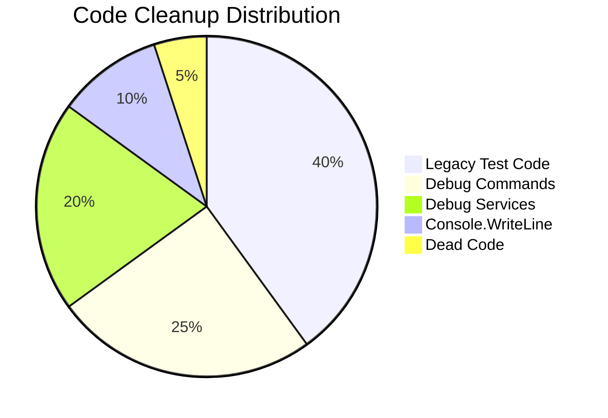

# v0.3.24a: The Broom (Deprecation Cleanup) - Expanded Implementation Plan

## Overview

A focused cleanup pass to remove deprecated code, secure debug commands, and standardize output before the v0.4.0 Alpha release. This ensures the codebase is production-ready and free of "temporary" v0.0.x artifacts.

**Parent Plan:** [v0.3.24](./v0.3.24.md)
**Status:** Planned
**Dependencies:** None (cleanup pass, no new features)

---

## Architecture Summary

### Key Cleanup Categories

1. **Legacy Code Removal** - Delete v0.0.x test map generation that's been replaced by proper dungeon templates
2. **Debug Command Security** - Wrap debug commands in `#if DEBUG` preprocessor directives
3. **Debug Service Security** - Conditionally register debug services in DI container
4. **Output Standardization** - Replace raw `Console.WriteLine` with proper logging/UI output
5. **Dead Code Elimination** - Remove unused methods, commented-out code, and TODO artifacts

### Cleanup Audit Summary



---

## Cleanup Audit Table

### Phase 1: Legacy Code Removal

| Item | File | Line | Action | Risk |
|------|------|------|--------|------|
| `GenerateTestMapAsync` | `DungeonGenerator.cs` | ~145 | DELETE method | Medium - update callers |
| Test map call | `Program.cs` | ~420 | REPLACE with `GenerateDungeonAsync` | Low |
| Hardcoded rooms | `DungeonGeneratorTests.cs` | ~50 | REFACTOR to use templates | Medium |

### Phase 2: Debug Command Security

| Item | File | Line | Action | Risk |
|------|------|------|--------|------|
| `debug-combat` command | `CommandParser.cs` | ~909 | WRAP in `#if DEBUG` | Low |
| `_debugConsoleRenderer` | `CommandParser.cs` | ~303 | WRAP in `#if DEBUG` | Low |
| Tilde (`~`) hotkey | `CommandParser.cs` | ~850 | WRAP in `#if DEBUG` | Low |

### Phase 3: Debug Service Security

| Item | File | Line | Action | Risk |
|------|------|------|--------|------|
| `IDebugConsoleService` | `Program.cs` | ~214 | WRAP registration in `#if DEBUG` | Low |
| `ICheatService` | `Program.cs` | ~218 | WRAP registration in `#if DEBUG` | Low |
| `DebugConsoleRenderer` | `Program.cs` | ~220 | WRAP registration in `#if DEBUG` | Low |

### Phase 4: Output Standardization

| Item | File | Line | Action | Risk |
|------|------|------|--------|------|
| Emergency save output | `EmergencySaveService.cs` | ~45 | DOCUMENT as intentional | None |
| Startup banner | `Program.cs` | ~50 | VERIFY uses `AnsiConsole` | None |

### Phase 5: Dead Code Elimination

| Item | File | Action | Risk |
|------|------|--------|------|
| Training Dummy default | `Enemy.cs` | CHANGE to "Unknown Enemy" | Low |
| Commented TODO blocks | Various | REMOVE or resolve | None |

---

## Files to Create (0 new files)

This is a cleanup pass with no new files created.

## Files to Modify (6 existing files)

| File | Changes |
|------|---------|
| `RuneAndRust.Engine/Services/DungeonGenerator.cs` | Delete `GenerateTestMapAsync()` method |
| `RuneAndRust.Engine/Services/CommandParser.cs` | Wrap debug commands in `#if DEBUG` |
| `RuneAndRust.Core/Entities/Enemy.cs` | Change default name from "Training Dummy" |
| `RuneAndRust.Terminal/Program.cs` | Update map call, wrap debug registrations |
| `RuneAndRust.Engine/Services/EmergencySaveService.cs` | Document intentional Console.WriteLine |
| `RuneAndRust.Tests/Engine/DungeonGeneratorTests.cs` | Refactor tests for new API |

---

## Implementation Order

1. Audit all `Console.WriteLine` calls in codebase
2. Update `Enemy.cs` default name
3. Delete `GenerateTestMapAsync()` from `DungeonGenerator.cs`
4. Update `Program.cs` to use `GenerateDungeonAsync`
5. Wrap debug commands in `CommandParser.cs`
6. Wrap debug service registrations in `Program.cs`
7. Document emergency save output
8. Run tests and verify Release build
9. Update `DungeonGeneratorTests.cs` if needed

---

## Detailed Code Specifications

### 1. Delete GenerateTestMapAsync

**File:** `RuneAndRust.Engine/Services/DungeonGenerator.cs`

Delete the entire method (approximately 50 lines):

```csharp
// DELETE THIS ENTIRE METHOD
/// <summary>
/// DEPRECATED: v0.0.5 test map generation. Use GenerateDungeonAsync instead.
/// </summary>
[Obsolete("Use GenerateDungeonAsync with template name")]
public async Task<Guid> GenerateTestMapAsync()
{
    // ... legacy hardcoded room generation ...
}
```

### 2. Update Program.cs Map Generation

**File:** `RuneAndRust.Terminal/Program.cs` (Line ~420)

```csharp
// BEFORE
var startRoomId = dungeonGen.GenerateTestMapAsync().GetAwaiter().GetResult();

// AFTER
// v0.3.24a: Use proper dungeon template instead of deprecated test map
var startRoomId = await dungeonGen.GenerateDungeonAsync("the_roots");
```

### 3. Wrap Debug Commands

**File:** `RuneAndRust.Engine/Services/CommandParser.cs`

```csharp
// Line ~303 - Constructor field
#if DEBUG
    private readonly IDebugConsoleRenderer? _debugConsoleRenderer;
#endif

// Line ~850 - Tilde hotkey
#if DEBUG
    // Debug console activation (tilde key)
    if (key.KeyChar == '~' || key.KeyChar == '`')
    {
        _debugConsoleRenderer?.Show();
        return ParseResult.None;
    }
#endif

// Line ~909 - Debug combat command
#if DEBUG
    case "debug-combat":
    case "dc":
        await StartDebugCombatAsync();
        return ParseResult.None;
#endif
```

### 4. Wrap Debug Service Registrations

**File:** `RuneAndRust.Terminal/Program.cs` (Line ~214)

```csharp
#if DEBUG
// ==============================================================================
// DEBUG SERVICES (v0.3.17) - Only registered in Debug builds
// ==============================================================================

// Register Debug Console Services (v0.3.17a)
services.AddSingleton<IDebugConsoleService, DebugConsoleService>();
services.AddScoped<IDebugConsoleRenderer, DebugConsoleRenderer>();

// Register Cheat Service (v0.3.17b)
services.AddScoped<ICheatService, CheatService>();

_logger.LogDebug("[DI] Debug services registered (DEBUG build)");
#endif
```

### 5. Update Enemy Default Name

**File:** `RuneAndRust.Core/Entities/Enemy.cs` (Line ~22)

```csharp
// BEFORE
public string Name { get; set; } = "Training Dummy";

// AFTER
/// <summary>
/// Display name of the enemy. Defaults to "Unknown Enemy" for safety.
/// v0.3.24a: Changed from "Training Dummy" for Release builds.
/// </summary>
public string Name { get; set; } = "Unknown Enemy";
```

### 6. Document Emergency Save Output

**File:** `RuneAndRust.Engine/Services/EmergencySaveService.cs** (Line ~45)

```csharp
/// <summary>
/// Attempts emergency save during critical failure.
/// </summary>
/// <remarks>
/// Uses Console.WriteLine intentionally because:
/// 1. This runs during a system crash when other services may be unavailable
/// 2. AnsiConsole may also be in a broken state
/// 3. User must see the save result regardless of logging state
/// </remarks>
private void NotifyUser(string message)
{
    // INTENTIONAL: Raw console output for crash resilience
    // Do NOT replace with ILogger or AnsiConsole - they may be unavailable
    Console.WriteLine($"[Emergency Save] {message}");
}
```

### 7. Update DungeonGeneratorTests

**File:** `RuneAndRust.Tests/Engine/DungeonGeneratorTests.cs`

```csharp
// BEFORE - Tests that call GenerateTestMapAsync
[Fact]
public async Task GenerateTestMapAsync_CreatesThreeRooms()
{
    var startId = await _generator.GenerateTestMapAsync();
    // ...
}

// AFTER - Use template-based generation or mocks
[Fact]
public async Task GenerateDungeonAsync_WithTheRoots_CreatesValidLayout()
{
    // Arrange
    var templateName = "the_roots";

    // Act
    var startId = await _generator.GenerateDungeonAsync(templateName);

    // Assert
    Assert.NotEqual(Guid.Empty, startId);
    var startRoom = await _roomRepository.GetAsync(startId);
    Assert.NotNull(startRoom);
    Assert.True(startRoom.Connections.Count > 0);
}
```

---

## Logging Requirements

| Component | Event | Level | Template | Properties |
|-----------|-------|-------|----------|------------|
| `DungeonGenerator` | Template Load | Info | `[Dungeon] Generating dungeon from template: {Template}` | Template |
| `Program` | Debug Services | Debug | `[DI] Debug services registered (DEBUG build)` | - |
| `CommandParser` | Unknown Command | Debug | `[Parse] Unknown command in Release: {Command}` | Command |

---

## Console.WriteLine Audit Results

### Acceptable Uses (Keep)

| File | Line | Reason |
|------|------|--------|
| `EmergencySaveService.cs` | ~45 | Crash resilience - logging may be unavailable |
| `Program.cs` | ~15 | Pre-DI startup banner (before services available) |

### Must Replace (If Found)

| Pattern | Replacement |
|---------|-------------|
| `Console.WriteLine(debug)` | `_logger.LogDebug(...)` |
| `Console.WriteLine(error)` | `_logger.LogError(...)` |
| `Console.WriteLine(user)` | `AnsiConsole.MarkupLine(...)` |

---

## Testing Strategy

### Automated Tests

**Run all existing tests to verify no regressions:**
```bash
dotnet test RuneAndRust.Tests
```

**Run dungeon generation tests specifically:**
```bash
dotnet test RuneAndRust.Tests --filter "FullyQualifiedName~DungeonGenerator"
```

### Build Verification

**Build in Release configuration:**
```bash
dotnet build -c Release
```

**Expected:** No compilation errors, no debug symbols in output.

### Debug Lock Verification

**Manual steps in Release build:**

1. Launch game in Release mode:
   ```bash
   cd RuneAndRust.Terminal
   dotnet run -c Release
   ```

2. At the main menu or in-game, type:
   - `debug-combat` → **Expected:** "Unknown command" or no reaction
   - `dc` → **Expected:** "Unknown command" or no reaction
   - Press `~` (tilde) → **Expected:** Nothing happens, normal gameplay continues

3. Start a new game → **Expected:** Game starts with proper dungeon template, not hardcoded test map

### Game Functionality Verification

**Manual steps:**

1. Start new game
2. Verify dungeon generates (room description appears)
3. Move between rooms (W/A/S/D or north/south/east/west)
4. Encounter at least one combat
5. Verify no "Training Dummy" enemies appear in normal encounters

---

## Work Breakdown

### Phase 1: Deprecation Cleanup
- [ ] Delete `GenerateTestMapAsync()` from `DungeonGenerator.cs`
- [ ] Update `Program.cs` to use `GenerateDungeonAsync("the_roots")`
- [ ] Update `DungeonGeneratorTests.cs` to use new API

### Phase 2: Debug Security
- [ ] Wrap `debug-combat` command in `#if DEBUG`
- [ ] Wrap tilde hotkey in `#if DEBUG`
- [ ] Wrap `_debugConsoleRenderer` field in `#if DEBUG`
- [ ] Wrap debug service registrations in `Program.cs`

### Phase 3: Standardization
- [ ] Change `Enemy.cs` default name to "Unknown Enemy"
- [ ] Document `EmergencySaveService.cs` Console.WriteLine
- [ ] Audit all Console.WriteLine calls in codebase

### Phase 4: Verification
- [ ] Run all tests
- [ ] Build Release configuration
- [ ] Manually verify debug commands are locked
- [ ] Manually verify game starts correctly

---

## Estimated Metrics

| Metric | Value |
|--------|-------|
| Lines Removed | ~50 (GenerateTestMapAsync) |
| Lines Modified | ~30 (#if DEBUG wraps) |
| Lines Added | ~10 (documentation comments) |
| Files Touched | 6 |
| Tests Updated | ~3 |

---

## Pre-Commit Checks

- [ ] All tests pass: `dotnet test RuneAndRust.Tests`
- [ ] Release build succeeds: `dotnet build -c Release`
- [ ] Debug commands inaccessible in Release
- [ ] No new `Console.WriteLine` introduced
- [ ] No compiler warnings in Release configuration
- [ ] Game starts correctly with template dungeon

---

## Risk Assessment

| Risk | Likelihood | Impact | Mitigation |
|------|------------|--------|------------|
| Tests fail after API removal | Medium | Low | Update tests before removing method |
| Debug services needed at runtime | Low | Medium | Null checks on optional services |
| Emergency save breaks | Low | High | Keep Console.WriteLine, document clearly |
| Template dungeon not found | Low | High | Verify template exists before removing test map |

---

## Rollback Plan

If issues are discovered after deployment:

1. **Git revert:** `git revert HEAD` to restore previous state
2. **Cherry-pick:** Selectively apply non-breaking changes
3. **Hotfix:** Re-enable debug commands if needed for debugging

**End of Plan**

