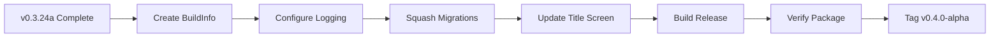

# v0.3.24b: The Golden Master (Alpha Packaging) - Expanded Implementation Plan

## Overview

Prepare the application for "Release" distribution as v0.4.0-alpha. This involves establishing a single source of truth for version information, configuring production-appropriate logging levels, consolidating database migrations into a clean slate, and creating the Alpha packaging artifacts.

**Parent Plan:** [v0.3.24](./v0.3.24.md)
**Status:** Planned
**Dependencies:** `v0.3.24a` (Deprecation Cleanup)

---

## Architecture Summary

### Key Packaging Tasks

1. **Version Centralization** - Create `BuildInfo` static class as single source of truth
2. **Production Logging** - Configure Serilog for Release builds (reduced verbosity)
3. **Migration Squash** - Consolidate all EF migrations into `Initial_v0_4_0`
4. **Title Screen** - Display version and codename on startup
5. **Build Artifacts** - Create release-ready binaries

### Golden Master Checklist



---

## Files to Create (1 new file)

| File | Purpose |
|------|---------|
| `RuneAndRust.Core/Constants/BuildInfo.cs` | Centralized version and build information |

## Files to Modify (3 existing files)

| File | Changes |
|------|---------|
| `RuneAndRust.Terminal/Program.cs` | Production logging configuration |
| `RuneAndRust.Terminal/Services/TitleScreenService.cs` | Display version info |
| `RuneAndRust.Persistence/Migrations/*` | Delete and recreate as single migration |

---

## Implementation Order

1. Create `BuildInfo.cs` with version constants
2. Update Serilog configuration for Debug/Release
3. Delete existing migrations
4. Drop and recreate database
5. Create `Initial_v0_4_0` migration
6. Update title screen to show version
7. Build Release configuration
8. Run verification steps

---

## Detailed Code Specifications

### 1. BuildInfo Static Class

**File:** `RuneAndRust.Core/Constants/BuildInfo.cs` (New)

```csharp
namespace RuneAndRust.Core.Constants;

/// <summary>
/// Centralized build and version information.
/// v0.3.24b: Single source of truth for version display.
/// </summary>
public static class BuildInfo
{
    /// <summary>
    /// Semantic version string. Format: Major.Minor.Patch[-prerelease]
    /// </summary>
    public const string Version = "0.4.0-alpha";

    /// <summary>
    /// Marketing codename for this release.
    /// </summary>
    public const string Codename = "The Saga";

    /// <summary>
    /// Major version number (for compatibility checks).
    /// </summary>
    public const int MajorVersion = 0;

    /// <summary>
    /// Minor version number.
    /// </summary>
    public const int MinorVersion = 4;

    /// <summary>
    /// Patch version number.
    /// </summary>
    public const int PatchVersion = 0;

    /// <summary>
    /// Pre-release tag (e.g., "alpha", "beta", "rc.1").
    /// Empty string for stable releases.
    /// </summary>
    public const string PreReleaseTag = "alpha";

    /// <summary>
    /// Full display string for UI.
    /// Example: "Rune & Rust v0.4.0-alpha 'The Saga'"
    /// </summary>
    public static string FullDisplayString =>
        $"Rune & Rust v{Version} '{Codename}'";

    /// <summary>
    /// Short display string for status bars.
    /// Example: "v0.4.0-alpha"
    /// </summary>
    public static string ShortDisplayString => $"v{Version}";

    /// <summary>
    /// Build timestamp. In production, this would be set by CI/CD.
    /// For now, uses compile time approximation.
    /// </summary>
    public static DateTime BuildDate { get; } = GetBuildDate();

    /// <summary>
    /// Indicates if this is a Debug build.
    /// </summary>
    public static bool IsDebug
    {
        get
        {
#if DEBUG
            return true;
#else
            return false;
#endif
        }
    }

    /// <summary>
    /// Build configuration string.
    /// </summary>
    public static string Configuration => IsDebug ? "Debug" : "Release";

    /// <summary>
    /// Gets approximate build date from assembly metadata.
    /// </summary>
    private static DateTime GetBuildDate()
    {
        // In real CI/CD, this would be set via AssemblyMetadata attribute
        // For now, return current date as placeholder
        return DateTime.UtcNow;
    }
}
```

### 2. Production Logging Configuration

**File:** `RuneAndRust.Terminal/Program.cs`

Update the Serilog configuration to be environment-aware:

```csharp
// ==============================================================================
// LOGGING CONFIGURATION (v0.3.24b)
// ==============================================================================

var loggerConfig = new LoggerConfiguration()
    .Enrich.FromLogContext()
    .Enrich.WithProperty("Application", "RuneAndRust")
    .Enrich.WithProperty("Version", BuildInfo.Version);

#if DEBUG
// Debug: Verbose logging to console and file
loggerConfig
    .MinimumLevel.Debug()
    .MinimumLevel.Override("Microsoft", LogEventLevel.Warning)
    .MinimumLevel.Override("System", LogEventLevel.Warning)
    .WriteTo.Console(
        outputTemplate: "[{Timestamp:HH:mm:ss} {Level:u3}] {Message:lj}{NewLine}{Exception}",
        theme: AnsiConsoleTheme.Code)
    .WriteTo.File(
        path: "logs/runeandrust-.log",
        rollingInterval: RollingInterval.Day,
        outputTemplate: "{Timestamp:yyyy-MM-dd HH:mm:ss.fff zzz} [{Level:u3}] {Message:lj}{NewLine}{Exception}");
#else
// Release: Information level to file only
// Console is reserved for TUI rendering via Spectre.Console
loggerConfig
    .MinimumLevel.Information()
    .MinimumLevel.Override("Microsoft", LogEventLevel.Warning)
    .MinimumLevel.Override("System", LogEventLevel.Warning)
    .MinimumLevel.Override("Microsoft.EntityFrameworkCore", LogEventLevel.Warning)
    .WriteTo.File(
        path: "logs/runeandrust-.log",
        rollingInterval: RollingInterval.Day,
        retainedFileCountLimit: 7, // Keep 7 days of logs
        outputTemplate: "{Timestamp:yyyy-MM-dd HH:mm:ss.fff zzz} [{Level:u3}] {Message:lj}{NewLine}{Exception}");
#endif

Log.Logger = loggerConfig.CreateLogger();

Log.Information("=== Rune & Rust {Version} ({Configuration}) ===",
    BuildInfo.Version, BuildInfo.Configuration);
```

### 3. Title Screen Version Display

**File:** `RuneAndRust.Terminal/Services/TitleScreenService.cs`

```csharp
using RuneAndRust.Core.Constants;
using Spectre.Console;

public class TitleScreenService : ITitleScreenService
{
    public void DisplayTitleScreen()
    {
        AnsiConsole.Clear();

        // ASCII Art Banner
        var titleArt = new FigletText("RUNE & RUST")
            .LeftJustified()
            .Color(Color.DarkOrange);

        AnsiConsole.Write(titleArt);

        // Version and Codename
        var versionPanel = new Panel(
            new Markup($"[bold yellow]{BuildInfo.ShortDisplayString}[/] [grey]'{BuildInfo.Codename}'[/]"))
            .BorderColor(Color.Grey)
            .Border(BoxBorder.Rounded)
            .Header("[grey]Version[/]");

        AnsiConsole.Write(versionPanel);

        // Build info (Debug only)
        if (BuildInfo.IsDebug)
        {
            AnsiConsole.MarkupLine($"[dim grey]Build: {BuildInfo.Configuration} | {BuildInfo.BuildDate:yyyy-MM-dd}[/]");
        }

        AnsiConsole.WriteLine();
    }

    /// <summary>
    /// Renders the footer with version info for status bars.
    /// </summary>
    public string GetVersionFooter()
    {
        return BuildInfo.IsDebug
            ? $"{BuildInfo.ShortDisplayString} [DEBUG]"
            : BuildInfo.ShortDisplayString;
    }
}
```

### 4. Migration Consolidation Commands

**Step-by-step migration squash:**

```bash
# Step 1: Navigate to project directory
cd RuneAndRust.Persistence

# Step 2: Delete all existing migrations
rm -rf Migrations/*

# Step 3: Drop the existing database (if using PostgreSQL)
# Option A: Using EF CLI
dotnet ef database drop --force --project ../RuneAndRust.Terminal

# Option B: Using psql (PostgreSQL)
psql -U postgres -c "DROP DATABASE IF EXISTS runeandrust;"
psql -U postgres -c "CREATE DATABASE runeandrust;"

# Step 4: Create the consolidated migration
dotnet ef migrations add Initial_v0_4_0 --project . --startup-project ../RuneAndRust.Terminal

# Step 5: Apply the migration
dotnet ef database update --project . --startup-project ../RuneAndRust.Terminal

# Step 6: Verify migration applied
dotnet ef migrations list --project . --startup-project ../RuneAndRust.Terminal
```

**Expected output after Step 6:**
```
Build succeeded.
Initial_v0_4_0 (Applied)
```

---

## Logging Requirements

| Component | Event | Level | Template | Properties |
|-----------|-------|-------|----------|------------|
| `Program` | Startup | Info | `=== Rune & Rust {Version} ({Configuration}) ===` | Version, Configuration |
| `Program` | Shutdown | Info | `Application shutdown complete.` | - |
| `TitleScreenService` | Display | Debug | `[Title] Displayed version: {Version}` | Version |

---

## Build Configuration Matrix

| Configuration | Min Log Level | Console Log | File Log | Retained Logs |
|---------------|---------------|-------------|----------|---------------|
| **Debug** | Debug | ✅ Verbose | ✅ Verbose | Unlimited |
| **Release** | Information | ❌ None | ✅ Info+ | 7 days |

### Log Level Overrides

| Namespace | Debug Level | Release Level |
|-----------|-------------|---------------|
| `RuneAndRust.*` | Debug | Information |
| `Microsoft.*` | Warning | Warning |
| `System.*` | Warning | Warning |
| `Microsoft.EntityFrameworkCore` | Debug | Warning |

---

## Testing Strategy

### Automated Tests

**Run all existing tests (should pass unchanged):**
```bash
dotnet test RuneAndRust.Tests
```

### Build Verification

**Build in Release configuration:**
```bash
dotnet build -c Release
```

**Publish self-contained executable (optional for Alpha):**
```bash
# Windows
dotnet publish -c Release -r win-x64 --self-contained -o publish/win-x64

# macOS
dotnet publish -c Release -r osx-arm64 --self-contained -o publish/osx-arm64

# Linux
dotnet publish -c Release -r linux-x64 --self-contained -o publish/linux-x64
```

### Manual Verification

#### 1. Version Display Test
1. Build and run in Debug mode: `dotnet run --project RuneAndRust.Terminal`
2. **Expected:** Title screen shows:
   ```
   RUNE & RUST
   ┌─ Version ─────────────────┐
   │ v0.4.0-alpha 'The Saga'   │
   └───────────────────────────┘
   Build: Debug | 2025-12-26
   ```

3. Build and run in Release mode: `dotnet run -c Release --project RuneAndRust.Terminal`
4. **Expected:** Title screen shows version WITHOUT debug info:
   ```
   RUNE & RUST
   ┌─ Version ─────────────────┐
   │ v0.4.0-alpha 'The Saga'   │
   └───────────────────────────┘
   ```

#### 2. Logging Verification (Debug)
1. Run in Debug mode
2. Play game briefly (explore, enter combat)
3. Check console output → **Expected:** Verbose debug logs visible
4. Check `logs/runeandrust-{date}.log` → **Expected:** Debug-level entries present

#### 3. Logging Verification (Release)
1. Run in Release mode: `dotnet run -c Release --project RuneAndRust.Terminal`
2. Play game briefly
3. Check console output → **Expected:** Clean TUI, no log spam
4. Check `logs/runeandrust-{date}.log` → **Expected:** Information+ level only

#### 4. Migration Verification
1. After migration squash, connect to database
2. Run: `\dt` (PostgreSQL) or equivalent
3. **Expected:** All tables present (`Characters`, `SaveGames`, `Rooms`, etc.)
4. List migrations: `dotnet ef migrations list`
5. **Expected:** Only `Initial_v0_4_0` listed

#### 5. Database Seeding Test
1. After migration, start new game
2. **Expected:** Default data present (e.g., room templates load)

---

## Work Breakdown

### Phase 1: Version Infrastructure
- [ ] Create `RuneAndRust.Core/Constants/BuildInfo.cs`
- [ ] Add version constants (Version, Codename, MajorVersion, etc.)
- [ ] Implement `IsDebug` conditional property
- [ ] Implement `FullDisplayString` and `ShortDisplayString`

### Phase 2: Logging Configuration
- [ ] Update `Program.cs` with environment-aware Serilog config
- [ ] Set Debug: MinimumLevel.Debug, Console + File
- [ ] Set Release: MinimumLevel.Information, File only
- [ ] Add namespace-level log overrides

### Phase 3: Migration Consolidation
- [ ] Delete all files in `Migrations/` directory
- [ ] Drop and recreate database
- [ ] Create `Initial_v0_4_0` migration
- [ ] Apply migration and verify

### Phase 4: UI Integration
- [ ] Update `TitleScreenService` to use `BuildInfo`
- [ ] Display version in title screen panel
- [ ] Add debug indicator for Debug builds
- [ ] Update status bar footer with version

### Phase 5: Verification
- [ ] Test version display in Debug
- [ ] Test version display in Release
- [ ] Verify log levels in Debug
- [ ] Verify log levels in Release
- [ ] Verify migration applied correctly
- [ ] Run full test suite

---

## Estimated Metrics

| Metric | Value |
|--------|-------|
| New Files | 1 (`BuildInfo.cs`) |
| Modified Files | 3 |
| New Lines | ~150 |
| Migrations Deleted | All existing (~5-10 files) |
| Migrations Created | 1 (`Initial_v0_4_0`) |

---

## Pre-Commit Checks

- [ ] `BuildInfo.Version` matches intended version (0.4.0-alpha)
- [ ] All tests pass: `dotnet test RuneAndRust.Tests`
- [ ] Release build succeeds: `dotnet build -c Release`
- [ ] No compilation warnings in Release
- [ ] Version displays correctly on title screen
- [ ] Logs redirect to file in Release (no console spam)
- [ ] Single migration exists: `Initial_v0_4_0`
- [ ] Database creates successfully from scratch

---

## Git Tagging (Post-Verification)

After all verification steps pass:

```bash
# Commit the changes
git add .
git commit -m "chore: v0.3.24b Golden Master preparation"

# Tag for Alpha release
git tag -a v0.4.0-alpha -m "v0.4.0-alpha: The Saga - First Alpha Release"

# Push tag
git push origin v0.4.0-alpha
```

---

## Release Artifacts

### Alpha Package Contents

| File/Directory | Description |
|----------------|-------------|
| `RuneAndRust.Terminal.exe` | Main executable (Windows) |
| `logs/` | Log output directory |
| `appsettings.json` | Configuration defaults |
| `README.md` | Player instructions |
| `CHANGELOG.md` | Version history |

### Future: CI/CD Integration

In future releases, `BuildInfo.BuildDate` should be populated by CI/CD pipeline:

```csharp
// Generated by build pipeline
[assembly: AssemblyMetadata("BuildDate", "2025-12-26T12:00:00Z")]
```

**End of Plan**

