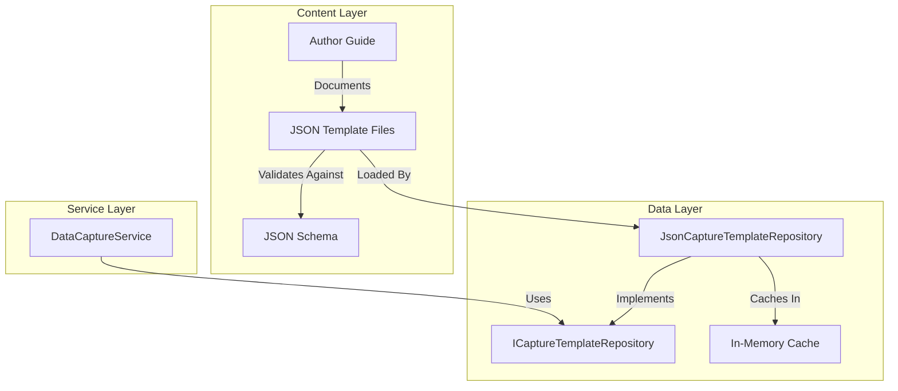
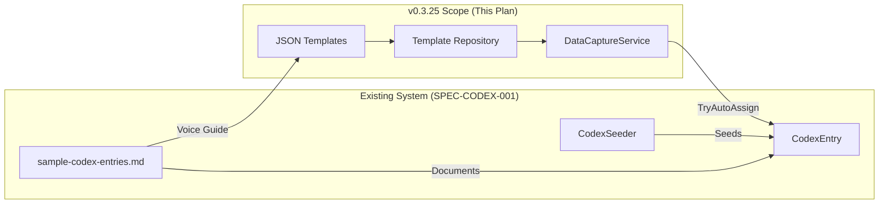

# v0.3.25: The Archive (Data Capture Template Externalization)

## Overview

Externalize hardcoded data capture templates from C# source code to JSON files, enabling content authors to add, edit, and manage lore fragments without code changes. This milestone transforms the static `CaptureTemplates.cs` into a data-driven system with validation, hot-reload capability, and a comprehensive authoring workflow.

**Milestone Codename:** The Archive
**Status:** Planned
**Dependencies:** `v0.3.24` (The Precursor) - Deprecation cleanup complete

---

## Related Specifications

| Specification | Relationship | Path |
|---------------|--------------|------|
| **SPEC-CODEX-001** | Parent system architecture | [docs/specs/knowledge/SPEC-CODEX-001.md](../../specs/knowledge/SPEC-CODEX-001.md) |
| **Sample Codex Entries** | Fragment structure, voice guidance | [docs/design/09-data/sample-codex-entries.md](../../design/09-data/sample-codex-entries.md) |
| **SPEC-CAPTURE-001** | Data Capture generation mechanics | Related spec (if exists) |

### Scope Clarification

> **This plan covers Data Capture templates (fragments) only.**
>
> **Not in scope:**
> - CodexEntry externalization (entries are seeded via `CodexSeeder.cs`)
> - The relationship between fragments and entries (defined in SPEC-CODEX-001)
> - Entry unlock thresholds (defined in SPEC-CODEX-001)
> - Narrative structure for multi-fragment entries (documented in `sample-codex-entries.md`)

### Integration with Existing System

The Data Capture templates created by this plan will:
1. **Link to CodexEntries** via `matchKeywords` → used by `TryAutoAssignAsync` to link captures to entries
2. **Follow voice guidance** from the Writer's Guide in `sample-codex-entries.md`
3. **Respect unlock thresholds** defined in CodexEntry's `UnlockThresholds` JSONB field
4. **Use CaptureTypes** as defined in SPEC-CODEX-001 (TextFragment, EchoRecording, etc.)

---

## Problem Statement

The current Data Capture system has **all lore content hardcoded** in `CaptureTemplates.cs`:

```csharp
// Current: Hardcoded in C#
public static readonly CaptureTemplate[] RustedServitor = new[]
{
    new CaptureTemplate(
        CaptureType.Specimen,
        "The servo-motor shows signs of organic fungal infiltration...",
        "Servitor examination",
        new[] { "servitor", "automaton" })
};
```

**Problems:**
1. **Content authors** must edit C# code and recompile
2. **No validation** of lore against Domain 4 constraints
3. **No hot-reload** during development
4. **Difficult to bulk import** from NotebookLM or other sources
5. **Version control noise** when lore changes are mixed with code changes

---

## Solution Architecture

### Target State

```
data/
└── capture-templates/
    ├── schema/
    │   └── capture-template.schema.json    # JSON Schema for validation
    ├── rusted-servitor.json                # Category file
    ├── generic-container.json
    ├── blighted-creature.json
    ├── industrial-site.json
    ├── ancient-ruin.json
    └── field-guide-triggers.json
```

```csharp
// Future: Data-driven
public class JsonCaptureTemplateRepository : ICaptureTemplateRepository
{
    public async Task<IEnumerable<CaptureTemplate>> GetByCategoryAsync(string category);
}
```

### Architecture Diagram



---

## Integration Points

### How Fragments Connect to Entries



### Key Relationships

| v0.3.25 Component | Connects To | Via |
|-------------------|-------------|-----|
| `CaptureTemplateDto.MatchKeywords` | `CodexEntry.Title` | `TryAutoAssignAsync` keyword matching |
| `CaptureTemplateDto.Type` | `CaptureType` enum | Shared enum in Core |
| `CaptureTemplateDto.Quality` | `DataCapture.Quality` | Legend Points system |
| `fragmentContent` voice | `sample-codex-entries.md` Writer's Guide | Style consistency |

---

## Sub-Plans

### v0.3.25a: The Schema (JSON Format Definition)
**Scope:** Define the JSON schema, file structure, and validation rules for capture templates.

| Deliverable | Description |
|-------------|-------------|
| `capture-template.schema.json` | JSON Schema with all fields, types, and constraints |
| `data/capture-templates/` directory | File structure with category-based JSON files |
| Migration of existing templates | Convert `CaptureTemplates.cs` content to JSON |
| Domain 4 validation | Schema constraints for measurement compliance |

**Key Files:**
- `data/capture-templates/schema/capture-template.schema.json`
- `data/capture-templates/*.json` (6 category files)

---

### v0.3.25b: The Repository (Data Access Layer)
**Scope:** Create the repository interface and JSON implementation for loading templates.

| Deliverable | Description |
|-------------|-------------|
| `ICaptureTemplateRepository` | Interface for template access |
| `JsonCaptureTemplateRepository` | JSON file loader with caching |
| Schema validation at load time | Reject invalid templates with clear errors |
| Category-based access | `GetByCategoryAsync(string category)` |

**Key Files:**
- `RuneAndRust.Core/Interfaces/ICaptureTemplateRepository.cs`
- `RuneAndRust.Engine/Repositories/JsonCaptureTemplateRepository.cs`

---

### v0.3.25c: The Refactor (Service Integration)
**Scope:** Refactor `DataCaptureService` to use the repository instead of static class.

| Deliverable | Description |
|-------------|-------------|
| Remove `CaptureTemplates.cs` static class | Delete hardcoded templates |
| Inject `ICaptureTemplateRepository` | Dependency injection in `DataCaptureService` |
| Update `SelectTemplate` logic | Use repository instead of static arrays |
| DI registration | Register repository in `Program.cs` |

**Key Files:**
- `RuneAndRust.Engine/Services/DataCaptureService.cs` (modified)
- `RuneAndRust.Terminal/Program.cs` (DI registration)
- `RuneAndRust.Engine/Services/CaptureTemplates.cs` (deleted)

---

### v0.3.25d: The Guide (Content Author Documentation)
**Scope:** Create comprehensive documentation for content authors to add new templates.

| Deliverable | Description |
|-------------|-------------|
| Author Guide markdown | Step-by-step template creation |
| Domain 4 compliance checklist | What to avoid in lore text |
| Voice guidance reference | AAM-VOICE Layer 2 constraints |
| Workflow for bulk import | NotebookLM to JSON pipeline |

**Key Files:**
- `docs/guides/capture-template-authoring.md`
- `docs/guides/domain-4-compliance.md` (reference)

---

## Implementation Order

```mermaid
gantt
    title v0.3.25 Implementation Sequence
    dateFormat X
    axisFormat %s

    section Schema (a)
    Define JSON Schema       :a1, 0, 1
    Create Directory Structure :a2, 1, 2
    Migrate Templates to JSON :a3, 2, 3

    section Repository (b)
    Create Interface         :b1, 3, 4
    Implement JSON Loader    :b2, 4, 5
    Add Caching & Validation :b3, 5, 6

    section Refactor (c)
    Inject Repository        :c1, 6, 7
    Update SelectTemplate    :c2, 7, 8
    Delete Static Class      :c3, 8, 9
    Verify & Test            :c4, 9, 10

    section Guide (d)
    Write Author Guide       :d1, 6, 8
    Add Examples & Templates :d2, 8, 9
    Review & Publish         :d3, 9, 10
```



---

## Success Criteria

| Criterion | Verification |
|-----------|--------------|
| All existing templates migrated to JSON | Count matches original (19 templates) |
| Schema validates all template files | `npm run validate-schema` passes |
| Service loads templates from JSON | Unit tests pass with mocked file system |
| No regression in capture generation | Integration tests for all categories |
| Author guide enables non-programmers | Tested with sample contributor |

---

## Risk Assessment

| Risk | Likelihood | Impact | Mitigation |
|------|------------|--------|------------|
| JSON parsing performance | Low | Medium | In-memory caching after first load |
| Schema too restrictive | Medium | Low | Iterative refinement with content team |
| File path issues cross-platform | Medium | Medium | Use `Path.Combine` and test on Win/Mac/Linux |
| Hot-reload complexity | Low | Low | Defer to future version if needed |

---

## Estimated Metrics

| Metric | Value |
|--------|-------|
| New Files | ~12 (6 JSON, 1 schema, 2 C#, 2 docs, 1 test) |
| Modified Files | 3 (DataCaptureService, Program.cs, tests) |
| Deleted Files | 1 (CaptureTemplates.cs) |
| New Lines | ~600 |
| Deleted Lines | ~250 |

---

## Sub-Plan Links

| Sub-Plan | Title | Status |
|----------|-------|--------|
| [v0.3.25a](./v0.3.25a.md) | The Schema | Planned |
| [v0.3.25b](./v0.3.25b.md) | The Repository | Planned |
| [v0.3.25c](./v0.3.25c.md) | The Refactor | Planned |
| [v0.3.25d](./v0.3.25d.md) | The Guide | Planned |

---

## Future Extensions

### v0.3.26: Codex Entry Externalization (Proposed)

A natural follow-up to this plan would externalize `CodexEntry` data from `CodexSeeder.cs` to JSON:

| Component | Current State | Future State |
|-----------|---------------|---------------|
| CodexEntry definitions | Hardcoded in `CodexSeeder.cs` | JSON in `data/codex-entries/` |
| Entry-to-fragment mapping | `matchKeywords` heuristic | Explicit IDs in entry JSON |
| `FullText` content | Seeder constants | Separate lore files |
| `UnlockThresholds` | Seeder constants | Entry JSON field |

### v0.3.27+ Considerations
- **Hot-Reload:** File watcher for development mode
- **Localization:** Multi-language template support
- **Template Editor:** In-game debug tool for live editing
- **Import Pipeline:** Automated NotebookLM → JSON conversion

**End of Plan**
