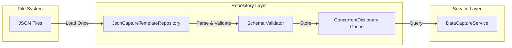

# v0.3.25b: The Repository (Data Access Layer) - Expanded Implementation Plan

## Overview

Create the repository interface and JSON implementation for loading capture templates from disk. This sub-plan establishes the data access layer that bridges the JSON template files (from v0.3.25a) to the game engine services.

**Parent Plan:** [v0.3.25](./v0.3.25.md)
**Status:** Planned
**Dependencies:** `v0.3.25a` (JSON Schema must be defined first)

---

## Related Specifications

| Specification | Relationship | Path |
|---------------|--------------|------|
| **SPEC-CODEX-001** | CaptureType enum, system architecture | [docs/specs/knowledge/SPEC-CODEX-001.md](../../specs/knowledge/SPEC-CODEX-001.md) |
| **DataCaptureService.cs** | Consumer of this repository | `RuneAndRust.Engine/Services/DataCaptureService.cs` |
| **CaptureTemplates.cs** | Static class being replaced | `RuneAndRust.Engine/Services/CaptureTemplates.cs` |

## Architecture Summary

### Key Deliverables

1. **Interface Definition** - `ICaptureTemplateRepository` with category-based access methods
2. **JSON Implementation** - `JsonCaptureTemplateRepository` that loads from file system
3. **Caching Layer** - In-memory cache to avoid repeated disk I/O
4. **Validation** - Schema validation at load time with detailed error messages
5. **Cross-Platform Paths** - `Path.Combine` for Windows/Mac/Linux compatibility

### Data Flow



---

## Files to Create (3 new files)

| File | Layer | Purpose |
|------|-------|---------|
| `RuneAndRust.Core/Interfaces/ICaptureTemplateRepository.cs` | Core | Repository interface |
| `RuneAndRust.Engine/Repositories/JsonCaptureTemplateRepository.cs` | Engine | JSON file loader |
| `RuneAndRust.Tests/Engine/JsonCaptureTemplateRepositoryTests.cs` | Tests | Unit tests |

## Files to Modify (1 existing file)

| File | Changes |
|------|---------|
| `RuneAndRust.Terminal/Program.cs` | Register repository in DI container |

---

## Implementation Order

1. Create `ICaptureTemplateRepository` interface
2. Create `CaptureTemplateCollection` model for JSON deserialization
3. Implement `JsonCaptureTemplateRepository` with file loading
4. Add in-memory caching with `ConcurrentDictionary`
5. Implement error handling and logging
6. Register in DI container
7. Write unit tests

---

## Detailed Code Specifications

### 1. ICaptureTemplateRepository Interface

**File:** `RuneAndRust.Core/Interfaces/ICaptureTemplateRepository.cs`

```csharp
using RuneAndRust.Core.Enums;

namespace RuneAndRust.Core.Interfaces;

/// <summary>
/// Repository interface for accessing Data Capture templates.
/// v0.3.25b: Abstracts template storage from service layer.
/// </summary>
/// <remarks>
/// See: SPEC-CAPTURE-001 for Data Capture System design.
/// Templates are loaded from external JSON files to enable content
/// authoring without code changes.
/// </remarks>
public interface ICaptureTemplateRepository
{
    /// <summary>
    /// Gets all templates for the specified category.
    /// </summary>
    /// <param name="category">Category name (e.g., "rusted-servitor").</param>
    /// <returns>Collection of templates, or empty if category not found.</returns>
    Task<IReadOnlyList<CaptureTemplateDto>> GetByCategoryAsync(string category);

    /// <summary>
    /// Gets a random template from the specified category.
    /// </summary>
    /// <param name="category">Category name.</param>
    /// <returns>Random template, or null if category empty/not found.</returns>
    Task<CaptureTemplateDto?> GetRandomAsync(string category);

    /// <summary>
    /// Gets all available category names.
    /// </summary>
    /// <returns>Collection of category identifiers.</returns>
    Task<IReadOnlyList<string>> GetCategoriesAsync();

    /// <summary>
    /// Gets a specific template by its unique ID.
    /// </summary>
    /// <param name="templateId">Template ID (e.g., "servitor-fungal-infection").</param>
    /// <returns>Template if found, null otherwise.</returns>
    Task<CaptureTemplateDto?> GetByIdAsync(string templateId);

    /// <summary>
    /// Forces a reload of all templates from disk.
    /// Used for hot-reload during development.
    /// </summary>
    Task ReloadAsync();

    /// <summary>
    /// Gets the total count of loaded templates across all categories.
    /// </summary>
    int TotalTemplateCount { get; }
}
```

### 2. CaptureTemplateDto Model

**File:** `RuneAndRust.Core/Models/CaptureTemplateDto.cs`

```csharp
using RuneAndRust.Core.Enums;

namespace RuneAndRust.Core.Models;

/// <summary>
/// Data Transfer Object for capture templates loaded from JSON.
/// v0.3.25b: Matches JSON schema structure.
/// </summary>
public record CaptureTemplateDto
{
    /// <summary>
    /// Unique template identifier (e.g., "servitor-fungal-infection").
    /// </summary>
    public required string Id { get; init; }

    /// <summary>
    /// Capture type classification.
    /// </summary>
    public required CaptureType Type { get; init; }

    /// <summary>
    /// The lore text content of this fragment.
    /// </summary>
    public required string FragmentContent { get; init; }

    /// <summary>
    /// Description of where/how the fragment was discovered.
    /// </summary>
    public required string Source { get; init; }

    /// <summary>
    /// Keywords for Codex auto-assignment.
    /// </summary>
    public required string[] MatchKeywords { get; init; }

    /// <summary>
    /// Quality value affecting Legend rewards. Default: 15.
    /// </summary>
    public int Quality { get; init; } = 15;

    /// <summary>
    /// Optional metadata tags for filtering.
    /// </summary>
    public string[] Tags { get; init; } = Array.Empty<string>();

    /// <summary>
    /// Category this template belongs to.
    /// </summary>
    public required string Category { get; init; }
}
```

### 3. CaptureTemplateCollection (JSON Deserialization)

**File:** `RuneAndRust.Core/Models/CaptureTemplateCollection.cs`

```csharp
using System.Text.Json.Serialization;

namespace RuneAndRust.Core.Models;

/// <summary>
/// Represents a category file loaded from JSON.
/// Matches the JSON schema structure for deserialization.
/// </summary>
public record CaptureTemplateCollection
{
    [JsonPropertyName("$schema")]
    public string? Schema { get; init; }

    [JsonPropertyName("category")]
    public required string Category { get; init; }

    [JsonPropertyName("version")]
    public required string Version { get; init; }

    [JsonPropertyName("description")]
    public string? Description { get; init; }

    [JsonPropertyName("matchKeywords")]
    public string[] MatchKeywords { get; init; } = Array.Empty<string>();

    [JsonPropertyName("templates")]
    public required CaptureTemplateJson[] Templates { get; init; }
}

/// <summary>
/// Individual template from JSON, before conversion to DTO.
/// </summary>
public record CaptureTemplateJson
{
    [JsonPropertyName("id")]
    public required string Id { get; init; }

    [JsonPropertyName("type")]
    public required string Type { get; init; }

    [JsonPropertyName("fragmentContent")]
    public required string FragmentContent { get; init; }

    [JsonPropertyName("source")]
    public required string Source { get; init; }

    [JsonPropertyName("matchKeywords")]
    public string[]? MatchKeywords { get; init; }

    [JsonPropertyName("quality")]
    public int Quality { get; init; } = 15;

    [JsonPropertyName("tags")]
    public string[]? Tags { get; init; }
}
```

### 4. JsonCaptureTemplateRepository Implementation

**File:** `RuneAndRust.Engine/Repositories/JsonCaptureTemplateRepository.cs`

```csharp
using System.Collections.Concurrent;
using System.Text.Json;
using Microsoft.Extensions.Logging;
using RuneAndRust.Core.Enums;
using RuneAndRust.Core.Interfaces;
using RuneAndRust.Core.Models;

namespace RuneAndRust.Engine.Repositories;

/// <summary>
/// Repository that loads capture templates from JSON files.
/// v0.3.25b: Data-driven template system.
/// </summary>
public class JsonCaptureTemplateRepository : ICaptureTemplateRepository
{
    private readonly ILogger<JsonCaptureTemplateRepository> _logger;
    private readonly string _templatesPath;
    private readonly Random _random;
    private readonly ConcurrentDictionary<string, List<CaptureTemplateDto>> _categoryCache;
    private readonly ConcurrentDictionary<string, CaptureTemplateDto> _idCache;
    private bool _isLoaded;
    private readonly object _loadLock = new();

    private static readonly JsonSerializerOptions JsonOptions = new()
    {
        PropertyNameCaseInsensitive = true,
        ReadCommentHandling = JsonCommentHandling.Skip,
        AllowTrailingCommas = true
    };

    /// <summary>
    /// Initializes a new instance of the repository.
    /// </summary>
    /// <param name="logger">Logger for diagnostics.</param>
    /// <param name="templatesPath">Base path to template directory. Defaults to "data/capture-templates/categories".</param>
    public JsonCaptureTemplateRepository(
        ILogger<JsonCaptureTemplateRepository> logger,
        string? templatesPath = null)
    {
        _logger = logger;
        _templatesPath = templatesPath ?? Path.Combine("data", "capture-templates", "categories");
        _random = new Random();
        _categoryCache = new ConcurrentDictionary<string, List<CaptureTemplateDto>>();
        _idCache = new ConcurrentDictionary<string, CaptureTemplateDto>();
    }

    /// <inheritdoc/>
    public int TotalTemplateCount => _idCache.Count;

    /// <inheritdoc/>
    public async Task<IReadOnlyList<CaptureTemplateDto>> GetByCategoryAsync(string category)
    {
        await EnsureLoadedAsync();

        if (_categoryCache.TryGetValue(category, out var templates))
        {
            _logger.LogTrace("[Templates] Retrieved {Count} templates for category '{Category}'",
                templates.Count, category);
            return templates.AsReadOnly();
        }

        _logger.LogDebug("[Templates] Category '{Category}' not found", category);
        return Array.Empty<CaptureTemplateDto>();
    }

    /// <inheritdoc/>
    public async Task<CaptureTemplateDto?> GetRandomAsync(string category)
    {
        var templates = await GetByCategoryAsync(category);

        if (templates.Count == 0)
            return null;

        var index = _random.Next(templates.Count);
        var template = templates[index];

        _logger.LogTrace("[Templates] Selected random template '{Id}' from category '{Category}'",
            template.Id, category);

        return template;
    }

    /// <inheritdoc/>
    public async Task<IReadOnlyList<string>> GetCategoriesAsync()
    {
        await EnsureLoadedAsync();
        return _categoryCache.Keys.ToList().AsReadOnly();
    }

    /// <inheritdoc/>
    public async Task<CaptureTemplateDto?> GetByIdAsync(string templateId)
    {
        await EnsureLoadedAsync();

        if (_idCache.TryGetValue(templateId, out var template))
        {
            _logger.LogTrace("[Templates] Found template by ID: '{Id}'", templateId);
            return template;
        }

        _logger.LogDebug("[Templates] Template ID '{Id}' not found", templateId);
        return null;
    }

    /// <inheritdoc/>
    public async Task ReloadAsync()
    {
        _logger.LogInformation("[Templates] Reloading all templates from '{Path}'", _templatesPath);

        _categoryCache.Clear();
        _idCache.Clear();
        _isLoaded = false;

        await EnsureLoadedAsync();

        _logger.LogInformation("[Templates] Reload complete. {Count} templates loaded.", TotalTemplateCount);
    }

    /// <summary>
    /// Ensures templates are loaded, using double-checked locking for thread safety.
    /// </summary>
    private async Task EnsureLoadedAsync()
    {
        if (_isLoaded) return;

        lock (_loadLock)
        {
            if (_isLoaded) return;
            LoadTemplatesSync();
            _isLoaded = true;
        }

        await Task.CompletedTask; // Keep async signature for future async file I/O
    }

    /// <summary>
    /// Synchronously loads all template files.
    /// </summary>
    private void LoadTemplatesSync()
    {
        _logger.LogDebug("[Templates] Loading templates from '{Path}'", _templatesPath);

        if (!Directory.Exists(_templatesPath))
        {
            _logger.LogWarning("[Templates] Templates directory not found: '{Path}'", _templatesPath);
            return;
        }

        var jsonFiles = Directory.GetFiles(_templatesPath, "*.json");
        _logger.LogDebug("[Templates] Found {Count} JSON files", jsonFiles.Length);

        foreach (var filePath in jsonFiles)
        {
            try
            {
                LoadCategoryFile(filePath);
            }
            catch (Exception ex)
            {
                _logger.LogError(ex, "[Templates] Failed to load file: '{Path}'", filePath);
            }
        }

        _logger.LogInformation("[Templates] Loaded {TemplateCount} templates across {CategoryCount} categories",
            TotalTemplateCount, _categoryCache.Count);
    }

    /// <summary>
    /// Loads a single category JSON file.
    /// </summary>
    private void LoadCategoryFile(string filePath)
    {
        _logger.LogTrace("[Templates] Loading file: '{Path}'", filePath);

        var json = File.ReadAllText(filePath);
        var collection = JsonSerializer.Deserialize<CaptureTemplateCollection>(json, JsonOptions);

        if (collection == null)
        {
            _logger.LogWarning("[Templates] Failed to deserialize: '{Path}'", filePath);
            return;
        }

        var templates = new List<CaptureTemplateDto>();

        foreach (var jsonTemplate in collection.Templates)
        {
            // Parse CaptureType enum
            if (!Enum.TryParse<CaptureType>(jsonTemplate.Type, out var captureType))
            {
                _logger.LogWarning("[Templates] Invalid type '{Type}' in template '{Id}'",
                    jsonTemplate.Type, jsonTemplate.Id);
                continue;
            }

            // Use template keywords, fallback to category keywords
            var keywords = jsonTemplate.MatchKeywords?.Length > 0
                ? jsonTemplate.MatchKeywords
                : collection.MatchKeywords;

            var dto = new CaptureTemplateDto
            {
                Id = jsonTemplate.Id,
                Type = captureType,
                FragmentContent = jsonTemplate.FragmentContent,
                Source = jsonTemplate.Source,
                MatchKeywords = keywords,
                Quality = jsonTemplate.Quality,
                Tags = jsonTemplate.Tags ?? Array.Empty<string>(),
                Category = collection.Category
            };

            templates.Add(dto);
            _idCache.TryAdd(dto.Id, dto);
        }

        _categoryCache.TryAdd(collection.Category, templates);
        _logger.LogDebug("[Templates] Loaded category '{Category}' with {Count} templates",
            collection.Category, templates.Count);
    }
}
```

### 5. DI Registration

**File:** `RuneAndRust.Terminal/Program.cs`

```csharp
// ==============================================================================
// CAPTURE TEMPLATE REPOSITORY (v0.3.25b)
// ==============================================================================

// Register the JSON-based capture template repository
services.AddSingleton<ICaptureTemplateRepository>(sp =>
{
    var logger = sp.GetRequiredService<ILogger<JsonCaptureTemplateRepository>>();
    var basePath = Path.Combine(AppContext.BaseDirectory, "data", "capture-templates", "categories");
    return new JsonCaptureTemplateRepository(logger, basePath);
});

_logger.LogDebug("[DI] Registered ICaptureTemplateRepository (JSON-based)");
```

---

## Error Handling Strategy

| Error Condition | Handling | Log Level |
|-----------------|----------|-----------|
| Templates directory missing | Log warning, return empty collections | Warning |
| JSON parse error | Log error with file path, skip file | Error |
| Invalid CaptureType enum | Log warning, skip template | Warning |
| Null/empty collections | Return empty list, don't throw | Debug |
| File I/O exception | Log error, continue with other files | Error |

---

## Caching Strategy

### Cache Implementation

| Cache | Type | Key | Purpose |
|-------|------|-----|---------|
| `_categoryCache` | `ConcurrentDictionary<string, List<CaptureTemplateDto>>` | Category name | Fast category lookup |
| `_idCache` | `ConcurrentDictionary<string, CaptureTemplateDto>` | Template ID | Fast ID lookup |

### Cache Lifetime

- **Load**: Once at first access (lazy initialization)
- **Reload**: On explicit `ReloadAsync()` call
- **Thread Safety**: `ConcurrentDictionary` + double-checked locking

---

## Logging Requirements

| Component | Event | Level | Template | Properties |
|-----------|-------|-------|----------|------------|
| JsonCaptureTemplateRepository | Load Start | Debug | `[Templates] Loading templates from '{Path}'` | Path |
| JsonCaptureTemplateRepository | Load Complete | Info | `[Templates] Loaded {TemplateCount} templates across {CategoryCount} categories` | TemplateCount, CategoryCount |
| JsonCaptureTemplateRepository | Category Loaded | Debug | `[Templates] Loaded category '{Category}' with {Count} templates` | Category, Count |
| JsonCaptureTemplateRepository | Category Not Found | Debug | `[Templates] Category '{Category}' not found` | Category |
| JsonCaptureTemplateRepository | Invalid Type | Warning | `[Templates] Invalid type '{Type}' in template '{Id}'` | Type, Id |
| JsonCaptureTemplateRepository | File Load Error | Error | `[Templates] Failed to load file: '{Path}'` | Path, Exception |
| JsonCaptureTemplateRepository | Reload | Info | `[Templates] Reloading all templates from '{Path}'` | Path |

---

## Testing Strategy

### Unit Tests

**File:** `RuneAndRust.Tests/Engine/JsonCaptureTemplateRepositoryTests.cs`

```csharp
using Microsoft.Extensions.Logging;
using Moq;
using RuneAndRust.Core.Enums;
using RuneAndRust.Engine.Repositories;
using Xunit;

namespace RuneAndRust.Tests.Engine;

public class JsonCaptureTemplateRepositoryTests : IDisposable
{
    private readonly string _testDir;
    private readonly Mock<ILogger<JsonCaptureTemplateRepository>> _loggerMock;

    public JsonCaptureTemplateRepositoryTests()
    {
        _testDir = Path.Combine(Path.GetTempPath(), $"capture-templates-{Guid.NewGuid()}");
        Directory.CreateDirectory(_testDir);
        _loggerMock = new Mock<ILogger<JsonCaptureTemplateRepository>>();
    }

    public void Dispose()
    {
        if (Directory.Exists(_testDir))
            Directory.Delete(_testDir, recursive: true);
    }

    [Fact]
    public async Task GetByCategoryAsync_ValidCategory_ReturnsTemplates()
    {
        // Arrange
        CreateTestFile("test-category.json", """
        {
            "category": "test-category",
            "version": "1.0.0",
            "matchKeywords": ["test"],
            "templates": [
                {
                    "id": "test-template-1",
                    "type": "TextFragment",
                    "fragmentContent": "This is a test fragment with enough content.",
                    "source": "Test source"
                }
            ]
        }
        """);

        var repo = new JsonCaptureTemplateRepository(_loggerMock.Object, _testDir);

        // Act
        var templates = await repo.GetByCategoryAsync("test-category");

        // Assert
        Assert.Single(templates);
        Assert.Equal("test-template-1", templates[0].Id);
        Assert.Equal(CaptureType.TextFragment, templates[0].Type);
    }

    [Fact]
    public async Task GetByCategoryAsync_InvalidCategory_ReturnsEmpty()
    {
        // Arrange
        var repo = new JsonCaptureTemplateRepository(_loggerMock.Object, _testDir);

        // Act
        var templates = await repo.GetByCategoryAsync("nonexistent");

        // Assert
        Assert.Empty(templates);
    }

    [Fact]
    public async Task GetRandomAsync_ValidCategory_ReturnsTemplate()
    {
        // Arrange
        CreateTestFile("random-test.json", """
        {
            "category": "random-test",
            "version": "1.0.0",
            "matchKeywords": ["test"],
            "templates": [
                { "id": "t1", "type": "Specimen", "fragmentContent": "Content one with sufficient length.", "source": "Test" },
                { "id": "t2", "type": "Specimen", "fragmentContent": "Content two with sufficient length.", "source": "Test" }
            ]
        }
        """);

        var repo = new JsonCaptureTemplateRepository(_loggerMock.Object, _testDir);

        // Act
        var template = await repo.GetRandomAsync("random-test");

        // Assert
        Assert.NotNull(template);
        Assert.Contains(template.Id, new[] { "t1", "t2" });
    }

    [Fact]
    public async Task GetByIdAsync_ValidId_ReturnsTemplate()
    {
        // Arrange
        CreateTestFile("id-test.json", """
        {
            "category": "id-test",
            "version": "1.0.0",
            "matchKeywords": ["test"],
            "templates": [
                { "id": "specific-id", "type": "OralHistory", "fragmentContent": "Specific content with enough text.", "source": "Test" }
            ]
        }
        """);

        var repo = new JsonCaptureTemplateRepository(_loggerMock.Object, _testDir);

        // Act
        var template = await repo.GetByIdAsync("specific-id");

        // Assert
        Assert.NotNull(template);
        Assert.Equal("specific-id", template.Id);
    }

    [Fact]
    public async Task GetCategoriesAsync_MultipleFiles_ReturnsAllCategories()
    {
        // Arrange
        CreateTestFile("cat-1.json", """
        { "category": "cat-1", "version": "1.0.0", "matchKeywords": ["a"], "templates": [{ "id": "t1", "type": "TextFragment", "fragmentContent": "Content for category one test.", "source": "Test" }] }
        """);
        CreateTestFile("cat-2.json", """
        { "category": "cat-2", "version": "1.0.0", "matchKeywords": ["b"], "templates": [{ "id": "t2", "type": "TextFragment", "fragmentContent": "Content for category two test.", "source": "Test" }] }
        """);

        var repo = new JsonCaptureTemplateRepository(_loggerMock.Object, _testDir);

        // Act
        var categories = await repo.GetCategoriesAsync();

        // Assert
        Assert.Contains("cat-1", categories);
        Assert.Contains("cat-2", categories);
    }

    [Fact]
    public async Task TotalTemplateCount_AfterLoad_ReturnsCorrectCount()
    {
        // Arrange
        CreateTestFile("count-test.json", """
        {
            "category": "count-test",
            "version": "1.0.0",
            "matchKeywords": ["test"],
            "templates": [
                { "id": "t1", "type": "TextFragment", "fragmentContent": "First template content here.", "source": "Test" },
                { "id": "t2", "type": "TextFragment", "fragmentContent": "Second template content here.", "source": "Test" },
                { "id": "t3", "type": "TextFragment", "fragmentContent": "Third template content here.", "source": "Test" }
            ]
        }
        """);

        var repo = new JsonCaptureTemplateRepository(_loggerMock.Object, _testDir);

        // Act
        await repo.GetCategoriesAsync(); // Trigger load

        // Assert
        Assert.Equal(3, repo.TotalTemplateCount);
    }

    [Fact]
    public async Task LoadTemplates_InvalidType_SkipsTemplate()
    {
        // Arrange
        CreateTestFile("invalid-type.json", """
        {
            "category": "invalid-type",
            "version": "1.0.0",
            "matchKeywords": ["test"],
            "templates": [
                { "id": "valid", "type": "TextFragment", "fragmentContent": "Valid template content here.", "source": "Test" },
                { "id": "invalid", "type": "NotARealType", "fragmentContent": "Invalid template content.", "source": "Test" }
            ]
        }
        """);

        var repo = new JsonCaptureTemplateRepository(_loggerMock.Object, _testDir);

        // Act
        var templates = await repo.GetByCategoryAsync("invalid-type");

        // Assert
        Assert.Single(templates);
        Assert.Equal("valid", templates[0].Id);
    }

    [Fact]
    public async Task ReloadAsync_ClearsAndReloads()
    {
        // Arrange
        CreateTestFile("reload-test.json", """
        {
            "category": "reload-test",
            "version": "1.0.0",
            "matchKeywords": ["test"],
            "templates": [{ "id": "original", "type": "TextFragment", "fragmentContent": "Original content here.", "source": "Test" }]
        }
        """);

        var repo = new JsonCaptureTemplateRepository(_loggerMock.Object, _testDir);
        await repo.GetCategoriesAsync(); // Initial load

        // Modify file
        File.WriteAllText(Path.Combine(_testDir, "reload-test.json"), """
        {
            "category": "reload-test",
            "version": "1.0.0",
            "matchKeywords": ["test"],
            "templates": [{ "id": "updated", "type": "TextFragment", "fragmentContent": "Updated content here.", "source": "Test" }]
        }
        """);

        // Act
        await repo.ReloadAsync();
        var templates = await repo.GetByCategoryAsync("reload-test");

        // Assert
        Assert.Single(templates);
        Assert.Equal("updated", templates[0].Id);
    }

    private void CreateTestFile(string filename, string content)
    {
        File.WriteAllText(Path.Combine(_testDir, filename), content);
    }
}
```

---

## Work Breakdown

### Phase 1: Interface & Models
- [ ] Create `ICaptureTemplateRepository.cs` interface
- [ ] Create `CaptureTemplateDto.cs` record
- [ ] Create `CaptureTemplateCollection.cs` for JSON deserialization

### Phase 2: Implementation
- [ ] Create `JsonCaptureTemplateRepository.cs`
- [ ] Implement `GetByCategoryAsync`
- [ ] Implement `GetRandomAsync`
- [ ] Implement `GetByIdAsync`
- [ ] Implement `GetCategoriesAsync`
- [ ] Implement `ReloadAsync`
- [ ] Add caching with `ConcurrentDictionary`

### Phase 3: Integration
- [ ] Register in DI container (`Program.cs`)
- [ ] Verify path resolution works cross-platform

### Phase 4: Testing
- [ ] Create test fixture with temp directory
- [ ] Write 8 unit tests (as specified above)
- [ ] Verify all tests pass

---

## Estimated Metrics

| Metric | Value |
|--------|-------|
| New Files | 4 (interface, 2 models, repository) |
| Test Files | 1 |
| New Lines | ~450 |
| Test Lines | ~200 |

---

## Pre-Commit Checks

- [ ] Interface compiles without errors
- [ ] Repository loads all 19 templates from v0.3.25a
- [ ] `TotalTemplateCount` equals 19
- [ ] All 8 unit tests pass
- [ ] No regression in existing tests
- [ ] DI registration logs correctly

**End of Plan**

