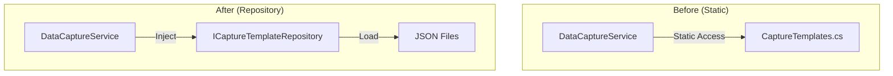

# v0.3.25c: The Refactor (Service Integration) - Expanded Implementation Plan

## Overview

Refactor `DataCaptureService` to use the new `ICaptureTemplateRepository` instead of the static `CaptureTemplates` class. This sub-plan completes the data-driven transformation by removing hardcoded templates and integrating the JSON-based repository.

**Parent Plan:** [v0.3.25](./v0.3.25.md)
**Status:** Planned
**Dependencies:** `v0.3.25b` (Repository must be implemented first)

---

## Related Specifications

| Specification | Relationship | Path |
|---------------|--------------|------|
| **SPEC-CODEX-001** | System architecture, Codex auto-assignment | [docs/specs/knowledge/SPEC-CODEX-001.md](../../specs/knowledge/SPEC-CODEX-001.md) |
| **Sample Codex Entries** | How fragments link to entries | [docs/design/09-data/sample-codex-entries.md](../../design/09-data/sample-codex-entries.md) |
| **DataCaptureService.cs** | Target of this refactoring | `RuneAndRust.Engine/Services/DataCaptureService.cs` |
| **CaptureTemplates.cs** | Static class being removed | `RuneAndRust.Engine/Services/CaptureTemplates.cs` |

> **Integration Note:** The `TryAutoAssignAsync` method uses `matchKeywords` from JSON templates to link `DataCapture` entities to `CodexEntry` records, as documented in SPEC-CODEX-001.

## Architecture Summary

### Key Deliverables

1.  **Service Refactoring** - Inject `ICaptureTemplateRepository` into `DataCaptureService`
2.  **Template Selection** - Update `SelectTemplate` to use async repository calls
3.  **Category Mapping** - Map object keywords to repository categories
4.  **Static Class Removal** - Delete `CaptureTemplates.cs` after migration
5.  **Test Updates** - Mock repository instead of relying on static data

### Before vs After



---

## Files to Modify (4 existing files)

| File | Changes |
|------|---------|
| `RuneAndRust.Engine/Services/DataCaptureService.cs` | Inject repository, refactor SelectTemplate |
| `RuneAndRust.Terminal/Program.cs` | Update DI registration if needed |
| `RuneAndRust.Tests/Engine/DataCaptureServiceTests.cs` | Mock repository instead of static |
| `RuneAndRust.Tests/Infrastructure/TestGameHost.cs` | Register mock repository |

## Files to Delete (1 file)

| File | Reason |
|------|--------|
| `RuneAndRust.Engine/Services/CaptureTemplates.cs` | Replaced by JSON files |

---

## Implementation Order

1.  Add `ICaptureTemplateRepository` field to `DataCaptureService`
2.  Update constructor to accept repository injection
3.  Create category mapping dictionary
4.  Refactor `SelectTemplate` to use async repository
5.  Create `CaptureTemplateDto` to `CaptureTemplate` conversion
6.  Update test mocks
7.  Verify all tests pass
8.  Delete `CaptureTemplates.cs`
9.  Final verification

---

## Detailed Code Specifications

### 1. DataCaptureService Constructor Update

**File:** `RuneAndRust.Engine/Services/DataCaptureService.cs`

```csharp
// Add new field
private readonly ICaptureTemplateRepository _templateRepository;

// Update constructor signature
public DataCaptureService(
    ILogger<DataCaptureService> logger,
    IDataCaptureRepository captureRepository,
    ICodexEntryRepository codexRepository,
    ICaptureTemplateRepository templateRepository) // NEW
{
    _logger = logger;
    _captureRepository = captureRepository;
    _codexRepository = codexRepository;
    _templateRepository = templateRepository; // NEW
    _random = new Random();
}

// Update seeded constructor (for testing)
public DataCaptureService(
    ILogger<DataCaptureService> logger,
    IDataCaptureRepository captureRepository,
    ICodexEntryRepository codexRepository,
    ICaptureTemplateRepository templateRepository, // NEW
    int seed)
{
    _logger = logger;
    _captureRepository = captureRepository;
    _codexRepository = codexRepository;
    _templateRepository = templateRepository; // NEW
    _random = new Random(seed);
}
```

### 2. Category Mapping Dictionary

**File:** `RuneAndRust.Engine/Services/DataCaptureService.cs`

```csharp
/// <summary>
/// Maps object keywords to template category names.
/// v0.3.25c: Categories match JSON file names (kebab-case).
/// </summary>
private static readonly Dictionary<string, string[]> CategoryKeywords = new()
{
    ["rusted-servitor"] = new[] { "servitor", "automaton", "machine", "mechanical" },
    ["blighted-creature"] = new[] { "blight", "corrupted", "infected", "mutation" },
    ["industrial-site"] = new[] { "industrial", "forge", "foundry", "factory", "mechanism" },
    ["ancient-ruin"] = new[] { "ruin", "ancient", "inscription", "tomb", "temple" },
    ["generic-container"] = new[] { "container", "chest", "crate", "box", "cache", "storage", "supply" },
    ["field-guide-triggers"] = new[] { "psychic", "combat", "fighting", "battle", "burden", "weight", "inventory" }
};
```

### 3. Refactored SelectTemplate Method

**File:** `RuneAndRust.Engine/Services/DataCaptureService.cs`

```csharp
/// <summary>
/// Selects a capture template based on the interactable object.
/// v0.3.25c: Uses repository instead of static class.
/// </summary>
private async Task<CaptureTemplateDto?> SelectTemplateAsync(InteractableObject obj)
{
    _logger.LogTrace("[Capture] Selecting template for object '{ObjectName}'", obj.Name);

    var objectName = obj.Name.ToLowerInvariant();
    var objectDesc = obj.Description.ToLowerInvariant();
    var combined = $"{objectName} {objectDesc}";

    // Find matching category
    string? matchedCategory = null;

    foreach (var (category, keywords) in CategoryKeywords)
    {
        if (keywords.Any(k => combined.Contains(k, StringComparison.OrdinalIgnoreCase)))
        {
            matchedCategory = category;
            _logger.LogTrace("[Capture] Matched category '{Category}' for '{ObjectName}'",
                category, obj.Name);
            break;
        }
    }

    // Fallback to generic container for containers without specific match
    if (matchedCategory == null && obj.IsContainer)
    {
        matchedCategory = "generic-container";
        _logger.LogTrace("[Capture] Fallback to generic-container for '{ObjectName}'", obj.Name);
    }

    if (matchedCategory == null)
    {
        _logger.LogTrace("[Capture] No category matched for '{ObjectName}'", obj.Name);
        return null;
    }

    // Get random template from repository
    var template = await _templateRepository.GetRandomAsync(matchedCategory);

    if (template == null)
    {
        _logger.LogWarning("[Capture] Category '{Category}' has no templates", matchedCategory);
        return null;
    }

    _logger.LogDebug("[Capture] Selected template '{TemplateId}' from category '{Category}'",
        template.Id, matchedCategory);

    return template;
}
```

### 4. Update TryGenerateFromSearchAsync

**File:** `RuneAndRust.Engine/Services/DataCaptureService.cs`

```csharp
/// <inheritdoc/>
public async Task<CaptureResult> TryGenerateFromSearchAsync(
    Guid characterId,
    InteractableObject container,
    int witsBonus = 0)
{
    _logger.LogDebug("Attempting capture generation for Character {CharacterId} from search of {ContainerName}",
        characterId, container.Name);

    // Calculate effective chance: base + (wits bonus * 5%)
    var effectiveChance = BaseSearchCaptureChance + (witsBonus * 5);
    var roll = _random.Next(100);

    _logger.LogDebug("Capture roll: {Roll} vs target {Target} (WITS bonus: {WitsBonus})",
        roll, effectiveChance, witsBonus);

    if (roll >= effectiveChance)
    {
        _logger.LogDebug("Capture roll failed, no capture generated");
        return CaptureResult.NoCapture("No lore fragments discovered.");
    }

    // v0.3.25c: Use async template selection
    var template = await SelectTemplateAsync(container);
    if (template == null)
    {
        _logger.LogDebug("No suitable capture template found for container {ContainerName}", container.Name);
        return CaptureResult.NoCapture("No lore fragments discovered.");
    }

    // Create the capture
    var capture = new DataCapture
    {
        CharacterId = characterId,
        Type = template.Type, // CaptureTemplateDto already has CaptureType
        FragmentContent = template.FragmentContent,
        Source = $"{template.Source} ({container.Name})",
        Quality = template.Quality, // Use template quality (default: 15)
        IsAnalyzed = false
    };

    // Try to auto-assign to a matching Codex entry
    var wasAutoAssigned = await TryAutoAssignAsync(capture, template.MatchKeywords);

    // Persist the capture
    await _captureRepository.AddAsync(capture);
    await _captureRepository.SaveChangesAsync();

    _logger.LogInformation("Generated {CaptureType} capture for Character {CharacterId}",
        capture.Type, characterId);

    var message = wasAutoAssigned
        ? $"You discovered a {capture.Type} fragment and added it to your Codex."
        : $"You discovered a {capture.Type} fragment. It may relate to something you haven't encountered yet.";

    return CaptureResult.Generated(message, capture, wasAutoAssigned);
}
```

### 5. Update TryGenerateFromExaminationAsync

**File:** `RuneAndRust.Engine/Services/DataCaptureService.cs`

```csharp
/// <inheritdoc/>
public async Task<CaptureResult> TryGenerateFromExaminationAsync(
    Guid characterId,
    InteractableObject target,
    int tierRevealed,
    int witsBonus = 0)
{
    _logger.LogDebug("Attempting capture generation for Character {CharacterId} from examination of {TargetName} (tier {Tier})",
        characterId, target.Name, tierRevealed);

    // Base tier (0) never generates captures
    if (tierRevealed < DetailedTier)
    {
        _logger.LogDebug("Base tier examination, no capture chance");
        return CaptureResult.NoCapture("Basic examination reveals no hidden knowledge.");
    }

    // Calculate effective chance based on tier
    var baseChance = tierRevealed >= ExpertTier ? ExpertExamCaptureChance : DetailedExamCaptureChance;
    var effectiveChance = baseChance + (witsBonus * 3);
    var roll = _random.Next(100);

    _logger.LogDebug("Capture roll: {Roll} vs target {Target} (WITS bonus: {WitsBonus})",
        roll, effectiveChance, witsBonus);

    if (roll >= effectiveChance)
    {
        _logger.LogDebug("Capture roll failed, no capture generated");
        return CaptureResult.NoCapture("Your examination reveals no additional knowledge.");
    }

    // v0.3.25c: Use async template selection
    var template = await SelectTemplateAsync(target);
    if (template == null)
    {
        _logger.LogDebug("No suitable capture template found for target {TargetName}", target.Name);
        return CaptureResult.NoCapture("Your examination reveals no additional knowledge.");
    }

    // Quality override for expert tier
    var quality = tierRevealed >= ExpertTier ? SpecialistQuality : template.Quality;
    _logger.LogTrace("Assigned quality {Quality} based on tier {Tier}", quality, tierRevealed);

    // Create the capture
    var capture = new DataCapture
    {
        CharacterId = characterId,
        Type = template.Type,
        FragmentContent = template.FragmentContent,
        Source = $"{template.Source} ({target.Name})",
        Quality = quality,
        IsAnalyzed = false
    };

    // Try to auto-assign to a matching Codex entry
    var wasAutoAssigned = await TryAutoAssignAsync(capture, template.MatchKeywords);

    // Persist the capture
    await _captureRepository.AddAsync(capture);
    await _captureRepository.SaveChangesAsync();

    _logger.LogInformation("Generated {CaptureType} capture for Character {CharacterId}",
        capture.Type, characterId);

    var tierName = tierRevealed >= ExpertTier ? "expert" : "detailed";
    var message = wasAutoAssigned
        ? $"Your {tierName} examination reveals a {capture.Type} fragment, added to your Codex."
        : $"Your {tierName} examination reveals a {capture.Type} fragment.";

    return CaptureResult.Generated(message, capture, wasAutoAssigned);
}
```

### 6. Remove Private Helper Methods

**File:** `RuneAndRust.Engine/Services/DataCaptureService.cs`

Delete these methods (no longer needed):

```csharp
// DELETE: SelectTemplate (replaced by SelectTemplateAsync)
private CaptureTemplate? SelectTemplate(InteractableObject obj) { ... }

// DELETE: SelectRandomTemplate (handled by repository)
private CaptureTemplate SelectRandomTemplate(CaptureTemplate[] templates) { ... }

// DELETE: ContainsAny (inline in CategoryKeywords loop)
private static bool ContainsAny(string text, params string[] keywords) { ... }
```

### 7. DI Registration (If Needed)

**File:** `RuneAndRust.Terminal/Program.cs`

The repository was registered in v0.3.25b. Verify `DataCaptureService` can resolve it:

```csharp
// DataCaptureService should already be scoped
// Verify repository is registered as singleton before service
services.AddSingleton<ICaptureTemplateRepository>(sp => ...); // From v0.3.25b

services.AddScoped<IDataCaptureService, DataCaptureService>(); // Existing
```

### 8. Update DataCaptureServiceTests

**File:** `RuneAndRust.Tests/Engine/DataCaptureServiceTests.cs`

```csharp
using Moq;
using RuneAndRust.Core.Interfaces;
using RuneAndRust.Core.Models;
using RuneAndRust.Core.Enums;

public class DataCaptureServiceTests
{
    private readonly Mock<ILogger<DataCaptureService>> _loggerMock;
    private readonly Mock<IDataCaptureRepository> _captureRepoMock;
    private readonly Mock<ICodexEntryRepository> _codexRepoMock;
    private readonly Mock<ICaptureTemplateRepository> _templateRepoMock; // NEW
    private readonly DataCaptureService _service;

    public DataCaptureServiceTests()
    {
        _loggerMock = new Mock<ILogger<DataCaptureService>>();
        _captureRepoMock = new Mock<IDataCaptureRepository>();
        _codexRepoMock = new Mock<ICodexEntryRepository>();
        _templateRepoMock = new Mock<ICaptureTemplateRepository>(); // NEW

        // Setup default template response
        _templateRepoMock
            .Setup(r => r.GetRandomAsync(It.IsAny<string>()))
            .ReturnsAsync(CreateTestTemplate());

        _service = new DataCaptureService(
            _loggerMock.Object,
            _captureRepoMock.Object,
            _codexRepoMock.Object,
            _templateRepoMock.Object, // NEW
            seed: 12345);
    }

    private static CaptureTemplateDto CreateTestTemplate()
    {
        return new CaptureTemplateDto
        {
            Id = "test-template",
            Type = CaptureType.TextFragment,
            FragmentContent = "Test fragment content for unit testing.",
            Source = "Test source",
            MatchKeywords = new[] { "test" },
            Quality = 15,
            Category = "test-category"
        };
    }

    [Fact]
    public async Task TryGenerateFromSearchAsync_SuccessfulRoll_UsesRepositoryTemplate()
    {
        // Arrange
        var container = new InteractableObject
        {
            Name = "Rusted Container",
            Description = "An old container",
            IsContainer = true
        };

        _templateRepoMock
            .Setup(r => r.GetRandomAsync("generic-container"))
            .ReturnsAsync(new CaptureTemplateDto
            {
                Id = "container-test",
                Type = CaptureType.TextFragment,
                FragmentContent = "Container lore content here.",
                Source = "Container search",
                MatchKeywords = new[] { "container" },
                Quality = 15,
                Category = "generic-container"
            });

        // Act
        var result = await _service.TryGenerateFromSearchAsync(
            Guid.NewGuid(), container, witsBonus: 10);

        // Assert
        _templateRepoMock.Verify(r => r.GetRandomAsync("generic-container"), Times.AtLeastOnce);
    }

    [Fact]
    public async Task TryGenerateFromSearchAsync_NoCategoryMatch_ReturnsNoCapture()
    {
        // Arrange
        var unmatchedObject = new InteractableObject
        {
            Name = "Unknown Object",
            Description = "Something weird",
            IsContainer = false
        };

        // No category keywords match, not a container
        // Act
        var result = await _service.TryGenerateFromSearchAsync(
            Guid.NewGuid(), unmatchedObject, witsBonus: 0);

        // Assert
        Assert.False(result.WasGenerated);
    }

    [Fact]
    public async Task SelectTemplateAsync_ServitorKeyword_QueriesServitorCategory()
    {
        // Arrange
        var servitor = new InteractableObject
        {
            Name = "Rusted Servitor",
            Description = "A mechanical automaton"
        };

        _templateRepoMock
            .Setup(r => r.GetRandomAsync("rusted-servitor"))
            .ReturnsAsync(CreateTestTemplate());

        // Act (indirectly through TryGenerateFromExaminationAsync)
        await _service.TryGenerateFromExaminationAsync(
            Guid.NewGuid(), servitor, tierRevealed: 2, witsBonus: 5);

        // Assert
        _templateRepoMock.Verify(r => r.GetRandomAsync("rusted-servitor"), Times.AtLeastOnce);
    }
}
```

### 9. Update TestGameHost

**File:** `RuneAndRust.Tests/Infrastructure/TestGameHost.cs`

```csharp
// Add mock template repository registration
services.AddSingleton<ICaptureTemplateRepository>(sp =>
{
    var loggerMock = new Mock<ILogger<JsonCaptureTemplateRepository>>();
    var mockRepo = new Mock<ICaptureTemplateRepository>();

    // Return empty by default - tests can override
    mockRepo.Setup(r => r.GetRandomAsync(It.IsAny<string>()))
        .ReturnsAsync((CaptureTemplateDto?)null);
    mockRepo.Setup(r => r.GetCategoriesAsync())
        .ReturnsAsync(Array.Empty<string>());
    mockRepo.Setup(r => r.TotalTemplateCount)
        .Returns(0);

    return mockRepo.Object;
});
```

### 10. Delete CaptureTemplates.cs

**File:** `RuneAndRust.Engine/Services/CaptureTemplates.cs`

After all tests pass, delete this file entirely:

```bash
rm RuneAndRust.Engine/Services/CaptureTemplates.cs
```

Ensure no references remain:

```bash
grep -r "CaptureTemplates\." --include="*.cs" .
# Should return no results
```

---

## Migration Checklist

### Pre-Migration Verification

-   [ ] v0.3.25a JSON files exist with 19 templates
-   [ ] v0.3.25b repository loads all templates correctly
-   [ ] `TotalTemplateCount` equals 19

### During Migration

-   [ ] `DataCaptureService` compiles with new constructor
-   [ ] All category keywords match JSON file names
-   [ ] `SelectTemplateAsync` returns templates from repository
-   [ ] No static references to `CaptureTemplates.cs`

### Post-Migration Verification

-   [ ] All existing `DataCaptureServiceTests` pass
-   [ ] All integration tests pass
-   [ ] Game generates captures from JSON templates
-   [ ] `CaptureTemplates.cs` deleted
-   [ ] No compiler warnings

---

## Logging Requirements

| Component | Event | Level | Template | Properties |
|-----------|-------|-------|----------|------------|
| DataCaptureService | Category Match | Trace | `[Capture] Matched category '{Category}' for '{ObjectName}'` | Category, ObjectName |
| DataCaptureService | Fallback | Trace | `[Capture] Fallback to generic-container for '{ObjectName}'` | ObjectName |
| DataCaptureService | No Match | Trace | `[Capture] No category matched for '{ObjectName}'` | ObjectName |
| DataCaptureService | Template Selected | Debug | `[Capture] Selected template '{TemplateId}' from category '{Category}'` | TemplateId, Category |
| DataCaptureService | No Templates | Warning | `[Capture] Category '{Category}' has no templates` | Category |

---

## Testing Strategy

### Unit Tests (Updated)

| Test | Purpose |
|------|---------|
| `TryGenerateFromSearchAsync_SuccessfulRoll_UsesRepositoryTemplate` | Verify repository is called |
| `TryGenerateFromSearchAsync_NoCategoryMatch_ReturnsNoCapture` | Verify fallback behavior |
| `SelectTemplateAsync_ServitorKeyword_QueriesServitorCategory` | Verify keyword-to-category mapping |
| `TryGenerateFromExaminationAsync_ExpertTier_OverridesQuality` | Verify quality override works |

### Integration Tests

| Test | Purpose |
|------|---------|
| `GenerateCapture_FromRealJsonFiles_Succeeds` | End-to-end with actual JSON |
| `CategoryMapping_AllKeywords_MatchExpectedCategories` | All 6 categories reachable |

---

## Work Breakdown

### Phase 1: Constructor & Fields
-   [ ] Add `ICaptureTemplateRepository` field
-   [ ] Update primary constructor
-   [ ] Update seeded constructor (testing)
-   [ ] Add `CategoryKeywords` dictionary

### Phase 2: Method Refactoring
-   [ ] Create `SelectTemplateAsync` method
-   [ ] Update `TryGenerateFromSearchAsync`
-   [ ] Update `TryGenerateFromExaminationAsync`
-   [ ] Delete old `SelectTemplate`, `SelectRandomTemplate`, `ContainsAny`

### Phase 3: Test Updates
-   [ ] Add `_templateRepoMock` to `DataCaptureServiceTests`
-   [ ] Update test setup with mock
-   [ ] Update `TestGameHost` with mock registration
-   [ ] Verify all tests pass

### Phase 4: Cleanup
-   [ ] Delete `CaptureTemplates.cs`
-   [ ] Remove unused using statements
-   [ ] Verify no static references remain
-   [ ] Final build verification

---

## Estimated Metrics

| Metric | Value |
|--------|-------|
| Modified Files | 4 |
| Deleted Files | 1 (`CaptureTemplates.cs`) |
| Lines Added | ~150 |
| Lines Deleted | ~250 (static class) |
| Tests Updated | ~5 |

---

## Risk Assessment

| Risk | Likelihood | Impact | Mitigation |
|------|------------|--------|------------|
| Test failures after refactor | Medium | Medium | Update mocks before running tests |
| Missing category keywords | Low | Low | Compare with original static class |
| Async deadlock | Low | High | Use `ConfigureAwait(false)` if needed |
| Breaking existing behavior | Low | High | Run full test suite before/after |

---

## Pre-Commit Checks

-   [ ] All unit tests pass
-   [ ] All integration tests pass
-   [ ] `CaptureTemplates.cs` deleted
-   [ ] No compiler warnings
-   [ ] Game starts and generates captures
-   [ ] Captures contain JSON-sourced content
-   [ ] 19 templates reachable through service

**End of Plan**
