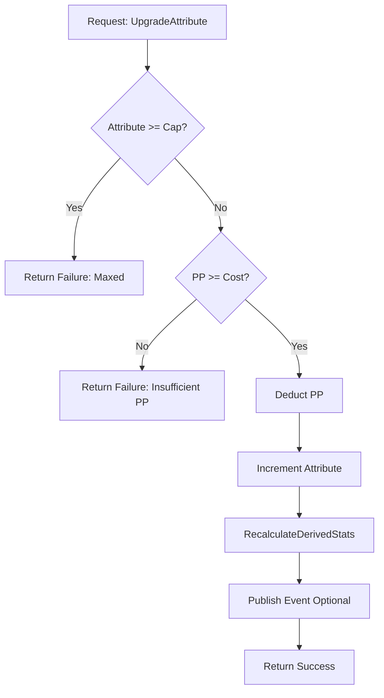

# v0.4.0b: The Growth (Attribute Upgrades)

## Overview

This sub-phase implements the transactional logic for character improvement, specifically the ability to spend **Progression Points** (PP) to permanently upgrade **Attributes** (MIGHT, FINESSE, WITS, WILL, STURDINESS). This system works in tandem with the `SagaService` (which awards PP) and `StatCalculationService` (which recalculates derived stats after an upgrade).

**Parent Plan:** [v0.4.0](./v0.4.0.md)
**Status:** Planned

---

## 1. Core Architecture

The `ProgressionService` acts as the transaction manager for character growth. It validates purchases, deducts currency, applies upgrades, and ensures all dependent stats are updated immediately.

### 1.1 Component Diagram

| Component | Layer | File | Purpose |
|-----------|-------|------|---------|
| `IProgressionService` | Core | `Interfaces/IProgressionService.cs` | Interface for upgrade transactions. |
| `ProgressionService` | Engine | `Services/ProgressionService.cs` | Implementation: UpgradeAttribute, GetUpgradeCost. |
| `StatCalculationService` | Engine | `Services/StatCalculationService.cs` | Existing service: RecalculateDerivedStats. |
| `AttributeUpgradedEvent` | Core | `Events/AttributeUpgradedEvent.cs` | *(Optional)* Domain event for UI feedback. |

### 1.2 Transaction Flow



### 1.3 Cost & Caps (v0.4 Rules)

To keep the initial implementation stable, we use a simplified economy:

| Rule | Value | Rationale |
|------|-------|-----------|
| **Base Cost** | **1 PP** | Flat cost per point. Easy to understand. |
| **Attribute Cap** | **10** | Hard cap for base attributes. |
| **Starting Value** | **5** | Default for all attributes at character creation. |
| **Economy** | **Scarcity** | ~22 PP earnable (L2-L10). Each point is meaningful. |

> **Future Cost Scaling (v0.5+):** Consider tiered costs: 1 PP (1-5), 2 PP (6-8), 3 PP (9-10).

---

## 2. Derived Stat Impact

When an attribute is upgraded, `StatCalculationService.RecalculateDerivedStats` is called. Here's how each attribute affects derived stats:

| Attribute | Derived Stats Affected | Formula |
|-----------|------------------------|---------|
| **STURDINESS** | MaxHP, MaxStamina | `MaxHP = 50 + (STURD × 10)`, `MaxStam = 20 + (FIN×5) + (STURD×3)` |
| **FINESSE** | MaxStamina | `MaxStam = 20 + (FIN×5) + (STURD×3)` |
| **WITS** | ActionPoints | `AP = 2 + (WITS / 4)` |
| **WILL** | MaxAp (Mystic only) | `MaxAp = 10 + (WILL × 5)` *(if Mystic)* |
| **MIGHT** | *(None directly)* | Affects damage calculations in `AttackResolutionService`. |

### 2.1 Example: Upgrade STURDINESS 5 → 6

| Stat | Before | After | Change |
|------|--------|-------|--------|
| STURDINESS | 5 | 6 | +1 |
| MaxHP | 100 | 110 | +10 |
| MaxStamina | 60 | 63 | +3 |
| CurrentHP | 50 | 55 | *(preserved 50% ratio)* |
| CurrentStamina | 30 | 31 | *(preserved 50% ratio)* |

> **Note:** `RecalculateDerivedStats` preserves the current HP/Stamina *ratio* when max changes, preventing full heals on upgrade.

---

## 3. Implementation Specifications

### 3.1 Interface Definition

**File:** `RuneAndRust.Core/Interfaces/IProgressionService.cs` (New)

```csharp
using RuneAndRust.Core.Entities;
using RuneAndRust.Core.Models;
using CharacterAttribute = RuneAndRust.Core.Enums.Attribute;

namespace RuneAndRust.Core.Interfaces;

/// <summary>
/// Service for managing character attribute progression.
/// </summary>
/// <remarks>See: v0.4.0b (The Growth) for implementation details.</remarks>
public interface IProgressionService
{
    /// <summary>
    /// Attempts to upgrade a specific attribute by spending Progression Points.
    /// </summary>
    /// <param name="character">The character to upgrade.</param>
    /// <param name="attribute">The attribute to increase.</param>
    /// <returns>A Result object indicating success or failure.</returns>
    Result UpgradeAttribute(Character character, CharacterAttribute attribute);

    /// <summary>
    /// Calculates the PP cost to upgrade an attribute from its current value.
    /// </summary>
    /// <param name="character">The character.</param>
    /// <param name="attribute">The attribute to check.</param>
    /// <returns>The cost in PP. Returns int.MaxValue if capped.</returns>
    int GetUpgradeCost(Character character, CharacterAttribute attribute);

    /// <summary>
    /// Checks if a specific attribute can be upgraded (not capped, has funds).
    /// </summary>
    bool CanUpgrade(Character character, CharacterAttribute attribute);
}
```

### 3.2 Service Implementation

**File:** `RuneAndRust.Engine/Services/ProgressionService.cs` (New)

```csharp
using Microsoft.Extensions.Logging;
using RuneAndRust.Core.Entities;
using RuneAndRust.Core.Interfaces;
using RuneAndRust.Core.Models;
using CharacterAttribute = RuneAndRust.Core.Enums.Attribute;

namespace RuneAndRust.Engine.Services;

/// <summary>
/// Engine-layer service for managing attribute upgrades.
/// </summary>
public class ProgressionService : IProgressionService
{
    private readonly IStatCalculationService _statCalc;
    private readonly ILogger<ProgressionService> _logger;

    private const int AttributeCap = 10;

    public ProgressionService(
        IStatCalculationService statCalc,
        ILogger<ProgressionService> logger)
    {
        _statCalc = statCalc;
        _logger = logger;
    }

    /// <inheritdoc/>
    public int GetUpgradeCost(Character character, CharacterAttribute attribute)
    {
        var currentVal = character.GetAttribute(attribute);
        if (currentVal >= AttributeCap)
        {
            return int.MaxValue; // Indicate not purchasable
        }

        // v0.4.0: Flat cost
        return 1;
    }

    /// <inheritdoc/>
    public bool CanUpgrade(Character character, CharacterAttribute attribute)
    {
        var currentVal = character.GetAttribute(attribute);
        if (currentVal >= AttributeCap)
        {
            return false;
        }

        return character.ProgressionPoints >= GetUpgradeCost(character, attribute);
    }

    /// <inheritdoc/>
    public Result UpgradeAttribute(Character character, CharacterAttribute attribute)
    {
        var currentVal = character.GetAttribute(attribute);

        // 1. Validate: Cap
        if (currentVal >= AttributeCap)
        {
            _logger.LogWarning(
                "[Progression] Upgrade failed: {Attribute} is at cap ({Cap}) for {Name}",
                attribute, AttributeCap, character.Name);
            return Result.Failure($"{attribute} has reached its physical limit.");
        }

        // 2. Validate: Funds
        var cost = GetUpgradeCost(character, attribute);
        if (character.ProgressionPoints < cost)
        {
            _logger.LogWarning(
                "[Progression] Upgrade failed for {Name}: Insufficient PP ({Have}/{Need})",
                character.Name, character.ProgressionPoints, cost);
            return Result.Failure($"Not enough Progression Points. Need {cost}, have {character.ProgressionPoints}.");
        }

        // 3. Execute: Transaction
        character.ProgressionPoints -= cost;
        character.SetAttribute(attribute, currentVal + 1);

        _logger.LogInformation(
            "[Progression] {Name} upgraded {Attribute} from {OldVal} to {NewVal} (Cost: {Cost} PP, Remaining: {Remaining} PP)",
            character.Name, attribute, currentVal, currentVal + 1, cost, character.ProgressionPoints);

        // 4. Side-effect: Recalculate derived stats
        _statCalc.RecalculateDerivedStats(character);

        return Result.Success($"Improved {attribute} to {currentVal + 1}.");
    }
}
```

---

## 4. Logging Requirements

| Component | Event | Level | Template | Properties |
|-----------|-------|-------|----------|------------|
| `ProgressionService` | Upgrade Success | Info | `[Progression] {Name} upgraded {Attribute} from {OldVal} to {NewVal} (Cost: {Cost} PP, Remaining: {Remaining} PP)` | Name, Attribute, OldVal, NewVal, Cost, Remaining |
| `ProgressionService` | Failed: Cap | Warn | `[Progression] Upgrade failed: {Attribute} is at cap ({Cap}) for {Name}` | Attribute, Cap, Name |
| `ProgressionService` | Failed: Funds | Warn | `[Progression] Upgrade failed for {Name}: Insufficient PP ({Have}/{Need})` | Name, Have, Need |

---

## 5. Dependency Injection Registration

**File:** `RuneAndRust.Terminal/Program.cs`

```csharp
// In service registration block
services.AddScoped<IProgressionService, ProgressionService>();
```

---

## 6. Testing Strategy

### 6.1 Unit Tests

**File:** `RuneAndRust.Tests/Engine/ProgressionServiceTests.cs` (New)

Tests follow the existing pattern in `RuneAndRust.Tests/Engine/` (e.g., `StatCalculationServiceTests.cs`).

| Test Method | Scenario | Setup | Expected Outcome |
|-------------|----------|-------|------------------|
| `Upgrade_DeductsPP` | Normal upgrade | Char: PP=3, MIGHT=5 | PP=2, MIGHT=6 |
| `Upgrade_IncreasesAttribute` | Normal upgrade | Char: PP=1, FINESSE=7 | FINESSE=8 |
| `Upgrade_CallsRecalculate` | Side-effect check | Mock `IStatCalculationService` | `RecalculateDerivedStats` called once |
| `Upgrade_ReturnsSuccess` | Result check | Char: PP=1, WITS=5 | `Result.IsSuccess == true` |
| `Upgrade_Fails_InsufficientPP` | Validation | Char: PP=0, WILL=5 | `Result.IsFailure`, PP unchanged, WILL unchanged |
| `Upgrade_Fails_AtCap` | Validation | Char: PP=5, STURDINESS=10 | `Result.IsFailure`, PP unchanged, STURDINESS unchanged |
| `GetUpgradeCost_Returns1_ForNormalValue` | Cost check | MIGHT=7 | Returns 1 |
| `GetUpgradeCost_ReturnsMaxValue_AtCap` | Cost check | MIGHT=10 | Returns `int.MaxValue` |
| `CanUpgrade_True_WhenAffordableAndNotCapped` | Helper check | PP=2, FINESSE=8 | Returns `true` |
| `CanUpgrade_False_WhenCapped` | Helper check | PP=5, WITS=10 | Returns `false` |

### 6.2 Verification Commands

**Run all Progression tests:**
```bash
dotnet test RuneAndRust.Tests --filter "FullyQualifiedName~ProgressionServiceTests"
```

**Run all Engine tests (regression check):**
```bash
dotnet test RuneAndRust.Tests --filter "FullyQualifiedName~Engine"
```

### 6.3 Integration Test Scenario (Manual or Automated)

1.  **Setup:** Create Character: Level=2, PP=1, STURDINESS=5, CurrentHP=50, MaxHP=100.
2.  **Action:** Call `progressionService.UpgradeAttribute(char, Sturdiness)`.
3.  **Assert:**
    -   `Result.IsSuccess == true`.
    -   `char.ProgressionPoints == 0`.
    -   `char.Sturdiness == 6`.
    -   `char.MaxHP == 110` (recalculated).
    -   `char.CurrentHP == 55` (preserved 50% ratio).

---

## 7. Work Breakdown

- [ ] **Core:** Create `IProgressionService.cs` interface.
- [ ] **Engine:** Implement `ProgressionService.cs`.
- [ ] **Terminal:** Register `IProgressionService` in `Program.cs`.
- [ ] **Tests:** Create `ProgressionServiceTests.cs` with 10 scenarios above.
- [ ] *(Optional)* **Core:** Create `AttributeUpgradedEvent.cs` for UI feedback.

