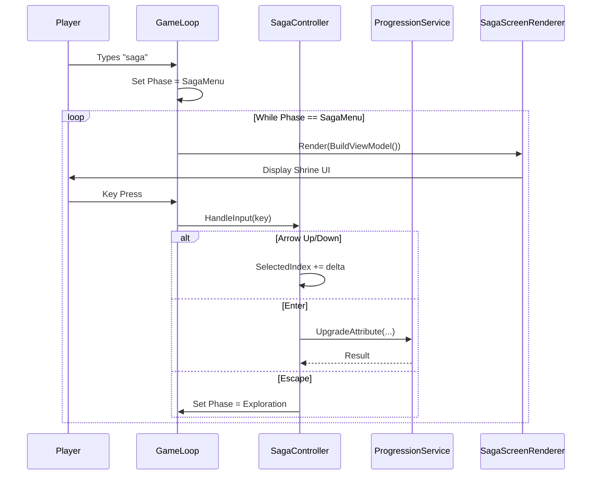

# v0.4.0c: The Shrine (Saga UI)

## Overview

This sub-phase focuses on the user interface ("The Shrine") where players can visualize their Legend (XP) and spend Progression Points (PP) to upgrade Attributes. It involves creating a dedicated `GamePhase`, a new Screen Renderer using Spectre.Console, and the input handling logic.

**Parent Plan:** [v0.4.0](./v0.4.0.md)
**Status:** Planned

---

## 1. Core Architecture

The Saga UI acts as a modal screen accessible from the main gameplay loop (via the `saga` command during Exploration). It requires a distinct `GamePhase` to hijack input and rendering.

### 1.1 Component Diagram

| Component | Layer | File | Purpose |
|-----------|-------|------|---------|
| `GamePhase.SagaMenu` | Core | `Enums/GamePhase.cs` | New phase for UI isolation. |
| `SagaViewModel` | Core | `ViewModels/SagaViewModel.cs` | Data transfer object for rendering. |
| `ISagaScreenRenderer` | Core | `Interfaces/ISagaScreenRenderer.cs` | Renderer contract. |
| `SagaScreenRenderer` | Terminal | `Rendering/SagaScreenRenderer.cs` | Spectre.Console implementation. |
| `SagaController` | Terminal | `Controllers/SagaController.cs` | Input handling (navigation, purchase, exit). |

### 1.2 Data Flow Diagram



---

## 2. UI Design

### 2.1 Visual Mockup (ASCII)

```
┌─────────────────────────────────────────────────────────────┐
│                    ✦ THE SHRINE OF ECHOES ✦                 │
├─────────────────────────────────────────────────────────────┤
│  Level: 3    Legend: ████████████░░░░░░░░ 300/600 (50%)     │
│                      Progression Points: [3]                │
├─────────────────────────────────────────────────────────────┤
│                                                             │
│    ATTRIBUTE      VALUE      COST      STATUS               │
│  ──────────────────────────────────────────────────         │
│  > MIGHT            5         1 PP     [UPGRADE]            │
│    FINESSE          6         1 PP     [UPGRADE]            │
│    STURDINESS       5         1 PP     [UPGRADE]            │
│    WITS             5         1 PP     [UPGRADE]            │
│    WILL            10         -        [MAXED]              │
│                                                             │
├─────────────────────────────────────────────────────────────┤
│  ↑↓ Navigate  │  Enter: Purchase  │  Esc: Return            │
└─────────────────────────────────────────────────────────────┘
```

### 2.2 UI Elements

| Element | Description | Color/Style |
|---------|-------------|-------------|
| **Header** | "THE SHRINE OF ECHOES" | Bold Gold (`gold1`) |
| **XP Bar** | Unicode blocks (█░) showing Legend progress | Cyan (`cyan1`) |
| **PP Display** | Current Progression Points in brackets | Yellow (`yellow`) |
| **Selected Row** | Arrow indicator (`>`) + Highlighted background | Inverted/Bold |
| **UPGRADE** | Affordable and not capped | Green (`green`) |
| **LOCKED** | Unaffordable (PP < Cost) | Red (`red`) |
| **MAXED** | At cap (Value == 10) | Grey (`grey`) |
| **Footer** | Control hints | Dim grey |

---

## 3. Implementation Specifications

### 3.1 GamePhase Enum Update

**File:** `RuneAndRust.Core/Enums/GamePhase.cs`

```diff
  public enum GamePhase
  {
      MainMenu = 0,
      Exploration = 1,
      Combat = 2,
      Quit = 3,
+     /// <summary>
+     /// The Saga progression menu ("The Shrine").
+     /// </summary>
+     SagaMenu = 4,
  }
```

### 3.2 SagaViewModel

**File:** `RuneAndRust.Core/ViewModels/SagaViewModel.cs` (New)

```csharp
using CharacterAttribute = RuneAndRust.Core.Enums.Attribute;

namespace RuneAndRust.Core.ViewModels;

/// <summary>
/// ViewModel for rendering the Saga progression UI.
/// </summary>
public record SagaViewModel(
    string CharacterName,
    int Level,
    int CurrentLegend,
    int LegendForNextLevel,
    int ProgressionPoints,
    int SelectedIndex,
    List<AttributeRowViewModel> Attributes
);

/// <summary>
/// ViewModel for a single attribute row in the Saga UI.
/// </summary>
public record AttributeRowViewModel(
    CharacterAttribute Type,
    int CurrentValue,
    int UpgradeCost,
    AttributeStatus Status
);

/// <summary>
/// Status of an attribute for UI display.
/// </summary>
public enum AttributeStatus
{
    Upgrade,  // Can afford, not capped
    Locked,   // Cannot afford
    Maxed     // At cap (10)
}
```

### 3.3 SagaController

**File:** `RuneAndRust.Terminal/Controllers/SagaController.cs` (New)

```csharp
using Microsoft.Extensions.Logging;
using RuneAndRust.Core.Entities;
using RuneAndRust.Core.Enums;
using RuneAndRust.Core.Interfaces;
using RuneAndRust.Core.Models;
using CharacterAttribute = RuneAndRust.Core.Enums.Attribute;

namespace RuneAndRust.Terminal.Controllers;

/// <summary>
/// Handles input for the Saga progression menu.
/// </summary>
public class SagaController
{
    private readonly IProgressionService _progression;
    private readonly ILogger<SagaController> _logger;

    private static readonly CharacterAttribute[] AttributeOrder = 
    {
        CharacterAttribute.Might,
        CharacterAttribute.Finesse,
        CharacterAttribute.Sturdiness,
        CharacterAttribute.Wits,
        CharacterAttribute.Will
    };

    public int SelectedIndex { get; private set; } = 0;

    public SagaController(IProgressionService progression, ILogger<SagaController> logger)
    {
        _progression = progression;
        _logger = logger;
    }

    /// <summary>
    /// Processes a keypress and returns the resulting game phase.
    /// </summary>
    public GamePhase HandleInput(ConsoleKey key, Character character, GameState state)
    {
        switch (key)
        {
            case ConsoleKey.UpArrow:
                SelectedIndex = Math.Max(0, SelectedIndex - 1);
                _logger.LogTrace("[Saga UI] Selection moved up to index {Index}", SelectedIndex);
                break;

            case ConsoleKey.DownArrow:
                SelectedIndex = Math.Min(AttributeOrder.Length - 1, SelectedIndex + 1);
                _logger.LogTrace("[Saga UI] Selection moved down to index {Index}", SelectedIndex);
                break;

            case ConsoleKey.Enter:
                var attribute = AttributeOrder[SelectedIndex];
                var result = _progression.UpgradeAttribute(character, attribute);
                if (result.IsSuccess)
                {
                    _logger.LogInformation("[Saga UI] Successfully upgraded {Attribute}", attribute);
                }
                else
                {
                    _logger.LogDebug("[Saga UI] Upgrade failed: {Message}", result.Error);
                }
                break;

            case ConsoleKey.Escape:
                _logger.LogInformation("[Saga UI] Exiting Shrine, returning to Exploration");
                SelectedIndex = 0; // Reset for next entry
                return GamePhase.Exploration;
        }

        return GamePhase.SagaMenu; // Stay in menu
    }
}
```

### 3.4 SagaScreenRenderer

**File:** `RuneAndRust.Terminal/Rendering/SagaScreenRenderer.cs` (New)

```csharp
using Microsoft.Extensions.Logging;
using RuneAndRust.Core.Interfaces;
using RuneAndRust.Core.ViewModels;
using Spectre.Console;

namespace RuneAndRust.Terminal.Rendering;

/// <summary>
/// Renders the Saga progression UI using Spectre.Console.
/// </summary>
public class SagaScreenRenderer : ISagaScreenRenderer
{
    private readonly IThemeService _theme;
    private readonly ILogger<SagaScreenRenderer> _logger;

    public SagaScreenRenderer(IThemeService theme, ILogger<SagaScreenRenderer> logger)
    {
        _theme = theme;
        _logger = logger;
    }

    public void Render(SagaViewModel vm)
    {
        AnsiConsole.Clear();

        // Header
        AnsiConsole.Write(new Rule("[bold gold1]✦ THE SHRINE OF ECHOES ✦[/]").RuleStyle("gold1"));

        // Stats Row
        var xpPct = vm.LegendForNextLevel > 0 
            ? (double)vm.CurrentLegend / vm.LegendForNextLevel 
            : 1.0;
        var xpBar = StatusWidget.RenderBar(vm.CurrentLegend, vm.LegendForNextLevel);
        AnsiConsole.MarkupLine($"  Level: [bold]{vm.Level}[/]    Legend: [cyan]{xpBar}[/] {vm.CurrentLegend}/{vm.LegendForNextLevel}");
        AnsiConsole.MarkupLine($"                      Progression Points: [yellow][{vm.ProgressionPoints}][/]");
        AnsiConsole.WriteLine();

        // Attribute Table
        var table = new Table()
            .Border(TableBorder.Rounded)
            .AddColumn("ATTRIBUTE")
            .AddColumn("VALUE")
            .AddColumn("COST")
            .AddColumn("STATUS");

        for (int i = 0; i < vm.Attributes.Count; i++)
        {
            var attr = vm.Attributes[i];
            var isSelected = i == vm.SelectedIndex;
            var indicator = isSelected ? ">" : " ";

            var name = isSelected 
                ? $"[bold]{indicator} {attr.Type}[/]" 
                : $"  {attr.Type}";

            var costText = attr.Status == AttributeStatus.Maxed 
                ? "-" 
                : $"{attr.UpgradeCost} PP";

            var statusText = attr.Status switch
            {
                AttributeStatus.Upgrade => "[green][UPGRADE][/]",
                AttributeStatus.Locked => "[red][LOCKED][/]",
                AttributeStatus.Maxed => "[grey][MAXED][/]",
                _ => ""
            };

            table.AddRow(name, attr.CurrentValue.ToString(), costText, statusText);
        }

        AnsiConsole.Write(table);
        AnsiConsole.WriteLine();

        // Footer
        AnsiConsole.MarkupLine("[dim]↑↓ Navigate  │  Enter: Purchase  │  Esc: Return[/]");

        _logger.LogTrace("[Saga UI] Rendered. Selected: {Index}", vm.SelectedIndex);
    }
}
```

---

## 4. Logging Requirements

| Component | Event | Level | Template | Properties |
|-----------|-------|-------|----------|------------|
| `SagaController` | Selection Change | Trace | `[Saga UI] Selection moved {Direction} to index {Index}` | Direction, Index |
| `SagaController` | Upgrade Success | Info | `[Saga UI] Successfully upgraded {Attribute}` | Attribute |
| `SagaController` | Upgrade Failed | Debug | `[Saga UI] Upgrade failed: {Message}` | Message |
| `SagaController` | Exit Menu | Info | `[Saga UI] Exiting Shrine, returning to Exploration` | - |
| `SagaScreenRenderer` | Render Complete | Trace | `[Saga UI] Rendered. Selected: {Index}` | Index |

---

## 5. Dependency Injection Registration

**File:** `RuneAndRust.Terminal/Program.cs`

```csharp
// In service registration block
services.AddScoped<ISagaScreenRenderer, SagaScreenRenderer>();
services.AddScoped<SagaController>();
```

---

## 6. GameService Integration

**File:** `RuneAndRust.Engine/Services/GameService.cs`

The game loop needs to route input/rendering based on `GamePhase.SagaMenu`:

```csharp
// In main loop switch
case GamePhase.SagaMenu:
    var sagaVm = BuildSagaViewModel(character, sagaController.SelectedIndex);
    _sagaRenderer.Render(sagaVm);
    var key = Console.ReadKey(true).Key;
    phase = _sagaController.HandleInput(key, character, state);
    break;
```

---

## 7. Testing Strategy

### 7.1 Unit Tests

**File:** `RuneAndRust.Tests/Terminal/SagaControllerTests.cs` (New)

| Test Method | Scenario | Setup | Expected Outcome |
|-------------|----------|-------|------------------|
| `HandleInput_UpArrow_DecrementsIndex` | Navigation | SelectedIndex=2 | SelectedIndex=1 |
| `HandleInput_UpArrow_AtZero_StaysZero` | Boundary | SelectedIndex=0 | SelectedIndex=0 |
| `HandleInput_DownArrow_IncrementsIndex` | Navigation | SelectedIndex=2 | SelectedIndex=3 |
| `HandleInput_DownArrow_AtMax_StaysMax` | Boundary | SelectedIndex=4 (5 attrs) | SelectedIndex=4 |
| `HandleInput_Enter_CallsProgressionService` | Action | Mock IProgressionService | `UpgradeAttribute` called with selected attr |
| `HandleInput_Escape_ReturnsExploration` | Exit | Any state | Returns `GamePhase.Exploration` |
| `HandleInput_Escape_ResetsSelection` | Exit | SelectedIndex=3 | SelectedIndex reset to 0 |
| `HandleInput_OtherKey_NoEffect` | Ignore | Press 'A' | SelectedIndex unchanged, returns SagaMenu |

### 7.2 Verification Commands

**Run all Saga UI tests:**
```bash
dotnet test RuneAndRust.Tests --filter "FullyQualifiedName~SagaControllerTests"
```

**Run all Terminal tests (regression check):**
```bash
dotnet test RuneAndRust.Tests --filter "FullyQualifiedName~Terminal"
```

### 7.3 Manual Verification

1.  **Prerequisites:** Debug mode with a Level 3 character (PP=3).
2.  **Open Menu:** Type `saga` in exploration mode.
3.  **Visual Check:**
    -   Header shows "THE SHRINE OF ECHOES" in gold.
    -   XP bar shows progress toward next level.
    -   PP count displayed prominently.
    -   All 5 attributes listed with correct values.
4.  **Navigation:**
    -   Press ↑/↓ arrows. Verify `>` indicator moves.
    -   Verify selection wraps within bounds (no crash at top/bottom).
5.  **Purchase:**
    -   Select an affordable attribute. Press Enter.
    -   Verify: Value increases, PP decreases, status updates.
6.  **Locked State:**
    -   Spend all PP. Verify all statuses change to [LOCKED].
7.  **Maxed State:**
    -   Use debug to set an attribute to 10. Verify shows [MAXED].
8.  **Exit:**
    -   Press Escape. Verify return to exploration mode.

---

## 8. Work Breakdown

- [ ] **Core:** Update `GamePhase.cs` with `SagaMenu` value.
- [ ] **Core:** Create `SagaViewModel.cs` and `AttributeRowViewModel`.
- [ ] **Core:** Create `ISagaScreenRenderer.cs` interface.
- [ ] **Terminal:** Implement `SagaController.cs`.
- [ ] **Terminal:** Implement `SagaScreenRenderer.cs`.
- [ ] **Terminal:** Register components in `Program.cs`.
- [ ] **Engine:** Update `GameService.cs` to route SagaMenu phase.
- [ ] **Tests:** Create `SagaControllerTests.cs` with 8 scenarios above.

