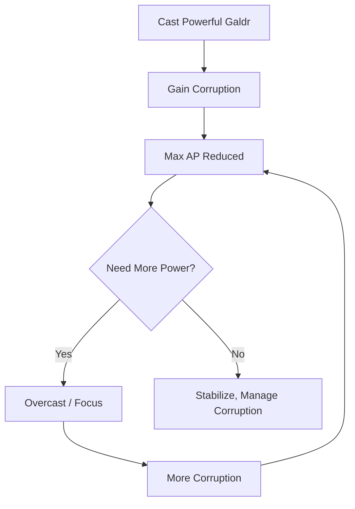

# v0.4.4e

Dependency Status: Awaiting Implementation
Domain: Character Progression, Combat, Magic/Abilities
Lifecycle Phase: Design
Parent Version: v0.4.4 (https://www.notion.so/v0-4-4-69109142f1134002b44e98fe58b49a05?pvs=21)
Status: Not started

# v0.4.4e: Canonical Alignment Remediation

> **Purpose**: This specification documents the **correct canonical values** from authoritative Game Specifications and defines how the Mystic/Aetheric functionalities SHOULD actually work. It serves as a remediation guide for discrepancies identified in v0.4.4a-d implementation plans.
> 

---

## 1. Overview

### 1.1 Scope

| Property | Value |
| --- | --- |
| **Plan ID** | `v0.4.4e` |
| **Type** | Remediation / Alignment |
| **Parent** | v0.4.4 (The Mystic) |
| **Priority** | Critical — Blocks further implementation |
| **Estimated Hours** | ~18h (review + refactor) |

### 1.2 Authoritative Sources

| Spec ID | Title | Governs |
| --- | --- | --- |
| `SPEC-CORE-ARCHETYPES` | Archetype & Specialization System | Attributes, derived stats, ability trees |
| `SPEC-ARCHETYPE-MYSTIC` | Mystic — Wielder of Tainted Aether | Mystic-specific attributes, abilities, resources |
| `SPEC-CORE-RES-AETHER` | Aether Pool (AP) | AP formula, regeneration, Corruption penalty |
| `SPEC-SYS-CPS-001` | Cognitive Paradox Syndrome | 6-tier stress, Breaking Point, Panic Table |
| `AAM-META-SETTING-FUNDAMENTALS-D3` | Domain 3 — Magic/Aetheric System | Terminology, weaving disciplines, forbidden terms |

---

## 2. Discrepancy Analysis

### 2.1 Critical Discrepancy: Aether Pool Formula

<aside>
⚠️

**SPEC CONFLICT DETECTED** — Two authoritative specifications provide different AP formulas. This must be resolved before implementation.

</aside>

**SPEC-CORE-RES-AETHER Formula:**

```
Max AP = (Base AP + [WILL × 10] + Gear) × (1 − Corruption Penalty)
Base AP = 50 (Mystic)
```

**SPEC-ARCHETYPE-MYSTIC Formula:**

```
Max AP = 20 + (WILL + WITS) × 5 + 10 (Attunement) = 70
```

**With Starting Attributes (WILL 4, WITS 4):**

| Formula Source | Calculation | Result |
| --- | --- | --- |
| SPEC-CORE-RES-AETHER | 50 + (4 × 10) + 0 | **90 AP** |
| SPEC-ARCHETYPE-MYSTIC | 20 + (4 + 4) × 5 + 10 | **70 AP** |

**REMEDIATION DECISION REQUIRED:**

- [ ]  **Option A**: Adopt SPEC-CORE-RES-AETHER formula (simpler, WILL-only scaling)
- [ ]  **Option B**: Adopt SPEC-ARCHETYPE-MYSTIC formula (WILL + WITS scaling, lower base)
- [ ]  **Option C**: Reconcile specs — Update one spec to match the other

**Recommendation**: Adopt **Option B** (SPEC-ARCHETYPE-MYSTIC) for character creation, but use SPEC-CORE-RES-AETHER's Corruption penalty multiplier. This gives:

```csharp
public int CalculateMaxAp(Character character)
{
    // Per SPEC-ARCHETYPE-MYSTIC (creation formula)
    int baseAp = 20;
    int attrBonus = (character.Attributes.Will + character.Attributes.Wits) * 5;
    int attunementBonus = 10; // From Aetheric Attunement passive
    int gearBonus = _equipmentService.GetTotalApBonus(character);
    
    int subtotal = baseAp + attrBonus + attunementBonus + gearBonus;
    
    // Per SPEC-CORE-RES-AETHER (corruption penalty)
    float corruptionPenalty = (character.Corruption / 10) * 0.05f;
    float multiplier = Math.Max(0.5f, 1.0f - corruptionPenalty);
    
    return (int)(subtotal * multiplier);
}
```

---

### 2.2 Discrepancy: School Mastery vs. Ability Trees

**Implementation (v0.4.4c):**

- 5-tier XP-based mastery (Novice → Apprentice → Journeyman → Master → Archon)
- XP thresholds: 0 → 100 → 300 → 600 → 1000
- Generic "spell schools" (Destruction, Restoration, etc.)

**Canonical (SPEC-CORE-ARCHETYPES):**

- 4-tier PP-based ability trees per **Specialization** (not school)
- Progression via Progression Points (PP), not XP
- Nordic-themed specializations, not D&D-style schools

**CANONICAL ABILITY TREE STRUCTURE:**

| Tier | Abilities | PP Cost (Each) | Prerequisite |
| --- | --- | --- | --- |
| **Tier 1** | 3 | 0 PP (free) | Unlock Specialization |
| **Tier 2** | 3 | 4 PP | 8 PP invested in tree |
| **Tier 3** | 2 | 5 PP | 16 PP invested in tree |
| **Capstone** | 1 | 6 PP | 24 PP invested in tree |

**REMEDIATION:**

```csharp
// REMOVE: XP-based mastery tiers
// public enum MasteryTier { Novice, Apprentice, Journeyman, Master, Archon }

// REPLACE WITH: PP-based ability tree tiers
public enum AbilityTier
{
    Tier1 = 1,  // Granted free on spec unlock
    Tier2 = 2,  // Requires 8 PP in tree
    Tier3 = 3,  // Requires 16 PP in tree
    Capstone = 4 // Requires 24 PP in tree
}

public class SpecializationTree
{
    public int SpecializationId { get; set; }
    public string Name { get; set; } // e.g., "Seiðkona", "Echo-Caller"
    public List<Ability> Tier1Abilities { get; set; } // 3 abilities, free
    public List<Ability> Tier2Abilities { get; set; } // 3 abilities, 4 PP each
    public List<Ability> Tier3Abilities { get; set; } // 2 abilities, 5 PP each
    public Ability CapstoneAbility { get; set; }      // 1 ability, 6 PP
    
    public int GetPPInvested(Character character) => 
        character.LearnedAbilities
            .Where(a => a.SpecializationId == SpecializationId)
            .Sum(a => a.PPCost);
}
```

---

### 2.3 Discrepancy: Generic Schools vs. Weaving Disciplines

**Implementation (v0.4.4c):**

```csharp
// INCORRECT — D&D-style magic schools
public enum MagicSchool
{
    Destruction,
    Restoration,
    Alteration,
    Divination
}
```

**Canonical (Domain 3):**

| Discipline | Function | Focal Point Type |
| --- | --- | --- |
| **Rune-Warden** | Defensive weaving; protective inscriptions | Armor runes, ward stones |
| **Rúnasmiðr** | Arcane artisan; inscribes runes | Tools, equipment |
| **Seiðkona** | Spirit communer; fate manipulation | Natural focal points, spirit fetishes |
| **Grove-Warden** | Nature weaver | Living wood, natural formations |
| **Galdr-Caster** | Evocation weaving; vocal resonance | Throat-runes, vocal inscriptions |
| **Blot-Priest** | Sacrificial weaving | Ritual implements, blood-runes |
| **Echo-Caller** | Psychic perception | Psychically attuned artifacts |
| **Bio-Theurgist** | Healing weaving | Berkano inscriptions, living tissue |

**REMEDIATION:**

```csharp
// CORRECT — Nordic-themed weaving disciplines
public enum WeavingDiscipline
{
    RuneWarden,      // Defensive
    Runasmidr,       // Inscription
    Seidkona,        // Divination/Support (Mystic Spec)
    GroveWarden,     // Nature
    GaldrCaster,     // Evocation
    BlotPriest,      // Sacrifice
    EchoCaller,      // Psychic (Mystic Spec)
    BioTheurgist     // Healing
}
```

**Mystic Specializations (per SPEC-ARCHETYPE-MYSTIC):**

- **Seiðkona**: Divination / Support (Coherent path, Fate Manipulation)
- **Echo-Caller**: Sound / Debuff (Coherent path, Aetheric Resonance)

---

### 2.4 Discrepancy: CPS Integration

**Implementation (v0.4.4d):**

- Soul Fracture mechanics (partial)
- Basic Paradox tracking

**Canonical (SPEC-SYS-CPS-001):**

**6-Tier Stress State Machine:**

| Tier | Stress Range | State | Defense Penalty | Effect |
| --- | --- | --- | --- | --- |
| 0 | 0-19 | Calm | 0 | Normal operation |
| 1 | 20-39 | Uneasy | -1 | Minor UI static |
| 2 | 40-59 | Anxious | -2 | Leetspeak text, hallucinations |
| 3 | 60-79 | Panicked | -3 | Major distortion, Disadvantage on Logic |
| 4 | 80-99 | Breaking | -4 | Severe distortion, Breaking Point imminent |
| 5 | 100 | TRAUMA | -5 | Trauma Check triggered |

**Breaking Point Mechanic (at 100 Stress):**

```csharp
public enum BreakingPointResult
{
    HeroicMoment,  // 4+ successes: Stress → 60, +1 Legend Point
    Stabilized,    // 1-3 successes: Stress → 75, [Disoriented] 2 turns
    Trauma,        // 0 successes: Stress → 50, [Stunned] 1 turn, +1 Permanent Trauma
    TerminalError  // Botch: Stress → 50, [Stunned] 2 turns, Severe Trauma or Stage 4
}

public BreakingPointResult ResolveBreakingPoint(Character character)
{
    int dc = 16;
    int successes = RollWillCheck(character, dc);
    
    if (successes >= 4)
    {
        character.PsychicStress = 60;
        character.LegendPoints += 1;
        return BreakingPointResult.HeroicMoment;
    }
    else if (successes >= 1)
    {
        character.PsychicStress = 75;
        ApplyStatus(character, StatusType.Disoriented, 2);
        return BreakingPointResult.Stabilized;
    }
    else if (!IsBotch(character))
    {
        character.PsychicStress = 50;
        ApplyStatus(character, StatusType.Stunned, 1);
        character.PermanentTraumas += 1;
        return BreakingPointResult.Trauma;
    }
    else
    {
        character.PsychicStress = 50;
        ApplyStatus(character, StatusType.Stunned, 2);
        // Severe Trauma or Stage 4 (Hollow Shell) = character retired
        return BreakingPointResult.TerminalError;
    }
}
```

**REMEDIATION:**

- Implement full 6-tier `StressState` enum
- Add `GetStressDefensePenalty()` method (already added to v0.4.4d)
- Implement Breaking Point mechanic with WILL vs DC 16 check
- Add Panic Table (d10) for Stage 3 effects

---

### 2.5 Discrepancy: Mystic Starting Attributes & Resources

**Canonical (SPEC-ARCHETYPE-MYSTIC + SPEC-CORE-ARCHETYPES):**

**Starting Attributes:**

| Attribute | Value | Notes |
| --- | --- | --- |
| MIGHT | 2 | Lowest |
| FINESSE | 3 | Average |
| WITS | 4 | Highest (tied) |
| WILL | 4 | Highest (tied) |
| STURDINESS | 2 | Lowest |
| **Total** | **15** | Standard |

**Derived Resources:**

| Resource | Formula | Mystic Value |
| --- | --- | --- |
| **Max HP** | `50 + (STURDINESS × 10)` | **70** (lowest) |
| **Max Stamina** | `20 + (MIGHT + FINESSE) × 5` | **45** (lowest) |
| **Max AP** | `20 + (WILL + WITS) × 5 + 10 (Attunement)` | **70** (highest) |

**Starting Abilities:**

1. **Aether Dart** (Attack, 5 AP, 2d6 + WILL, Range 5, Aetheric damage)
2. **Focus Aether** (Channel, 10 Stamina, restore 15 AP, 10% Corruption risk)
3. **Aetheric Attunement** (Passive, +10 Max AP, +1 AP/turn regen)

---

### 2.6 Discrepancy: Corruption → AP Penalty

**Canonical (SPEC-CORE-RES-AETHER):**

```
Corruption Penalty = floor(Corruption / 10) × 5%
```

| Corruption | Penalty | At 70 Base AP |
| --- | --- | --- |
| 0-9 | 0% | 70 |
| 10-19 | 5% | 66 |
| 20-29 | 10% | 63 |
| 30-39 | 15% | 59 |
| 40-49 | 20% | 56 |
| 50-59 | 25% | 52 |
| 60-69 | 30% | 49 |
| 100 | 50% (floor) | 35 |

**Death Spiral Mechanic** (intentional design):



---

## 3. Terminology Compliance

### 3.1 Forbidden Terms

| ❌ FORBIDDEN | ✅ USE INSTEAD |
| --- | --- |
| Magic (generic) | Aetheric, Weaving |
| Spell | Galdr (evocation), Chant |
| Mana | Aether, Flux, AP |
| Wizard, Sorcerer | Weaver, Mystic |
| Cast (as in spell) | Weave, Channel, Execute |
| Caster | Weaver |
| MagicService | AethericService |
| SpellRegistry | GaldrRegistry |
| MagicSchool | WeavingDiscipline |

### 3.2 Critical: Galdr Is NOT an Entity Type

<aside>
🚨

**Galdr** refers ONLY to the **evocation discipline** (vocal weaving). It is NEVER an entity type. Do not create "Galdr enemies" or "Galdr creatures."

</aside>

---

## 4. Implementation Remediation Tasks

### 4.1 High Priority (Blocking)

- [ ]  **Resolve AP Formula Conflict**: Choose between SPEC-CORE-RES-AETHER and SPEC-ARCHETYPE-MYSTIC formulas; update specs to be consistent
- [ ]  **Replace MasteryTier with AbilityTier**: Remove 5-tier XP system, implement 4-tier PP system per SPEC-CORE-ARCHETYPES
- [ ]  **Replace MagicSchool with WeavingDiscipline**: Use Nordic-themed discipline names

### 4.2 Medium Priority (Correctness)

- [ ]  **Implement Full CPS State Machine**: 6 tiers with Defense penalties
- [ ]  **Implement Breaking Point**: WILL vs DC 16, 4 outcomes
- [ ]  **Implement Panic Table**: d10 roll for Stage 3 effects
- [ ]  **Verify Mystic Attributes**: MIGHT 2, FINESSE 3, WITS 4, WILL 4, STURDINESS 2

### 4.3 Low Priority (Terminology)

- [ ]  **Complete v0.4.5c/d manual corrections**: Replace remaining `Spell`→`Galdr` terms
- [ ]  **Verify v0.4.6x terminology**: No "enchanting" or "magical" terms

---

## 5. Updated Service Interfaces

### 5.1 AethericService (Corrected)

```csharp
public interface IAethericService
{
    // AP Calculations (per SPEC-ARCHETYPE-MYSTIC + SPEC-CORE-RES-AETHER)
    int CalculateMaxAp(Character character);
    float GetCorruptionAPMultiplier(int corruption);
    
    // Weaving Actions
    bool CanWeaveGaldr(Character character, Galdr galdr);
    WeaveResult WeaveGaldr(Character character, Galdr galdr);
    int FocusAether(Character character); // Returns AP gained + corruption risk
    
    // Chant Management
    void StartChant(Character character, Galdr galdr);
    bool CheckConcentration(Character character, int damageTaken);
    void ResolveChant(Character character);
    
    // Rest Recovery
    void RestoreAp(Character character, RestType restType);
}
```

### 5.2 CpsService (New)

```csharp
public interface ICpsService
{
    // Stress Management
    StressState GetStressState(int psychicStress);
    int GetStressDefensePenalty(int psychicStress);
    void ApplyStress(Character character, int amount, bool canResist);
    
    // Breaking Point
    BreakingPointResult ResolveBreakingPoint(Character character);
    
    // Panic Table (Stage 3)
    PanicEffect RollPanicTable();
    void ApplyPanicEffect(Character character, PanicEffect effect);
}

public enum StressState { Calm, Uneasy, Anxious, Panicked, Breaking, Trauma }

public enum PanicEffect
{
    Freeze,         // 1-2: Lose all actions
    Flight,         // 3-4: Flee from stress source
    Fight,          // 5-6: Attack nearest entity
    Babble,         // 7: -5 Stealth to party
    SelfHarm,       // 8: 1d6 self-damage
    Hallucination,  // 9: Treat empty space as cover
    Catatonia       // 10: Prone + Stunned 1d4 rounds
}
```

### 5.3 SpecializationService (Corrected)

```csharp
public interface ISpecializationService
{
    // Queries (per SPEC-CORE-ARCHETYPES)
    IEnumerable<SpecializationData> GetAvailableSpecializations(ArchetypeID archetype);
    bool CanUnlock(Character character, int specializationId);
    bool CanLearnAbility(Character character, int abilityId);
    int GetPPInvestedInTree(Character character, int specializationId);
    
    // Actions
    void UnlockSpecialization(Character character, int specializationId);
    void LearnAbility(Character character, int abilityId);
}

// Mystic Specializations (per SPEC-ARCHETYPE-MYSTIC)
public static class MysticSpecializations
{
    public const int Seidkona = 401;   // Divination / Support
    public const int EchoCaller = 402; // Sound / Debuff
}
```

---

## 6. Testing Requirements

### 6.1 Unit Tests

- [ ]  `CalculateMaxAp_StartingMystic_Returns70`
- [ ]  `CalculateMaxAp_With30Corruption_Returns59` (15% penalty)
- [ ]  `GetStressState_At45Stress_ReturnsAnxious`
- [ ]  `GetStressDefensePenalty_At65Stress_ReturnsMinus3`
- [ ]  `ResolveBreakingPoint_With4Successes_ReturnsHeroicMoment`
- [ ]  `CanLearnTier2Ability_With7PPInTree_ReturnsFalse` (needs 8 PP)
- [ ]  `CanLearnTier2Ability_With8PPInTree_ReturnsTrue`

### 6.2 Integration Tests

- [ ]  **Mystic Death Spiral**: Cast → Corruption → Reduced AP → Need Overcast → More Corruption
- [ ]  **CPS Progression**: Stress accumulates → Defense degrades → Breaking Point → Trauma
- [ ]  **Specialization Progression**: Unlock Seiðkona → Learn Tier 1 → Invest PP → Unlock Tier 2

---

## 7. Deliverables Checklist

### Phase 1: Spec Resolution (~4h)

- [ ]  Reconcile AP formula discrepancy between SPEC-CORE-RES-AETHER and SPEC-ARCHETYPE-MYSTIC
- [ ]  Update authoritative spec with final formula
- [ ]  Document decision in this plan

### Phase 2: Core Refactor (~8h)

- [ ]  Replace `MasteryTier` with `AbilityTier` enum
- [ ]  Replace `MagicSchool` with `WeavingDiscipline` enum
- [ ]  Implement `CpsService` with 6-tier state machine
- [ ]  Implement Breaking Point mechanic
- [ ]  Implement Panic Table

### Phase 3: Verification (~4h)

- [ ]  Run all unit tests
- [ ]  Run all integration tests
- [ ]  Verify Mystic starting attributes/resources match SPEC-ARCHETYPE-MYSTIC
- [ ]  Verify terminology compliance across all v0.4.4x plans

### Phase 4: Documentation (~2h)

- [ ]  Update v0.4.4a-d implementation plans with corrections
- [ ]  Mark remediation tasks as complete
- [ ]  Update changelog draft

---

## 8. Related Documents

| Document | Relationship |
| --- | --- |
| v0.4.4 (Parent) | This plan remediates discrepancies in v0.4.4a-d |
| v0.4.5 (Galdr & Chants) | Depends on corrected AethericService |
| v0.4.6 (Runic Inscription) | Uses WeavingDiscipline enum |
| SPEC-CORE-ARCHETYPES | Authoritative for ability trees |
| SPEC-ARCHETYPE-MYSTIC | Authoritative for Mystic specifics |
| SPEC-CORE-RES-AETHER | Authoritative for AP mechanics |
| SPEC-SYS-CPS-001 | Authoritative for CPS mechanics |
| Domain 3 (AAM-META) | Authoritative for terminology |