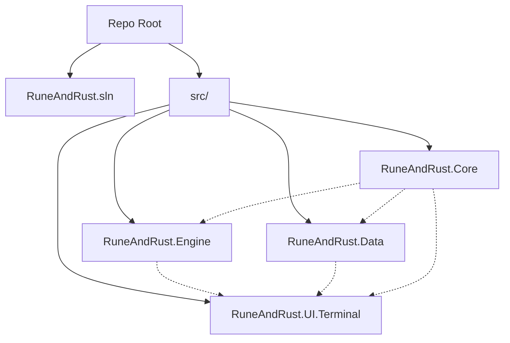

# Phase 1: The Foundation — Detailed Specification

> *"A fortress built on sand will fall before the first winter storm."*

## 1. Overview
This document expands upon the "Foundation" phase outlined in the [Initial Implementation Strategy](./initial-implementation-strategy.md). The primary objective is to establish the Visual Studio Solution (`.sln`) and the four core projects that define the architecture, ensuring they are correctly linked and capable of running a "Hello World" style Verification test via Dependency Injection.

**Success Definition**: A running "Walking Skeleton" application where the UI successfully resolves and executes logic from the Engine via the DI container, proving the architecture is wired correctly.

## 2. Technical Decision Tree & Rationale

Before writing code, we must justify our architectural choices.

### 2.1 Why strict Clean Architecture?
*   **Alternative**: Monolithic Console App.
*   **Reasoning**: We need to support **Both TUI and GUI**. If logic is coupled to the Console, rewriting for Avalonia becomes impossible.
*   **Decision**: Split `Core` (Interfaces), `Engine` (Logic), and `UI` (Presentation) strictly.

### 2.2 Why .NET 8?
*   **Alternative**: .NET Framework 4.8 or .NET 6/7.
*   **Reasoning**: .NET 8 is the current LTS (Long Term Support). It has native AOT potential (faster startup) and better C# 12 support.
*   **Decision**: Enforce `<TargetFramework>net8.0</TargetFramework>` in all projects.

### 2.3 Why Spectre.Console?
*   **Alternative**: `System.Console` or `Curses`.
*   **Reasoning**: `System.Console` is too primitive (no easy colors/tables). `Curses` libraries often have native dependencies. Spectre is pure C#, heavily used, and robust.
*   **Decision**: Use Spectre.Console for the TUI layer.

## 3. Directory & Project Structure

We will create a specific directory layout to keep source code, tests, and documentation distinct.



### 3.1 Naming Conventions
- **Solution Name**: `RuneAndRust`
- **Root Namespace**: `RuneAndRust`
- **Project Prefixes**: `RuneAndRust.{Layer}`

## 4. Project Specifications

### 4.1 RuneAndRust.Core
*   **Type**: Class Library
*   **Role**: The "Inner Circle" / Domain Layer.
*   **Dependencies**: None (Pure C#).
*   **Key Contents for Phase 1**:
    *   `Interfaces/IGameEngine.cs`: The contract for the main game controller.
    *   `Entities/GameState.cs`: A minimal class representing the game's state.

### 4.2 RuneAndRust.Engine
*   **Type**: Class Library
*   **Role**: Application Logic.
*   **Dependencies**:
    *   `ProjectReference`: `RuneAndRust.Core`
*   **Key Contents for Phase 1**:
    *   `GameEngine.cs`: Implementation of `IGameEngine`.
    *   `Services/`: Folder for future logic services.

### 4.3 RuneAndRust.Data
*   **Type**: Class Library
*   **Role**: Infrastructure / Persistence.
*   **Dependencies**:
    *   `ProjectReference`: `RuneAndRust.Core`
    *   `Package`: `Microsoft.EntityFrameworkCore` (Later in Phase 3, but Project ref needed now).
*   **Key Contents for Phase 1**:
    *   Empty initially, establishing the reference link only.

### 4.4 RuneAndRust.UI.Terminal
*   **Type**: Console Application
*   **Role**: Entry Point / Presentation.
*   **Dependencies**:
    *   `ProjectReference`: `RuneAndRust.Engine`
    *   `ProjectReference`: `RuneAndRust.Data`
    *   `Package`: `Spectre.Console` (Latest)
    *   `Package`: `Microsoft.Extensions.DependencyInjection` (Latest)
*   **Key Contents for Phase 1**:
    *   `Program.cs`: The Composition Root.

## 5. Implementation Workflow

### Step 1: Solution Initialization
Commands to execute in the root directory:
1.  `dotnet new sln -n RuneAndRust`
2.  `mkdir src`

### Step 2: Project Creation
Run inside `src/`:
1.  `dotnet new classlib -n RuneAndRust.Core`
2.  `dotnet new classlib -n RuneAndRust.Engine`
3.  `dotnet new classlib -n RuneAndRust.Data`
4.  `dotnet new console -n RuneAndRust.UI.Terminal`

### Step 3: Global Dependencies
Establish the "Onion Architecture" links:
1.  `dotnet add src/RuneAndRust.Engine/ reference src/RuneAndRust.Core/`
2.  `dotnet add src/RuneAndRust.Data/ reference src/RuneAndRust.Core/`
3.  `dotnet add src/RuneAndRust.UI.Terminal/ reference src/RuneAndRust.Engine/`
4.  `dotnet add src/RuneAndRust.UI.Terminal/ reference src/RuneAndRust.Data/`
5.  `dotnet sln add src/**/*.csproj`

### Step 4: Package Installation
Install the necessary NuGet packages for the UI layer:
```bash
dotnet add src/RuneAndRust.UI.Terminal/ package Spectre.Console
dotnet add src/RuneAndRust.UI.Terminal/ package Microsoft.Extensions.DependencyInjection
```

### Step 5: The "Walking Skeleton" Code

**In `RuneAndRust.Core`**:
Create `IGameEngine.cs`:
```csharp
namespace RuneAndRust.Core.Interfaces;

public interface IGameEngine
{
    string GetVersion();
}
```

**In `RuneAndRust.Engine`**:
Create `GameEngine.cs`:
```csharp
using RuneAndRust.Core.Interfaces;

namespace RuneAndRust.Engine;

public class GameEngine : IGameEngine
{
    public string GetVersion() => "Rune & Rust v0.0.1 (Skeleton)";
}
```

**In `RuneAndRust.UI.Terminal`**:
Modify `Program.cs` to set up DI:
```csharp
using Microsoft.Extensions.DependencyInjection;
using RuneAndRust.Core.Interfaces;
using RuneAndRust.Engine;
using Spectre.Console;

var serviceProvider = new ServiceCollection()
    .AddSingleton<IGameEngine, GameEngine>()
    .BuildServiceProvider();

var engine = serviceProvider.GetRequiredService<IGameEngine>();

AnsiConsole.MarkupLine($"[green]Successfully initialized:[/Provider] {engine.GetVersion()}");
```

## 6. Deliverable Checklist

- [ ] **Solution**: `RuneAndRust.sln` exists at root.
- [ ] **Projects**: 4 projects exist in `src/`.
- [ ] **References**:
    - [ ] `Core` has 0 dependencies.
    - [ ] `Engine` depends on `Core`.
    - [ ] `Data` depends on `Core`.
    - [ ] `UI` depends on everything.
- [ ] **Verification**:
    - [ ] `dotnet build` passes with 0 warnings.
    - [ ] `dotnet run` outputs the green verification text.
- [ ] **Git**: `.gitignore` is set up for Visual Studio (via `dotnet new gitignore`).

## 7. Troubleshooting

*   **Error**: "Class defined in two assemblies"
    *   **Cause**: Circular dependencies.
    *   **Fix**: Check that `Core` NEVER references `Engine` or `Data`.
*   **Error**: "Spectre.Console not found"
    *   **Cause**: NuGet restore failed.
    *   **Fix**: Run `dotnet restore` at the solution level.
