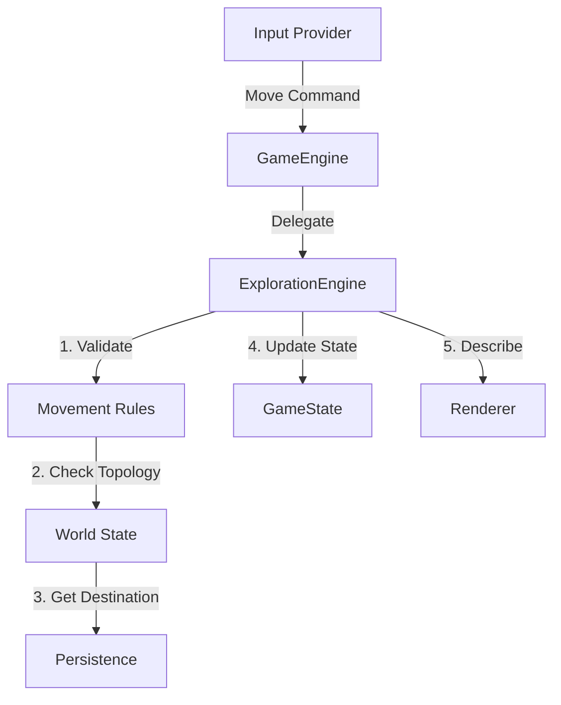

# Phase 4: Exploration — Detailed Specification

> *"To stand still is to rust. To move is to risk. Make your choice."*

## 1. Overview
Phase 4 implements the **Gameplay Loop** for exploration. Players can now navigate the world, observing descriptions and interacting with the basic topology of the dungeon. This phase bridges the gap between the abstract data structures of Phase 3 and the interactive experience of Phase 2.

**Success Definition**: A player can launch the game, be placed in a "Starting Room", type `North` to move to an adjacent room, and see the new room's description rendered in the TUI.

## 2. Architectural Design

### 2.1 The Exploration Engine
The `ExplorationEngine` is a sub-system responsible for processing movement and interaction commands.



### 2.2 Room Topology Models
We need a robust way to link rooms.
*   **Grid-Based?**: No. Rune & Rust is a "Node Graph" dungeon. Rooms are nodes; Exits are edges.
*   **Persistence**: Exits are stored in the database, linking `RoomID_A` to `RoomID_B` via a `Direction`.

## 3. Technical Decision Trees

### 3.1 Rendering Strategy
**Question**: How do we display the room?
*   **Option A**: Minimalist Text (Zork style).
*   **Option B**: ASCII Map + Text.
*   **Decision**: **Hybrid**.
    *   **Phase 4**: Rich Text Description (Spectre.Console Panels).
    *   **Phase 5+**: Procedural ASCII minimap.

### 3.2 Movement Logic
**Question**: How do we handle "Invalid Moves"?
*   **Option A**: Exception handling.
*   **Option B**: `Result` pattern return.
*   **Decision**: **Result Pattern**.
    *   Return `MoveResult.Failure("The door is locked.")` or `MoveResult.Failure("There is no exit there.")`.
    *   The UI renders these failures as "Flavor Text" rather than crashing or showing error codes.

## 4. Implementation Workflow

### Step 1: Core Entities (`RuneAndRust.Core`)
Define the physical world.
```csharp
public class Room
{
    public Guid Id { get; set; }
    public string Name { get; set; }
    public string Description { get; set; }
    public ICollection<Exit> Exits { get; set; }
}

public class Exit
{
    public Direction Direction { get; set; }
    public Guid TargetRoomId { get; set; }
    public bool IsLocked { get; set; }
}

public enum Direction { North, South, East, West, Up, Down }
```

### Step 2: Database Migration (`RuneAndRust.Data`)
*   Update `RuneAndRustDbContext` to include `DbSet<Room>`.
*   Seed data: Create a "Starter Dungeon" with 3-4 linked rooms so we can test movement immediately without procedural generation.

### Step 3: The Exploration Service (`RuneAndRust.Engine`)
Implement `MovementService`:
*   `MoveAsync(Character character, Direction dir)`
*   Logic:
    1.  Get current room of character.
    2.  Check for exit in `dir`.
    3.  If locked -> Return Fail.
    4.  If valid -> Update `Character.CurrentRoomId`.
    5.  Log to `TravelHistory`.
    6.  Save `GameState`.

### Step 4: UI Integration (`RuneAndRust.UI.Terminal`)
*   **Input**: Map keys `W/A/S/D` or `Arrow Keys` to `MoveCommand`.
*   **Renderer**: Create `RoomRenderer` class.
    *   Use `Spectre.Console.Panel` for the Room Name header.
    *   Use `Markup` for the description.
    *   List available exits: `[Exits: North, East]`

## 5. Deliverable Checklist

### 5.1 Infrastructure
- [ ] **Data**: `Room` and `Exit` entities created.
- [ ] **Data**: Initial Migration applied.
- [ ] **Data**: Seeder created (GameStart => "The Atrium" => "The Hallway").

### 5.2 Core/Engine
- [ ] **Core**: `MovementService` interface defined.
- [ ] **Engine**: `MovementService` implemented.
- [ ] **Engine**: `ExplorationController` wired into the main loop.

### 5.3 UI
- [ ] **Renderer**: Room Title and Description visible.
- [ ] **Renderer**: Exits list visible.
- [ ] **Input**: Arrow keys trigger movement.
- [ ] **Feedback**: Invalid moves show a message ("You bump into a wall.").

## 6. Integration Test Plan
**Test**: `CanWalkCompleteLoop`
1.  Start Game (Room A).
2.  Command: `Move East` -> Success -> Room B.
3.  Command: `Move West` -> Success -> Room A.
4.  Command: `Move North` (No Exit) -> Fail -> Room A.
5.  Verify `GameState.CurrentRoomId` matches expectations at each step.

## 7. Future Considerations (Phase 5+)
*   **Fog of War**: Only show exits the player has discovered.
*   **Auto-Map**: Generate a visual grid based on `VisitedRooms`.
*   **Encounters**: `MoveAsync` triggers a "random encounter check".
