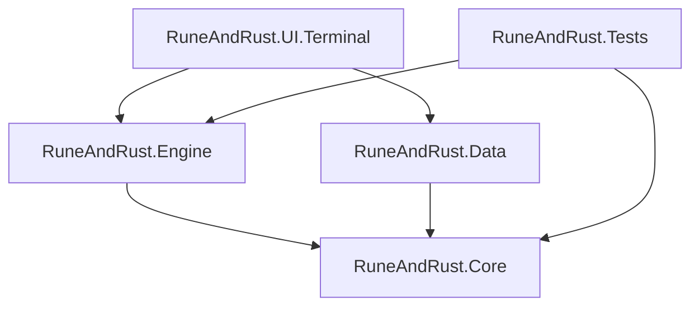

# v0.1.0 — Phase 1: The Foundation

> *"First the bones, then the flesh, then the armor."* — Dvergr Proverb

## Overview

This release establishes the foundational "Walking Skeleton" for **Rune & Rust** — the core project structure implementing Clean Architecture with strict separation between Game Logic (Engine) and Presentation (UI).

| Property | Value |
|----------|-------|
| Version | 0.1.0 |
| Codename | The Foundation |
| Phase | 1 of 4 |
| Release Date | 2025-12-18 |
| Status | ✅ Complete |

---

## Architecture Implemented

### Solution Structure

```text
RuneAndRust.sln
├── src/
│   ├── RuneAndRust.Core/           # Domain Layer (0 dependencies)
│   ├── RuneAndRust.Engine/         # Application Layer → Core
│   ├── RuneAndRust.Data/           # Infrastructure Layer → Core
│   └── RuneAndRust.UI.Terminal/    # Presentation Layer → Engine, Data
└── tests/
    └── RuneAndRust.Tests/          # Unit tests
```

### Dependency Graph



---

## Deliverables Completed

### ✅ Solution & Project Files

| Item | Path | Status |
|------|------|--------|
| Solution file | `RuneAndRust.sln` | ✅ |
| Core library | `src/RuneAndRust.Core/` | ✅ |
| Engine library | `src/RuneAndRust.Engine/` | ✅ |
| Data library | `src/RuneAndRust.Data/` | ✅ |
| Terminal UI | `src/RuneAndRust.UI.Terminal/` | ✅ |
| Test project | `tests/RuneAndRust.Tests/` | ✅ |

### ✅ Core Domain Types

| File | Purpose |
|------|---------|
| `Core/Interfaces/IGameEngine.cs` | Game engine contract |
| `Core/Interfaces/IGameState.cs` | Game state contract |
| `Core/Entities/GameState.cs` | State machine implementation |
| `Core/Enums/GamePhase.cs` | 11 game phases |
| `Core/Enums/InputType.cs` | Input command types |
| `Core/Models/GameInput.cs` | Input wrapper |

### ✅ Engine Implementation

| File | Purpose |
|------|---------|
| `Engine/GameEngine.cs` | Main engine with phase-based input handling |

### ✅ Terminal UI

| File | Purpose |
|------|---------|
| `UI.Terminal/Program.cs` | DI composition root |
| `UI.Terminal/GameRenderer.cs` | Spectre.Console rendering |
| `UI.Terminal/TerminalInputProvider.cs` | Input abstraction |

---

## Dependencies

### NuGet Packages

| Package | Version | Project |
|---------|---------|---------|
| `Spectre.Console` | 0.54.0 | UI.Terminal |
| `Microsoft.Extensions.DependencyInjection` | 10.0.1 | UI.Terminal |
| `Microsoft.Extensions.Hosting` | 10.0.1 | UI.Terminal |
| `Serilog` | 4.3.0 | Engine |
| `Serilog.Extensions.Hosting` | 10.0.0 | UI.Terminal |
| `Serilog.Sinks.Console` | 6.1.1 | UI.Terminal |

### Target Framework

All projects target **.NET 9.0** (`net9.0`).

---

## Technical Decisions

| Decision | Rationale |
|----------|-----------|
| **Clean Architecture** | Enables future GUI support without engine rewrite |
| **.NET 9.0** | Latest LTS candidate with C# 13 features |
| **Spectre.Console** | Rich TUI without native dependencies |
| **Serilog** | Structured logging with flexible sinks |
| **Microsoft.Extensions.DI** | Standard DI container, familiar to .NET devs |

---

## Verification

```bash
# Build verification
dotnet restore && dotnet build
# Result: Build succeeded

# Projects verified
✅ RuneAndRust.Core       → bin/Debug/net9.0/RuneAndRust.Core.dll
✅ RuneAndRust.Data       → bin/Debug/net9.0/RuneAndRust.Data.dll
✅ RuneAndRust.Engine     → bin/Debug/net9.0/RuneAndRust.Engine.dll
✅ RuneAndRust.UI.Terminal → bin/Debug/net9.0/RuneAndRust.UI.Terminal.dll
✅ RuneAndRust.Tests      → bin/Debug/net9.0/RuneAndRust.Tests.dll
```

---

## Unit Testing

### Test Framework

| Component | Version |
|-----------|---------|
| xUnit | 2.9.2 |
| Microsoft.NET.Test.Sdk | 17.12.0 |
| xunit.runner.visualstudio | 2.8.2 |
| coverlet.collector | 6.0.2 |

### Test Results

```bash
dotnet test --verbosity normal
# Result: 4 passed, 0 failed (0.5s)
```

### Tests Implemented

| Test | Validates |
|------|-----------|
| `GetVersion_ReturnsVersionString` | Engine returns version info |
| `Initialize_SetsPhaseToMainMenu` | Engine starts in MainMenu phase |
| `StartNewGame_TransitionsToExploration` | New game reaches Exploration phase |
| `Update_Quit_ReturnsFalse` | Quit input terminates game loop |

### Test Patterns Used

- **NullLogger injection**: Uses `NullLogger<GameEngine>.Instance` for logger dependencies
- **AAA pattern**: All tests follow Arrange-Act-Assert structure
- **Interface testing**: Tests against `IGameEngine` contract

---

## Known Issues

| Issue | Severity | Notes |
|-------|----------|-------|
| Missing `.gitignore` | Low | Add via `dotnet new gitignore` |

---

## Next Phase

**Phase 2: The Loop** — Implement the state machine game loop per `SPEC-CORE-GAMELOOP`.

> [!NOTE]
> Phase 2 implementation has already been started. The `GameState` class includes full phase transition logic and the `GameEngine` handles phase-based input routing.

---

## Related Documentation

- [Initial Implementation Strategy](../00-project/initial-implementation-strategy.md)
- [Phase 1 Specification](../00-project/phase-1-spec.md)
- [Game Loop System](../01-core/game-loop.md)
