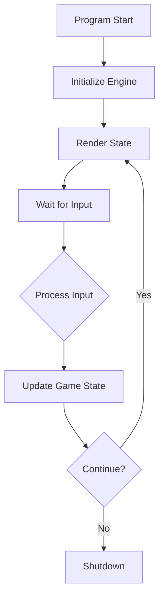

# v0.1.1 — Phase 2: The Game Loop

> *"Time is a wheel, but the runes determine where it strikes the ground."*

## Overview

This release implements the **State Machine** game loop and **Input Abstraction** layer, transforming the static skeleton into a living application with proper state transitions and structured logging.

| Property | Value |
|----------|-------|
| Version | 0.1.1 |
| Codename | The Game Loop |
| Phase | 2 of 4 |
| Release Date | 2025-12-18 |
| Status | ✅ Complete |

---

## Architecture Implemented

### Core Loop Pattern



### Input Abstraction

Platform-agnostic input handling via Command Pattern:

```
Console.ReadKey() → TerminalInputProvider → GameInput → GameEngine.Update()
```

---

## Deliverables Completed

### ✅ Core Types

| File | Purpose |
|------|---------|
| `Enums/GamePhase.cs` | 11 game phases (MainMenu, Loading, Exploration, Combat, etc.) |
| `Enums/InputType.cs` | 24 input types (movement, menu, interaction, combat, system) |
| `Models/GameInput.cs` | Platform-agnostic input record with optional RawValue |
| `Interfaces/IGameState.cs` | Read-only state view interface |
| `Entities/GameState.cs` | State machine with validated transitions |

### ✅ Engine Implementation

| File | Purpose |
|------|---------|
| `GameEngine.cs` | Phase-based input routing with full state machine |

**State Transitions Implemented:**

| From | Valid Targets |
|------|---------------|
| MainMenu | Loading, Exiting |
| Loading | Exploration, MainMenu |
| Exploration | Combat, Interaction, Inventory, Paused, Saving, Dialogue |
| Combat | Exploration, GameOver |
| Paused | Exploration, Combat, MainMenu |
| GameOver | MainMenu |

### ✅ Terminal UI

| File | Purpose |
|------|---------|
| `Program.cs` | DI composition root with Serilog |
| `TerminalInputProvider.cs` | Console key → GameInput mapping |
| `GameRenderer.cs` | Phase-based Spectre.Console rendering |

**Screens Implemented:**
- Main Menu (ASCII art panel)
- Exploration (placeholder room)
- Paused overlay
- Loading spinner

---

## Serilog Logging

### Packages

| Package | Version | Project |
|---------|---------|---------|
| `Serilog` | 4.3.0 | Engine |
| `Serilog.Extensions.Logging` | 10.0.0 | Engine |
| `Serilog.Extensions.Hosting` | 10.0.0 | UI.Terminal |
| `Serilog.Sinks.Console` | 6.1.1 | UI.Terminal |

### Configuration

```csharp
Log.Logger = new LoggerConfiguration()
    .MinimumLevel.Debug()
    .WriteTo.Console(outputTemplate: 
        "[{Timestamp:HH:mm:ss} {Level:u3}] {Message:lj}{NewLine}{Exception}")
    .CreateLogger();
```

### Logged Events

| Event | Level | Template |
|-------|-------|----------|
| Engine init | Information | `GameEngine initializing. Session: {SessionId}` |
| Phase transition | Information | `Phase transition: {From} -> {To}` |
| Input processing | Debug | `Processing input: {InputType}` |
| Movement commands | Debug | `Movement command: {Direction}` |
| Engine shutdown | Information | `GameEngine shutting down. Session: {SessionId}` |

---

## Input Mappings

### Main Menu

| Key | Action |
|-----|--------|
| Enter / Space | Start New Game |
| ↑ / ↓ | Menu navigation (future) |
| Esc / Q | Quit |

### Exploration

| Key | Action |
|-----|--------|
| W / ↑ | Move North |
| S / ↓ | Move South |
| A / ← | Move West |
| D / → | Move East |
| E | Interact |
| X | Examine |
| I | Open Inventory |
| M | Open Map |
| Esc | Pause |
| Q | Quit |

### Paused

| Key | Action |
|-----|--------|
| Esc / Enter | Resume |
| Q | Return to Main Menu |

---

## Unit Tests

### New Tests Added

| Test | Validates |
|------|-----------|
| `GetVersion_ReturnsVersionString` | Engine version info |
| `Initialize_SetsPhaseToMainMenu` | Initial state correct |
| `StartNewGame_TransitionsToExploration` | New game flow |
| `Update_Quit_ReturnsFalse` | Quit terminates loop |

```bash
dotnet test
# Result: 4 passed, 0 failed (0.5s)
```

---

## Runtime Verification

```
╔═══════════════════════════════════════════╗
║              RUNE & RUST                  ║
║     A Post-Apocalyptic Nordic RPG         ║
║       Press ENTER to Start New Game       ║
║            Press Q to Quit                ║
╚═══════════════════════════════════════════╝
Version: Rune & Rust v0.1.0 (Phase 2)
```

**Verified Flows:**
- ✅ App launches to Main Menu
- ✅ Enter transitions to Exploration
- ✅ Esc pauses from Exploration
- ✅ Q quits gracefully
- ✅ Logs show phase transitions

---

## Technical Decisions

| Decision | Rationale |
|----------|-----------|
| **Blocking input loop** | Simpler for TUI; async planned for Phase 3 |
| **Full redraw on render** | Acceptable simplicity; Live Display for Phase 3 |
| **No MediatR** | Direct method calls easier to debug at this scale |
| **Serilog over ILogger only** | Structured logging with Console sink for debugging |

---

## Next Phase

**Phase 3: Persistence** — EF Core integration with PostgreSQL/SQLite for save/load functionality.

---

## Related Documentation

- [Phase 2 Specification](../00-project/phase-2-spec.md)
- [Game Loop System](../01-core/game-loop.md)
- [Persistence System](../01-core/persistence.md)
- [v0.1.0 Changelog](./v0.1.0-phase-1-foundation.md)
