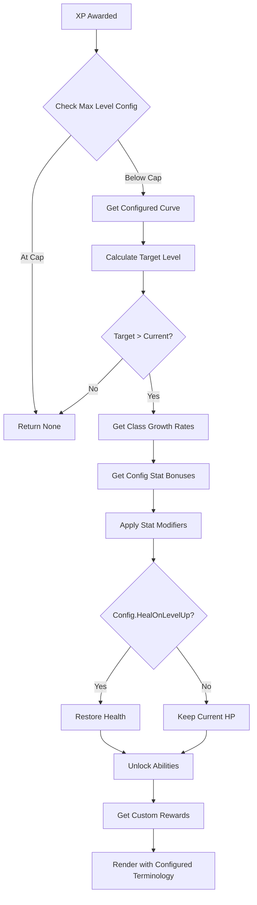
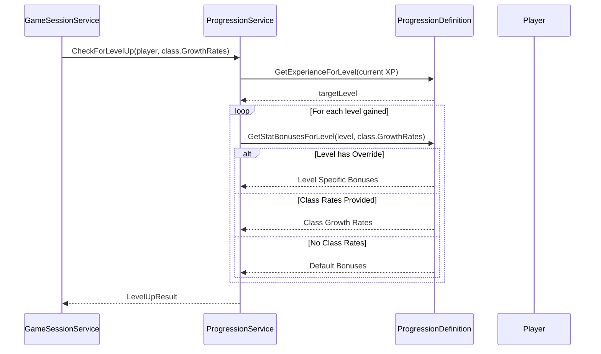

# v0.0.8c Implementation Plan: Progression Configuration

**Version:** 0.0.8c
**Parent:** v0.0.8 (Experience & Leveling)
**Prerequisites:** v0.0.8b Complete (Level-Up Mechanics)
**Design Specification:** [v0.0.8c-design-specification.md](v0.0.8c-design-specification.md)
**Status:** Ready for Implementation
**Target Tests:** ~335 -> ~349 (+14 tests)

---

## Table of Contents

1. [Executive Summary](#executive-summary)
2. [Dependencies from Previous Phases](#dependencies-from-previous-phases)
3. [Current System Analysis](#current-system-analysis)
4. [Detailed Implementation](#detailed-implementation)
   - [Domain Layer](#domain-layer)
   - [Application Layer](#application-layer)
   - [Infrastructure Layer](#infrastructure-layer)
   - [Presentation Layer](#presentation-layer)
5. [Flow Diagrams](#flow-diagrams)
6. [Testing Strategy](#testing-strategy)
7. [Logging Strategy](#logging-strategy)
8. [Implementation Checklist](#implementation-checklist)
9. [Acceptance Criteria](#acceptance-criteria)
10. [Risk Assessment](#risk-assessment)
11. [File Summary](#file-summary)

---

## Executive Summary

### Purpose

Transform the level-up system from hardcoded defaults to a fully configurable, data-driven system. This phase introduces `progression.json` configuration, allowing level requirements, stat bonuses, terminology (e.g., "Level" vs "Rank"), and rewards to be customized without code changes. It also integrates class-specific growth rates for stat bonuses.

### Scope

**In Scope:**
- `ProgressionDefinition` entity loaded from `config/progression.json`
- `LevelDefinition` for per-level custom configuration
- `ProgressionCurve` enum (Linear, Exponential, Custom)
- Configurable terminology for XP and Level display names
- Configurable max level cap (default 20)
- Configurable base XP requirement and multiplier for progression curves
- Per-level stat bonus overrides
- Per-level custom reward descriptions
- Class-specific stat bonus integration via `ClassDefinition.GrowthRates`
- Update `ProgressionService` to use configuration
- Update `Player.GetExperienceForLevel()` and `GetLevelForExperience()` to use configuration
- Update `IGameConfigurationProvider` with progression configuration methods
- Update `JsonConfigurationProvider` to load `progression.json`
- Update renderers to use configured terminology
- Default progression configuration when no custom config exists

**Out of Scope:**
- Skill point allocation system
- Prestige/Rebirth mechanics
- Multiple progression tracks
- Experience penalties/bonuses from equipment
- Level-down mechanics
- Per-class XP requirements

### Key Decisions

| Decision | Choice | Rationale |
|----------|--------|-----------|
| Configuration Format | JSON | Consistent with existing `classes.json` and `abilities.json` |
| Default Curve | Exponential (1.5x) | Provides better long-term pacing than linear |
| Max Level Cap | 20 (Soft Cap) | Prevents stat inflation while allowing extended play |
| Class Growth Integration | Override Defaults | Class stats should define specific archetypes completely |
| Terminology Scope | Display Only | Code remains `Experience` and `Level` for consistency |

---

## Dependencies from Previous Phases

### Dependencies from v0.0.8b (Level-Up Mechanics)

| Type | Location | Usage in this phase |
|------|----------|---------------------|
| `ProgressionService` | `Domain/Services/ProgressionService.cs` | Primary service being updated |
| `StatModifiers` | `Domain/ValueObjects/StatModifiers.cs` | Used for calculated bonuses |
| `LevelUpResult` | `Domain/ValueObjects/LevelUpResult.cs` | Result object used in flow |
| `Player.ApplyStatModifiers` | `Domain/Entities/Player.cs` | Applying the calculated stats |
| `LevelUpDto` | `Application/DTOs/LevelUpDto.cs` | updated with terminology/rewards |
| `SpectreGameRenderer` | `Presentation/Tui/Adapters/SpectreGameRenderer.cs` | Updated to use configurable terms |

### Dependencies from v0.0.8a (Core Experience System)

| Type | Location | Usage in this phase |
|------|----------|---------------------|
| `Player.Experience` | `Domain/Entities/Player.cs` | Checked against new thresholds |
| `ExperienceGainDto` | `Application/DTOs/ExperienceGainDto.cs` | Updated with terminology |

### Dependencies from v0.0.3/4 (Configuration & Classes)

| Type | Location | Usage in this phase |
|------|----------|---------------------|
| `ClassDefinition.GrowthRates` | `Domain/Definitions/ClassDefinition.cs` | Source of class specific stats |
| `JsonConfigurationProvider` | `Infrastructure/Configuration/JsonConfigurationProvider.cs` | Will load the new config file |
| `IGameConfigurationProvider` | `Application/Interfaces/IConfigurationProvider.cs` | Interface update |

---

## Current System Analysis

### Existing Progression Logic (v0.0.8b)

Currently, the `ProgressionService` and `Player` class use hardcoded logic:

**src/Core/RuneAndRust.Domain/Entities/Player.cs:**
```csharp
public static int GetExperienceForLevel(int level)
{
    if (level <= 1) return 0;
    return level * 100; // Hardcoded Linear structure
}
```

**src/Core/RuneAndRust.Domain/Services/ProgressionService.cs:**
```csharp
public StatModifiers GetStatIncreasesForLevels(int levelsGained)
{
    // Hardcoded defaults: +5 HP, +1 ATK, +1 DEF
    return StatModifiers.DefaultLevelUp.Multiply(levelsGained);
}
```

### New Configurable Logic (v0.0.8c)

The logic will change to delegate to a `ProgressionDefinition` object:

```csharp
public static int GetExperienceForLevel(int level, ProgressionDefinition? config = null)
{
    config ??= ProgressionDefinition.Default;
    return config.GetExperienceForLevel(level); // Delegates to configurable curve logic
}
```

This ensures that all calculations—from UI display to actual level-up mechanics—share the same source of truth.

---

## Detailed Implementation

### Domain Layer

#### 1. ProgressionCurve.cs (NEW Enum)

**File:** `src/Core/RuneAndRust.Domain/Enums/ProgressionCurve.cs`

```csharp
namespace RuneAndRust.Domain.Enums;

/// <summary>
/// Defines the type of progression curve for XP requirements.
/// </summary>
public enum ProgressionCurve
{
    /// <summary>
    /// Linear progression: each level requires the same additional XP.
    /// Formula: (level - 1) * baseXpRequirement
    /// </summary>
    Linear,

    /// <summary>
    /// Exponential progression: each level requires more XP than the last.
    /// Formula: cumulative sum of (baseXp * multiplier^(level-2))
    /// </summary>
    Exponential,

    /// <summary>
    /// Custom progression: XP requirements are defined per-level in LevelOverrides.
    /// Falls back to linear for undefined levels.
    /// </summary>
    Custom
}
```

#### 2. StatBonusConfig.cs (NEW Configuration Class)

**File:** `src/Core/RuneAndRust.Domain/Definitions/StatBonusConfig.cs`

```csharp
using RuneAndRust.Domain.ValueObjects;

namespace RuneAndRust.Domain.Definitions;

/// <summary>
/// Configuration class for stat bonuses, used in JSON deserialization.
/// </summary>
/// <remarks>
/// This is a mutable class for JSON binding. Use ToStatModifiers()
/// to convert to the immutable StatModifiers value object.
/// </remarks>
public class StatBonusConfig
{
    /// <summary>
    /// Gets or sets the max health bonus.
    /// </summary>
    public int MaxHealth { get; set; } = 5;

    /// <summary>
    /// Gets or sets the attack bonus.
    /// </summary>
    public int Attack { get; set; } = 1;

    /// <summary>
    /// Gets or sets the defense bonus.
    /// </summary>
    public int Defense { get; set; } = 1;

    /// <summary>
    /// Converts this configuration to a StatModifiers value object.
    /// </summary>
    /// <returns>An immutable StatModifiers instance.</returns>
    public StatModifiers ToStatModifiers() => new(MaxHealth, Attack, Defense);
}
```

#### 3. LevelDefinition.cs (NEW Entity)

**File:** `src/Core/RuneAndRust.Domain/Definitions/LevelDefinition.cs`

```csharp
namespace RuneAndRust.Domain.Definitions;

/// <summary>
/// Defines custom configuration for a specific level.
/// </summary>
public class LevelDefinition
{
    /// <summary>
    /// Gets the level number this definition applies to.
    /// </summary>
    public int Level { get; init; }

    /// <summary>
    /// Gets the cumulative XP required to reach this level.
    /// </summary>
    public int? XpRequired { get; init; }

    /// <summary>
    /// Gets custom stat bonuses for this level.
    /// </summary>
    public StatBonusConfig? StatBonuses { get; init; }

    /// <summary>
    /// Gets custom rewards granted at this level.
    /// </summary>
    public IReadOnlyList<string> CustomRewards { get; init; } = Array.Empty<string>();

    /// <summary>
    /// Gets a milestone title granted at this level.
    /// </summary>
    public string? Title { get; init; }
}
```

#### 4. ProgressionDefinition.cs (NEW Entity)

**File:** `src/Core/RuneAndRust.Domain/Definitions/ProgressionDefinition.cs`

```csharp
using RuneAndRust.Domain.Enums;
using RuneAndRust.Domain.ValueObjects;

namespace RuneAndRust.Domain.Definitions;

/// <summary>
/// Defines the progression system configuration for the game.
/// </summary>
public class ProgressionDefinition
{
    public string ExperienceTerminology { get; init; } = "XP";
    public string LevelTerminology { get; init; } = "Level";
    public int MaxLevel { get; init; } = 20;
    public ProgressionCurve CurveType { get; init; } = ProgressionCurve.Exponential;
    public int BaseXpRequirement { get; init; } = 100;
    public float XpMultiplier { get; init; } = 1.5f;
    public StatBonusConfig DefaultStatBonuses { get; init; } = new();
    public IReadOnlyDictionary<int, LevelDefinition> LevelOverrides { get; init; } =
        new Dictionary<int, LevelDefinition>();
    public bool HealOnLevelUp { get; init; } = true;

    /// <summary>
    /// Creates a default progression definition with standard values.
    /// </summary>
    public static ProgressionDefinition Default => new();

    /// <summary>
    /// Calculates the cumulative XP required to reach a specific level.
    /// </summary>
    public int GetExperienceForLevel(int level)
    {
        if (level <= 1) return 0;
        if (MaxLevel > 0 && level > MaxLevel) level = MaxLevel;

        if (LevelOverrides.TryGetValue(level, out var customLevel) && customLevel.XpRequired.HasValue)
        {
            return customLevel.XpRequired.Value;
        }

        return CurveType switch
        {
            ProgressionCurve.Linear => CalculateLinearXp(level),
            ProgressionCurve.Exponential => CalculateExponentialXp(level),
            ProgressionCurve.Custom => GetCustomXpForLevel(level),
            _ => CalculateLinearXp(level)
        };
    }

    /// <summary>
    /// Gets what level corresponds to a given XP amount.
    /// </summary>
    public int GetLevelForExperience(int experience)
    {
        var maxLevelToCheck = MaxLevel > 0 ? MaxLevel : 100;

        for (var level = maxLevelToCheck; level >= 1; level--)
        {
            if (experience >= GetExperienceForLevel(level))
            {
                return level;
            }
        }
        return 1;
    }

    /// <summary>
    /// Gets the stat bonuses for leveling up, considering class growth rates.
    /// </summary>
    public StatModifiers GetStatBonusesForLevel(int level, StatModifiers? classGrowthRates = null)
    {
        if (LevelOverrides.TryGetValue(level, out var levelDef) && levelDef.StatBonuses != null)
        {
            return levelDef.StatBonuses.ToStatModifiers();
        }

        if (classGrowthRates.HasValue && classGrowthRates.Value.HasModifications)
        {
            return classGrowthRates.Value;
        }

        return DefaultStatBonuses.ToStatModifiers();
    }

    private int CalculateLinearXp(int level) => (level - 1) * BaseXpRequirement;

    private int CalculateExponentialXp(int level)
    {
        if (level == 2) return BaseXpRequirement;
        var cumulative = 0;
        var xpForLevel = (float)BaseXpRequirement;
        for (var l = 2; l <= level; l++)
        {
            cumulative += (int)xpForLevel;
            xpForLevel *= XpMultiplier;
        }
        return cumulative;
    }

    private int GetCustomXpForLevel(int level)
    {
        if (LevelOverrides.TryGetValue(level, out var levelDef) && levelDef.XpRequired.HasValue)
        {
            return levelDef.XpRequired.Value;
        }
        return CalculateLinearXp(level);
    }
}
```

#### 5. Player.cs (UPDATE)

**File:** `src/Core/RuneAndRust.Domain/Entities/Player.cs`

Update XP calculation methods to accept `ProgressionDefinition`.

```csharp
// Update static methods to use ProgressionDefinition
public static int GetExperienceForLevel(int level, ProgressionDefinition? progression = null)
{
    progression ??= ProgressionDefinition.Default;
    return progression.GetExperienceForLevel(level);
}

public static int GetLevelForExperience(int experience, ProgressionDefinition? progression = null)
{
    progression ??= ProgressionDefinition.Default;
    return progression.GetLevelForExperience(experience);
}

// Update instance method
public int GetExperienceToNextLevel(ProgressionDefinition? progression)
{
    progression ??= ProgressionDefinition.Default;

    if (progression.MaxLevel > 0 && Level >= progression.MaxLevel)
    {
        return 0; // At max level
    }

    return progression.GetExperienceForLevel(Level + 1);
}

// Helper property uses default if not provided (fallback)
public int ExperienceToNextLevel => GetExperienceToNextLevel(null);
```

#### 6. ProgressionService.cs (UPDATE)

**File:** `src/Core/RuneAndRust.Domain/Services/ProgressionService.cs`

Update to inject and use `ProgressionDefinition`.

```csharp
public class ProgressionService
{
    private readonly ILogger<ProgressionService> _logger;
    private readonly ProgressionDefinition _progression;

    public ProgressionService(
        ILogger<ProgressionService> logger,
        ProgressionDefinition? progression = null) // NEW: Accepts config
    {
        _logger = logger;
        _progression = progression ?? ProgressionDefinition.Default;
        // Log initialization parameters...
    }

    // Expose config for renderers
    public ProgressionDefinition Progression => _progression;

    public LevelUpResult CheckForLevelUp(Player player, StatModifiers? classGrowthRates = null)
    {
        // 1. Check Max Level Cap
        if (_progression.MaxLevel > 0 && player.Level >= _progression.MaxLevel) { ... return None ... }

        // 2. Calculate Target Level
        var targetLevel = _progression.GetLevelForExperience(player.Experience);
        if (_progression.MaxLevel > 0 && targetLevel > _progression.MaxLevel) targetLevel = _progression.MaxLevel;

        if (targetLevel <= player.Level) { ... return None ... }

        // 3. Calculate Stats
        var statIncreases = GetStatIncreasesForLevels(player.Level, targetLevel, classGrowthRates);

        return new LevelUpResult(player.Level, targetLevel, statIncreases, Array.Empty<string>());
    }

    public LevelUpResult ApplyLevelUp(Player player, LevelUpResult result, Func<int, IReadOnlyList<string>>? getAbilitiesAtLevel = null)
    {
        // Use configured HealOnLevelUp setting
        player.ApplyStatModifiers(result.StatIncreases, healToNewMax: _progression.HealOnLevelUp);
        player.SetLevel(result.NewLevel);
        // ... rest of logic (abilities) ...
        return result;
    }

    public StatModifiers GetStatIncreasesForLevels(int fromLevel, int toLevel, StatModifiers? classGrowthRates = null)
    {
        var total = StatModifiers.Zero;
        for (var level = fromLevel + 1; level <= toLevel; level++)
        {
            var bonuses = _progression.GetStatBonusesForLevel(level, classGrowthRates);
            total = total.Add(bonuses);
        }
        return total;
    }

    // New methods for retrieving metadata
    public IReadOnlyList<string> GetCustomRewardsForLevel(int level) { ... }
### Application Layer

#### 1. IGameConfigurationProvider.cs (UPDATE)

**File:** `src/Core/RuneAndRust.Application/Interfaces/IConfigurationProvider.cs`

```csharp
public interface IGameConfigurationProvider
{
    // ... existing methods ...
    ProgressionDefinition GetProgressionConfiguration(); // NEW
}
```

#### 2. DTO Updates

**File:** `src/Core/RuneAndRust.Application/DTOs/ExperienceGainDto.cs`

Add terminology properties to DTO so renderer can display correct terms.

```csharp
public record ExperienceGainDto(
    int AmountGained,
    int NewTotal,
    string Source,
    int CurrentLevel,
    int ExperienceToNextLevel,
    int ProgressPercent,
    string ExperienceTerminology = "XP",  // NEW
    string LevelTerminology = "Level"     // NEW
);
```

**File:** `src/Core/RuneAndRust.Application/DTOs/LevelUpDto.cs`

Add terminology, rewards, and title properties.

```csharp
public record LevelUpDto(
    int OldLevel,
    int NewLevel,
    int LevelsGained,
    int OldMaxHealth,
    int NewMaxHealth,
    int OldAttack,
    int NewAttack,
    int OldDefense,
    int NewDefense,
    IReadOnlyList<string> UnlockedAbilityNames,
    int XpToNextLevel,
    IReadOnlyList<string> CustomRewards, // NEW
    string? Title,                       // NEW
    string ExperienceTerminology = "XP", // NEW
    string LevelTerminology = "Level"    // NEW
)
{
    // ... existing properties ...
    public bool HasCustomRewards => CustomRewards.Count > 0; // NEW
    public bool HasTitle => !string.IsNullOrEmpty(Title);    // NEW
}
```

#### 3. GameSessionService.cs (UPDATE)

Update `GameSessionService` to supply the configuration to the `ProgressionService` and DTOs.

```csharp
// When initializing service:
var progressionConfig = _configProvider.GetProgressionConfiguration();
_progressionService = new ProgressionService(_logger, progressionConfig);

// When creating ExperienceGainDto:
new ExperienceGainDto(...,
    ExperienceTerminology: _progressionService.Progression.ExperienceTerminology,
    LevelTerminology: _progressionService.Progression.LevelTerminology);

// When creating LevelUpDto:
new LevelUpDto(...,
    CustomRewards: _progressionService.GetCustomRewardsForLevel(result.NewLevel),
    Title: _progressionService.GetTitleForLevel(result.NewLevel),
    ExperienceTerminology: _progressionService.Progression.ExperienceTerminology,
    LevelTerminology: _progressionService.Progression.LevelTerminology);
```

---

### Infrastructure Layer

#### 1. JsonConfigurationProvider.cs (UPDATE)

**File:** `src/Infrastructure/RuneAndRust.Infrastructure/Configuration/JsonConfigurationProvider.cs`

Implement `GetProgressionConfiguration()`.

```csharp
private ProgressionDefinition? _progression;

public ProgressionDefinition GetProgressionConfiguration()
{
    if (_progression != null) return _progression;

    var filePath = Path.Combine(_configPath, "progression.json");
    var config = LoadJsonFile<ProgressionJsonConfig>(filePath);
    _progression = config?.ToProgressionDefinition() ?? ProgressionDefinition.Default;

    return _progression;
}

// JSON Mapping Classes (Private/Internal)
private class ProgressionJsonConfig { ... }
private class StatBonusJsonConfig { ... }
private class LevelDefinitionJsonConfig { ... }
```

---

### Presentation Layer

#### 1. SpectreGameRenderer.cs (UPDATE)

**File:** `src/Presentation/RuneAndRust.Presentation.Tui/Adapters/SpectreGameRenderer.cs`

Update render methods to use DTO terminology instead of hardcoded strings.

```csharp
public Task RenderExperienceGainAsync(ExperienceGainDto dto, ...)
{
    // Use dto.ExperienceTerminology instead of "XP"
    AnsiConsole.MarkupLine($"... {dto.AmountGained} {dto.ExperienceTerminology} ...");
}

private static string BuildLevelUpContent(LevelUpDto dto)
{
    // Use dto.LevelTerminology instead of "Level"
    // Use dto.ExperienceTerminology instead of "XP"
    sb.AppendLine($"... {dto.LevelTerminology} UP! ...");

    // Render Title if present
    if (dto.HasTitle) sb.AppendLine($"Title Earned: {dto.Title}");

    // Render Custom Rewards if present
    if (dto.HasCustomRewards) { ... }
}
```

---

## Flow Diagrams

### Configurable Level-Up Flow



### Class Growth Rates Integration



---

## Testing Strategy

### Test Organization

```
tests/
├── RuneAndRust.Domain.UnitTests/
│   ├── Definitions/
│   │   ├── ProgressionDefinitionTests.cs    (6 tests)
│   │   └── StatBonusConfigTests.cs          (2 tests)
│   └── Services/
│       └── ProgressionServiceConfigTests.cs (6 tests)
```

### Test Scenarios

#### 1. ProgressionDefinitionTests.cs

- **Default Values**: Verify `Default` returns standard XP/Level terms and Exponential curve.
- **Linear Curve**: Verify `GetExperienceForLevel` calculates linear progression correctly.
- **Exponential Curve**: Verify `GetExperienceForLevel` calculates exponential progression correctly.
- **Custom Curve**: Verify `GetExperienceForLevel` respects `LevelOverrides`.
- **Level Lookup**: Verify `GetLevelForExperience` reverses the calculation correctly.
- **Stat Bonuses**: Verify priority (Level Override > Class Growth > Default).

#### 2. StatBonusConfigTests.cs

- **Serialization**: Verify object can be created and properties set.
- **Conversion**: Verify `ToStatModifiers` returns correct immutable struct.

#### 3. ProgressionServiceConfigTests.cs

- **Max Level Cap**: Verify leveling stops exactly at `MaxLevel`.
- **Curve Usage**: Verify service uses the definition's curve logic.
- **Terminology**: Verify logs use configured terminology.
- **Custom Rewards**: Verify rewards are retrieved from `LevelOverrides`.
- **Title**: Verify titles are retrieved from `LevelOverrides`.
- **Heal Config**: Verify `ApplyLevelUp` respects `HealOnLevelUp` setting.

### Integration Validation

- Verify `GameSessionService` correctly loads and passes configuration.
- Verify `SpectreGameRenderer` displays "Glory" instead of "XP" if configured.
- Verify `progression.json` is loaded correctly by `JsonConfigurationProvider`.

---

## Logging Strategy

### Log Levels by Operation

| Operation | Level | Example |
|-----------|-------|---------|
| Progression Config Loaded | Debug | "Loaded progression config - MaxLevel: 20, Curve: Exponential, XP/Level" |
| Player at Max Level | Debug | "Player [Name] at max level 20" |
| Level-up Detection (No Change) | Debug | "No level up - Player [Name] at Level 5 with 1200 XP" |
| Level-up Detected | Information | "Level up detected - Player [Name]: Level 5 -> Level 6 (+5 HP, ...)" |
| Level-up Applied | Information | "Level up applied - Player [Name] is now Level 6. Stats: ... Unlocked: ..." |

### Structured Logging Format

```csharp
// JsonConfigurationProvider
_logger.LogDebug(
    "Loaded progression config - MaxLevel: {MaxLevel}, Curve: {Curve}, {XPTerm}/{LevelTerm} terminology",
    _progression.MaxLevel,
    _progression.CurveType,
    _progression.ExperienceTerminology,
    _progression.LevelTerminology);

// ProgressionService - Max Level Check
_logger.LogDebug(
    "Player {PlayerName} at max level {MaxLevel}",
    player.Name, _progression.MaxLevel);

// ProgressionService - No Level Up
_logger.LogDebug(
    "No level up - Player {PlayerName} at {LevelTerm} {Level} with {XP} {XPTerm}",
    player.Name, _progression.LevelTerminology, player.Level,
    player.Experience, _progression.ExperienceTerminology);
```

---

## Implementation Checklist

### Phase 1: Domain Layer - Configuration
- [ ] Create `src/Core/RuneAndRust.Domain/Enums/ProgressionCurve.cs`
- [ ] Create `src/Core/RuneAndRust.Domain/Definitions/StatBonusConfig.cs`
- [ ] Create `src/Core/RuneAndRust.Domain/Definitions/LevelDefinition.cs`
- [ ] Create `src/Core/RuneAndRust.Domain/Definitions/ProgressionDefinition.cs`
  - [ ] Implement `Default` property
  - [ ] Implement `GetExperienceForLevel()` (Linear, Exponential, Custom)
  - [ ] Implement `GetLevelForExperience()`
  - [ ] Implement `GetStatBonusesForLevel()` with override logic

### Phase 2: Domain Layer - Service Updates
- [ ] Modify `src/Core/RuneAndRust.Domain/Entities/Player.cs`
  - [ ] Update static methods to accept `ProgressionDefinition?`
  - [ ] Update instance methods
- [ ] Modify `src/Core/RuneAndRust.Domain/Services/ProgressionService.cs`
  - [ ] Inject `ProgressionDefinition` in constructor
  - [ ] Update `CheckForLevelUp` to use config values/caps
  - [ ] Update `ApplyLevelUp` to use `HealOnLevelUp` setting
  - [ ] Implement `GetCustomRewardsForLevel` and `GetTitleForLevel`
  - [ ] Update logging to use configured terminology

### Phase 3: Infrastructure & Application
- [ ] Modify `src/Infrastructure/RuneAndRust.Infrastructure/Configuration/JsonConfigurationProvider.cs`
  - [ ] Add `GetProgressionConfiguration()`
  - [ ] Add mapping classes (internal)
- [ ] Modify `src/Core/RuneAndRust.Application/Interfaces/IConfigurationProvider.cs`
- [ ] Modify `src/Core/RuneAndRust.Application/DTOs/ExperienceGainDto.cs`
- [ ] Modify `src/Core/RuneAndRust.Application/DTOs/LevelUpDto.cs`
- [ ] Modify `src/Core/RuneAndRust.Application/Services/GameSessionService.cs`
  - [ ] Pass configuration config to Service/DTOs

### Phase 4: Presentation Layer
- [ ] Modify `src/Presentation/RuneAndRust.Presentation.Tui/Adapters/SpectreGameRenderer.cs`
  - [ ] Update `RenderExperienceGainAsync` to use terminology
  - [ ] Update `RenderLevelUpAsync` to use terminology and show rewards/titles

### Phase 5: Verification
- [ ] Create `tests/RuneAndRust.Domain.UnitTests/Definitions/ProgressionDefinitionTests.cs` (6 tests)
- [ ] Create `tests/RuneAndRust.Domain.UnitTests/Definitions/StatBonusConfigTests.cs` (2 tests)
- [ ] Create `tests/RuneAndRust.Domain.UnitTests/Services/ProgressionServiceConfigTests.cs` (6 tests)
- [ ] Run all tests (Expect ~349 passing)
- [ ] Manual verification using `progression.json`

---

## Acceptance Criteria

### Functional Criteria

| ID | Criterion | Verification |
|----|-----------|--------------|
| AC-1 | `ProgressionDefinition` loads from `progression.json` | Integration Test |
| AC-2 | Default configuration is used if JSON is missing | Unit Test |
| AC-3 | Max Level Cap prevents leveling beyond configured limit | Unit Test |
| AC-4 | `Linear` curve calculates XP correctly | Unit Test |
| AC-5 | `Exponential` curve calculates XP correctly | Unit Test |
| AC-6 | `Custom` curve uses per-level overrides | Unit Test |
| AC-7 | Class `GrowthRates` override default bonuses if present | Unit Test |
| AC-8 | Level `StatBonuses` override both Class and Default values | Unit Test |
| AC-9 | UI displays configured XP Terminology (e.g. "Glory") | Manual Check |
| AC-10 | UI displays configured Level Terminology (e.g. "Rank") | Manual Check |
| AC-11 | Custom rewards are displayed in Level-Up notification | Manual Check |
| AC-12 | Milestone Titles are displayed in Level-Up notification | Manual Check |
| AC-13 | `HealOnLevelUp` setting is respected | Unit Test |

### Non-Functional Criteria

| ID | Criterion | Verification |
|----|-----------|--------------|
| NF-1 | Invalid JSON configuration uses defaults safely | Integration Test |
| NF-2 | Logging uses configured terminology for consistency | Code Review |
| NF-3 | No breaking changes to existing save files (XP is integer) | Code Review |

---

## Risk Assessment

| Risk | Impact | Probability | Mitigation |
|------|--------|-------------|------------|
| Invalid/Corrupt JSON | Medium | Low | Strong defaults and try-catch in provider |
| Extreme Progression Values | Low | Low | Int overflow checks, reasonable caps |
| Missing Levels in Custom Curve | High | Low | Fallback to linear calculation for missing levels |
| Circular Dependency | Low | Low | Definitions are pure data, Services inject Definitions |
| UI Layout Breakage (Long Terms) | Low | Medium | Spectre.Console handles wrapping, testing with long terms |

---

## File Summary

### New Files

| File | Purpose |
|------|---------|
| `src/Core/RuneAndRust.Domain/Enums/ProgressionCurve.cs` | Enum for XP curve types |
| `src/Core/RuneAndRust.Domain/Definitions/StatBonusConfig.cs` | Config class for stat bonuses |
| `src/Core/RuneAndRust.Domain/Definitions/LevelDefinition.cs` | Per-level configuration entity |
| `src/Core/RuneAndRust.Domain/Definitions/ProgressionDefinition.cs` | Main configuration entity |
| `tests/RuneAndRust.Domain.UnitTests/Definitions/ProgressionDefinitionTests.cs` | Unit tests for definition logic |
| `tests/RuneAndRust.Domain.UnitTests/Definitions/StatBonusConfigTests.cs` | Unit tests for config class |
| `tests/RuneAndRust.Domain.UnitTests/Services/ProgressionServiceConfigTests.cs` | Unit tests for service config logic |

### Modified Files

| File | Updates |
|------|---------|
| `src/Core/RuneAndRust.Domain/Entities/Player.cs` | Update XP methods to use config |
| `src/Core/RuneAndRust.Domain/Services/ProgressionService.cs` | Inject/use config, new metadata methods |
| `src/Core/RuneAndRust.Application/Interfaces/IConfigurationProvider.cs` | Add `GetProgressionConfiguration` |
| `src/Core/RuneAndRust.Application/DTOs/ExperienceGainDto.cs` | Add terminology properties |
| `src/Core/RuneAndRust.Application/DTOs/LevelUpDto.cs` | Add terminology/rewards/title properties |
| `src/Core/RuneAndRust.Application/Services/GameSessionService.cs` | Pass config to Service/DTOs |
| `src/Infrastructure/RuneAndRust.Infrastructure/Configuration/JsonConfigurationProvider.cs` | Load `progression.json` |
| `src/Presentation/RuneAndRust.Presentation.Tui/Adapters/SpectreGameRenderer.cs` | Render with terminology |

---

## Next Steps

After completing this phase:

1. **v0.0.9 (Combat System Refinement)**
   - Begin implementation of advanced combat mechanics
   - Updates to enemy AI and ability interactions
   - Integration with new stat progressions for balancing

---

